# PHASE 5: STREAMING PROCESSING & SAGA PATTERN

## 🎯 Overview

Phase 5 implements **Saga Pattern** for distributed transactions and **Streaming Processing** for real-time analytics. This phase demonstrates how to coordinate complex workflows across microservices without distributed transactions.

### Why Saga Pattern?

**Problem with Distributed Transactions:**
```
Order Service ─┐
               ├─ BEGIN DISTRIBUTED TRANSACTION
Payment Service ├─ (Not possible across HTTP/Kafka!)
               ├─
Inventory      ─┘  COMMIT/ROLLBACK ALL
```

**Issues:**
- **No 2PC** (Two-Phase Commit) across services
- **Blocking**: Locks resources across services
- **Tight Coupling**: All services must be available
- **Performance**: Slow due to coordination

**Solution with Saga:**
```
Order Service creates order
  → Payment Service processes payment
    → If success: Inventory Service reserves items
    → If failure: Cancel order (COMPENSATION)
```

---

## 📊 Architecture

### Saga Choreography Flow

```
┌─────────────────────────────────────────────────────────────┐
│                      SUCCESS PATH                            │
└─────────────────────────────────────────────────────────────┘

1. Order Service
   ↓ OrderCreatedEvent
2. Payment Service (processes)
   ↓ PaymentCompletedEvent
3. Inventory Service (reserves)
   ↓ InventoryReservedEvent
4. ✓ Order Complete


┌─────────────────────────────────────────────────────────────┐
│                    COMPENSATION PATH                         │
└─────────────────────────────────────────────────────────────┘

1. Order Service
   ↓ OrderCreatedEvent
2. Payment Service (fails)
   ↓ PaymentFailedEvent
3. Order Service (COMPENSATION)
   ↓ OrderCancelledEvent
4. ✗ Order Cancelled

OR:

1. Order Service
   ↓ OrderCreatedEvent
2. Payment Service (succeeds)
   ↓ PaymentCompletedEvent
3. Inventory Service (fails)
   ↓ InventoryFailedEvent
4. Payment Service (COMPENSATION - refund)
5. Order Service (COMPENSATION - cancel)
6. ✗ Order Cancelled + Payment Refunded
```

### Streaming Analytics

```
┌────────────────────────────────────────┐
│    Events Stream (Continuous Flow)     │
└────────────┬───────────────────────────┘
             │
             │ Subscribe to ALL events
             │
     ┌───────▼────────┐
     │   Analytics    │
     │   Service      │
     │                │
     │ • Count orders │
     │ • Sum revenue  │
     │ • Time windows │
     │ • Success rate │
     └───────┬────────┘
             │
             ▼
      Periodic Reports
```

---

## 🔑 Key Concepts

### 1. Saga Pattern

**Definition**: A saga is a sequence of local transactions coordinated by events.

**Characteristics:**
- **No Distributed Transaction**: Each service commits locally
- **Compensation**: Forward actions to undo effects (not rollback)
- **Eventually Consistent**: System reaches consistent state over time
- **Idempotent**: Operations can be retried safely

### 2. Choreography vs Orchestration

#### Choreography (Implemented in Phase 5)

**How it works:**
- Each service listens for events
- Performs local transaction
- Emits next event

**Example:**
```
OrderCreated → Payment Service
                 ↓
              PaymentCompleted → Inventory Service
                                    ↓
                                 InventoryReserved
```

**Pros:**
-  Loose coupling
-  No single point of failure
-  Easy to add new participants
-  Services are truly independent

**Cons:**
-  Hard to understand overall flow
-  Cyclic dependencies possible
-  Difficult to debug
-  No central state tracking

**When to use:**
- Simple workflows (2-4 steps)
- Services are truly independent
- Want to avoid centralized control
- Event-driven architecture

#### Orchestration (Conceptual)

**How it works:**
- Central orchestrator coordinates saga
- Orchestrator calls each service
- Services return success/failure

**Example:**
```
Saga Orchestrator:
  1. Call Payment Service → Success
  2. Call Inventory Service → Success
  3. Call Shipping Service → Success
  4. Complete Saga
```

**Pros:**
-  Clear control flow
-  Easy to understand
-  Easy to add business logic
-  Centralized state management

**Cons:**
-  Central point of failure
-  Orchestrator becomes complex
-  Tight coupling to orchestrator
-  Services less independent

**When to use:**
- Complex workflows (5+ steps)
- Need to track saga state
- Business logic in workflow itself
- Clear ownership required

### 3. Compensation Pattern

**Why Compensation?**
- Cannot use database transactions across services
- Cannot rollback distributed operations
- Instead, perform compensating actions

**Compensation vs Rollback:**

| Aspect | Database Rollback | Saga Compensation |
|--------|------------------|-------------------|
| Action | Undo changes | Forward action |
| Timing | Immediate | Asynchronous |
| State | Restore previous | New state |
| Example | DELETE order | Mark as cancelled |

**Compensation Characteristics:**
- **Forward Action**: New transaction, not undo
- **Business Decision**: Refund vs store credit?
- **May Not Restore**: Exact previous state may differ
- **Idempotent**: Can be retried safely

**Designing Compensations:**

```
Step 1: OrderCreated
  Compensation: CancelOrder
  
Step 2: PaymentCompleted
  Compensation: RefundPayment
  
Step 3: InventoryReserved
  Compensation: ReleaseInventory
  
Step 4: ItemShipped
  Compensation: ??? (Can't un-ship!)
```

**Key Point**: Some actions cannot be compensated. Design saga steps carefully!

### 4. Streaming vs Messaging

#### Messaging (Phase 4)

**Characteristics:**
- Discrete events
- Stateless or simple state
- Fire-and-forget
- Example: Send email on OrderCreated

**Code:**
```typescript
@KafkaListener('order-created')
handleOrder(event) {
  sendEmail(event.userId);
}
```

#### Streaming (Phase 5)

**Characteristics:**
- Continuous flow of events
- Stateful processing
- Time windows, aggregation
- Example: Revenue per hour

**Code:**
```typescript
let revenue = 0;

@KafkaListener('payment-completed')
handlePayment(event) {
  revenue += event.amount;
  console.log('Total revenue:', revenue);
}
```

### 5. Stream Processing Patterns

#### Aggregation
```typescript
// Sum, count, average
totalRevenue += event.amount;
orderCount++;
```

#### Windowing
```typescript
// Group by time window
ordersPerMinute[currentMinute]++;
```

#### Filtering
```typescript
// Select subset
if (event.amount > 1000) {
  highValueOrders.push(event);
}
```

#### Enrichment
```typescript
// Add context
const user = await getUserProfile(event.userId);
event.userDetails = user;
```

#### Joining
```typescript
// Combine streams
const order = orders.get(event.orderId);
const payment = payments.get(event.paymentId);
// Emit combined event
```

### 6. Lambda vs Kappa Architecture

#### Lambda Architecture (Traditional)

```
                    ┌─────────────┐
Events ────────────→│ Batch Layer │─┐
    │               │ (Accurate)  │ │
    │               └─────────────┘ │
    │                                │
    └──────────────→┌─────────────┐ │
                    │ Speed Layer │─┤
                    │ (Fast)      │ │
                    └─────────────┘ │
                                    ▼
                            ┌───────────────┐
                            │ Serving Layer │
                            └───────────────┘
```

**Pros:**
- Accurate batch processing
- Fast real-time results
- Best of both worlds

**Cons:**
- Complex (two systems)
- Hard to maintain
- Data synchronization issues

#### Kappa Architecture (Modern)

```
Events ──→ Stream Processor ──→ Serving Layer
```

**Pros:**
- Simple (one system)
- Kafka-centric
- Easy to maintain
- Replay capability

**Cons:**
- Need reprocessing for schema changes
- Single processing model

**Most systems today use Kappa**

---

## 🏗️ Implementation

### File Structure

```
backend/
├── apps/
│   ├── order-service/        # Saga initiator + compensation
│   │   └── src/
│   │       └── order-service.service.ts
│   ├── payment-service/      # Saga participant
│   │   └── src/
│   │       └── payment-service.service.ts
│   ├── inventory-service/    # Saga participant (NEW)
│   │   └── src/
│   │       └── inventory-service.service.ts
│   └── analytics-service/    # Streaming processing (NEW)
│       └── src/
│           └── analytics-service.service.ts
└── libs/kafka/
    └── events.types.ts        # Extended with saga events
```

### 1. Event Types (Extended)

**libs/kafka/events.types.ts:**
```typescript
// Success events
export interface PaymentCompletedEvent {
  eventType: 'PaymentCompleted';
  data: {
    orderId: string;
    paymentId: string;
    amount: number;
    transactionId: string;
  };
}

export interface InventoryReservedEvent {
  eventType: 'InventoryReserved';
  data: {
    orderId: string;
    reservationId: string;
    items: Array<{ productId: string; quantity: number }>;
  };
}

// Failure events (trigger compensation)
export interface PaymentFailedEvent {
  eventType: 'PaymentFailed';
  data: {
    orderId: string;
    reason: string;
    errorCode: string;
  };
}

export interface InventoryFailedEvent {
  eventType: 'InventoryFailed';
  data: {
    orderId: string;
    reason: string;
    items: Array<{ productId: string; availableQuantity: number }>;
  };
}

// Compensation event
export interface OrderCancelledEvent {
  eventType: 'OrderCancelled';
  data: {
    orderId: string;
    reason: string;
    cancelledAt: string;
  };
}
```

### 2. Saga Initiator (Order Service)

**order-service.service.ts:**
```typescript
@Injectable()
export class OrderServiceService implements OnModuleInit {
  private orders: Map<string, any> = new Map();

  constructor(
    private readonly kafkaProducer: KafkaProducerService,
    private readonly kafkaConsumer: KafkaConsumerService,
  ) {}

  async onModuleInit() {
    // Listen for compensation events
    await this.kafkaConsumer.subscribe(
      ConsumerGroups.ORDER_SERVICE,
      [Topics.PAYMENT_FAILED],
      this.handlePaymentFailed.bind(this),
    );
  }

  // SAGA START
  async createOrder(orderDto) {
    const order = { id: uuidv4(), ...orderDto, status: 'pending' };
    this.orders.set(order.id, order);

    const event: OrderCreatedEvent = {
      eventType: 'OrderCreated',
      data: order,
    };

    await this.kafkaProducer.send(Topics.ORDER_CREATED, event, order.id);
    return order;
  }

  // COMPENSATION
  private async handlePaymentFailed(event: PaymentFailedEvent) {
    const order = this.orders.get(event.data.orderId);
    order.status = 'cancelled';
    order.cancellationReason = event.data.reason;

    const cancelledEvent: OrderCancelledEvent = {
      eventType: 'OrderCancelled',
      data: {
        orderId: order.id,
        reason: event.data.reason,
        cancelledAt: new Date().toISOString(),
      },
    };

    await this.kafkaProducer.send(Topics.ORDER_CANCELLED, cancelledEvent);
  }
}
```

### 3. Saga Participant (Payment Service)

**payment-service.service.ts:**
```typescript
@Injectable()
export class PaymentServiceService implements OnModuleInit {
  async onModuleInit() {
    await this.kafkaConsumer.subscribe(
      ConsumerGroups.PAYMENT_SERVICE,
      [Topics.ORDER_CREATED],
      this.handleOrderCreated.bind(this),
    );
  }

  private async handleOrderCreated(event: OrderCreatedEvent) {
    const paymentSucceeds = Math.random() > 0.3; // 70% success rate

    if (paymentSucceeds) {
      // SUCCESS PATH
      const completedEvent: PaymentCompletedEvent = {
        eventType: 'PaymentCompleted',
        data: {
          orderId: event.data.orderId,
          paymentId: uuidv4(),
          amount: event.data.total,
          transactionId: `txn_${uuidv4()}`,
        },
      };
      await this.kafkaProducer.send(Topics.PAYMENT_COMPLETED, completedEvent);
    } else {
      // FAILURE PATH - Trigger compensation
      const failedEvent: PaymentFailedEvent = {
        eventType: 'PaymentFailed',
        data: {
          orderId: event.data.orderId,
          reason: 'Insufficient funds',
          errorCode: 'PAYMENT_DECLINED',
        },
      };
      await this.kafkaProducer.send(Topics.PAYMENT_FAILED, failedEvent);
    }
  }
}
```

### 4. Saga Participant (Inventory Service)

**inventory-service.service.ts:**
```typescript
@Injectable()
export class InventoryServiceService implements OnModuleInit {
  async onModuleInit() {
    await this.kafkaConsumer.subscribe(
      ConsumerGroups.INVENTORY_SERVICE,
      [Topics.PAYMENT_COMPLETED],
      this.handlePaymentCompleted.bind(this),
    );
  }

  private async handlePaymentCompleted(event: PaymentCompletedEvent) {
    const inventoryAvailable = Math.random() > 0.2; // 80% success rate

    if (inventoryAvailable) {
      // SUCCESS PATH
      const reservedEvent: InventoryReservedEvent = {
        eventType: 'InventoryReserved',
        data: {
          orderId: event.data.orderId,
          reservationId: uuidv4(),
          items: [{ productId: 'prod-1', quantity: 2 }],
        },
      };
      await this.kafkaProducer.send(Topics.INVENTORY_RESERVED, reservedEvent);
    } else {
      // FAILURE PATH - Trigger compensation chain
      const failedEvent: InventoryFailedEvent = {
        eventType: 'InventoryFailed',
        data: {
          orderId: event.data.orderId,
          reason: 'Insufficient stock',
          items: [{ productId: 'prod-1', availableQuantity: 0 }],
        },
      };
      await this.kafkaProducer.send(Topics.INVENTORY_FAILED, failedEvent);
    }
  }
}
```

### 5. Streaming Analytics

**analytics-service.service.ts:**
```typescript
@Injectable()
export class AnalyticsServiceService implements OnModuleInit {
  private totalRevenue = 0;
  private orderCount = 0;
  private successfulOrders = 0;

  async onModuleInit() {
    // Subscribe to ALL events (pub/sub)
    await this.kafkaConsumer.subscribe(
      ConsumerGroups.ANALYTICS_SERVICE,
      [
        Topics.ORDER_CREATED,
        Topics.PAYMENT_COMPLETED,
        Topics.PAYMENT_FAILED,
      ],
      this.handleEvent.bind(this),
    );

    // Periodic reporting
    setInterval(() => this.printReport(), 10000);
  }

  private async handleEvent(event: any) {
    switch (event.eventType) {
      case 'OrderCreated':
        this.orderCount++;
        break;
      case 'PaymentCompleted':
        this.totalRevenue += event.data.amount;
        this.successfulOrders++;
        break;
    }
  }

  private printReport() {
    console.log('\n📊 [STREAMING ANALYTICS]');
    console.log(`   Total Orders: ${this.orderCount}`);
    console.log(`   Successful: ${this.successfulOrders}`);
    console.log(`   Success Rate: ${(this.successfulOrders/this.orderCount*100).toFixed(1)}%`);
    console.log(`   Total Revenue: $${this.totalRevenue.toFixed(2)}`);
  }
}
```

---

## 🧪 Testing

### Manual Testing

#### 1. Start Kafka
```bash
docker-compose -f docker-compose.kafka.yml up -d
```

#### 2. Start Services
```bash
# Terminal 1: Order Service
cd backend && PORT=3002 npm run start order-service

# Terminal 2: Payment Service
PORT=3003 npm run start payment-service

# Terminal 3: Inventory Service
PORT=3004 npm run start inventory-service

# Terminal 4: Analytics Service
PORT=3005 npm run start analytics-service
```

#### 3. Create Orders
```bash
# Create order (saga starts)
curl -X POST http://localhost:3002/orders \
  -H "Content-Type: application/json" \
  -d '{
    "userId": "user-123",
    "items": [
      {"productId": "prod-1", "quantity": 2, "price": 50}
    ]
  }'

# Check order status
curl http://localhost:3002/orders/{orderId}
```

#### 4. Watch Saga Flow

**Success Path:**
```
[Order Service]  ✓ Order created
[Payment Service] ✓ Payment completed
[Inventory Service] ✓ Inventory reserved
[Analytics Service] 📊 Revenue updated
```

**Compensation Path (Payment fails):**
```
[Order Service] ✓ Order created
[Payment Service] ✗ Payment failed
[Order Service] ✗ Order cancelled (COMPENSATION)
[Analytics Service] 📊 Failure counted
```

**Compensation Path (Inventory fails):**
```
[Order Service] ✓ Order created
[Payment Service] ✓ Payment completed
[Inventory Service] ✗ Inventory failed
[Payment Service] ✗ Payment refunded (COMPENSATION)
[Order Service] ✗ Order cancelled (COMPENSATION)
```

### Automated Test Script

**test-saga.sh:**
```bash
#!/bin/bash

echo "🔄 PHASE 5: Saga Pattern & Streaming Demo"
echo ""

# Create 10 orders
for i in {1..10}; do
  echo "Creating order $i..."
  curl -s -X POST http://localhost:3002/orders \
    -H "Content-Type: application/json" \
    -d '{
      "userId": "user-'$i'",
      "items": [
        {"productId": "prod-1", "quantity": 2, "price": 50}
      ]
    }' | jq .
  sleep 2
done

echo ""
echo "✓ Created 10 orders"
echo "✓ Watch logs for saga flow"
echo "✓ Some will succeed, some will fail (compensation)"
echo "✓ Analytics service aggregating results"
echo ""
echo "📊 Check analytics:"
echo "curl http://localhost:3005/analytics"
```

---

## 📈 Saga Flow Diagrams

### Success Path


### Compensation Path (Payment Fails)

```mermaid
sequenceDiagram
    participant O as Order Service
    participant K as Kafka
    participant P as Payment Service
    participant A as Analytics Service

    O->>K: OrderCreatedEvent
    K->>P: Consume
    K->>A: Consume
    P->>K: PaymentFailedEvent
    K->>O: Consume
    K->>A: Consume
    O->>K: OrderCancelledEvent
    
    Note over O,A: ✗ Order Cancelled (Compensation)
```



---

## 🎯 Best Practices

### 1. Idempotency

**Always** make saga steps idempotent:

```typescript
// Check if already processed
if (processedEvents.has(event.eventId)) {
  return; // Skip duplicate
}

// Process event
await processOrder(event);

// Mark as processed
processedEvents.add(event.eventId);
```

### 2. Event Versioning

```typescript
export interface OrderCreatedEventV2 {
  eventType: 'OrderCreated';
  version: 2; // Add version field
  data: {
    // New fields
  };
}
```

### 3. Correlation ID

```typescript
// Track saga across services
const correlationId = uuidv4();
event.headers = { correlationId };
```

### 4. Timeout Handling

```typescript
// Set timeout for saga
setTimeout(() => {
  if (saga.status === 'pending') {
    compensate(saga);
  }
}, 30000); // 30 seconds
```

### 5. Saga State Tracking

```typescript
// Optional: Store saga state
const sagaState = {
  sagaId: uuidv4(),
  orderId: order.id,
  steps: ['order-created', 'payment-pending'],
  status: 'in-progress',
};
```

---

## 🚀 Advanced Topics

### Event Sourcing with Saga

```typescript
// Store all events
eventStore.append('order-123', [
  { type: 'OrderCreated', data: {...} },
  { type: 'PaymentCompleted', data: {...} },
  { type: 'InventoryReserved', data: {...} },
]);

// Rebuild state from events
const order = eventStore.replay('order-123');
```

### Saga Orchestrator Pattern

```typescript
@Injectable()
export class SagaOrchestrator {
  async executeOrderSaga(orderId: string) {
    try {
      // Step 1
      await this.paymentService.processPayment(orderId);
      
      // Step 2
      await this.inventoryService.reserveItems(orderId);
      
      // Step 3
      await this.shippingService.scheduleShipping(orderId);
      
      // Success
      await this.completeOrder(orderId);
    } catch (error) {
      // Compensation
      await this.compensate(orderId, error);
    }
  }
}
```

### CQRS Integration

```typescript
// Write Model (Commands)
@EventPattern('create-order')
handleCreateOrder(command: CreateOrderCommand) {
  const order = this.createOrder(command);
  this.eventBus.publish(new OrderCreatedEvent(order));
}

// Read Model (Queries)
@EventPattern('order-created')
updateReadModel(event: OrderCreatedEvent) {
  this.orderReadModel.insert(event.data);
}
```

---

## 📚 Summary

### What We Built

 **Saga Choreography Pattern**
- Order Service (initiator + compensation)
- Payment Service (participant)
- Inventory Service (participant)
- Compensation actions on failure

 **Streaming Processing**
- Analytics Service (real-time aggregation)
- Revenue tracking
- Success rate calculation
- Time windowing

 **Event-Driven Patterns**
- Idempotency
- Event versioning
- Correlation IDs
- Pub/sub for analytics

### Key Takeaways

1. **Sagas** solve distributed transaction problem
2. **Choreography** = events, **Orchestration** = controller
3. **Compensation** replaces rollback
4. **Streaming** = stateful event processing
5. **Lambda/Kappa** architectures for stream processing

### Next Steps

1. **Production**: Add saga state tracking
2. **Monitoring**: Track saga completion rates
3. **Debugging**: Add distributed tracing
4. **Optimization**: Batch compensation actions
5. **Advanced**: Implement orchestration pattern

---

**Phase 5 Complete!** 🎉

Distributed workflows with saga pattern and real-time streaming analytics.
