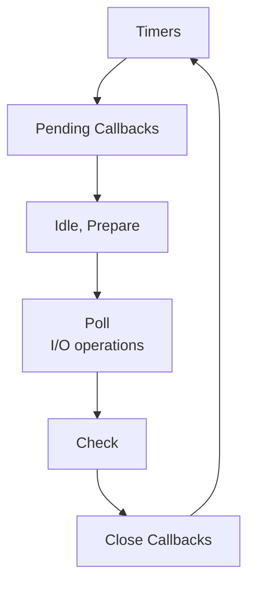

# Blocking vs Non-Blocking I/O

## Tổng quan

Hiểu biết về blocking vs non-blocking I/O rất quan trọng để xây dựng API Gateway hiệu suất cao. Kiến trúc event-driven, non-blocking của Node.js làm cho nó tuyệt vời cho các hoạt động nặng về I/O, nhưng các tác vụ đòi hỏi nhiều CPU có thể chặn event loop và làm giảm hiệu suất.

## Event Loop

Node.js hoạt động trên một event loop đơn luồng:



## Blocking Operations

### Điều gì chặn Event Loop?

1. **Tính toán đòi hỏi nhiều CPU**
   ```typescript
   //  BAD: Blocks event loop
   @Get('fibonacci')
   calculateFibonacci(@Query('n') n: number) {
     function fib(num: number): number {
       if (num <= 1) return num;
       return fib(num - 1) + fib(num - 2);
     }
     return fib(n); // Blocks for large n
   }
   ```

2. **Các hoạt động File đồng bộ**
   ```typescript
   //  TỆ: Chặn event loop
   const data = fs.readFileSync('/large-file.txt');
   ```

3. **Các hoạt động Crypto đồng bộ**
   ```typescript
   //  TỆ: Chặn event loop
   const hash = crypto.pbkdf2Sync(password, salt, 100000, 64, 'sha512');
   ```

4. **Phân tích JSON phức tạp**
   ```typescript
   //  TỆ: Có thể chặn với payload rất lớn
   const data = JSON.parse(hugeJsonString);
   ```

### Ví dụ thực tế từ dự án của chúng ta

Dự án của chúng ta minh họa vấn đề blocking:

```typescript
// Endpoint này mô phỏng công việc đòi hỏi nhiều CPU
@Get('cpu-intensive')
async cpuIntensive() {
  const start = Date.now();
  
  // Mô phỏng tính toán nặng
  let result = 0;
  for (let i = 0; i < 10_000_000_000; i++) {
    result += Math.sqrt(i);
  }
  
  return {
    result,
    duration: Date.now() - start,
    message: 'CPU-intensive task completed'
  };
}
```

**Kết quả kiểm thử:**
- **Một instance**: 53,364ms (chặn tất cả request khác!)
- **3 instances**: 116ms mỗi instance (requests được phân phối)

## Non-Blocking Operations

### Các hoạt động I/O (Tự nhiên Non-Blocking)

```typescript
//  TỐT: Non-blocking
@Get('users')
async getUsers() {
  // Database query không chặn
  return await this.userRepository.find();
}

@Get('external-api')
async fetchData() {
  // HTTP request không chặn
  return await this.httpService.get('https://api.example.com/data');
}
```

### Cách thức hoạt động của Non-Blocking

```
Request 1 đến → Event Loop → Khởi tạo DB query → Tiếp tục
Request 2 đến → Event Loop → Khởi tạo API call → Tiếp tục
Request 3 đến → Event Loop → Khởi tạo File read → Tiếp tục
                         ↓
                  DB query hoàn thành → Callback → Response 1
                  API call hoàn thành → Callback → Response 2
                  File read hoàn thành → Callback → Response 3
```

Tất cả ba requests được xử lý đồng thời trên một luồng duy nhất!

## Giải pháp cho công việc đòi hỏi nhiều CPU

### 1. Worker Threads

Sử dụng worker threads cho các tác vụ đòi hỏi nhiều CPU:

```typescript
import { Worker } from 'worker_threads';

@Injectable()
export class CpuService {
  async heavyComputation(data: any) {
    return new Promise((resolve, reject) => {
      const worker = new Worker('./cpu-worker.js', {
        workerData: data
      });
      
      worker.on('message', resolve);
      worker.on('error', reject);
      worker.on('exit', (code) => {
        if (code !== 0) {
          reject(new Error(`Worker stopped with exit code ${code}`));
        }
      });
    });
  }
}
```

**File worker (cpu-worker.js):**
```javascript
const { parentPort, workerData } = require('worker_threads');

// Thực hiện tính toán nặng
const result = computeHeavyTask(workerData);

// Gửi kết quả về
parentPort.postMessage(result);
```

### 2. Cluster Module

Fork nhiều processes để tận dụng tất cả CPU cores:

```typescript
import cluster from 'cluster';
import os from 'os';

if (cluster.isPrimary) {
  const numCPUs = os.cpus().length;
  
  console.log(`Master process ${process.pid} is running`);
  console.log(`Forking ${numCPUs} workers...`);
  
  // Fork workers
  for (let i = 0; i < numCPUs; i++) {
    cluster.fork();
  }
  
  cluster.on('exit', (worker, code, signal) => {
    console.log(`Worker ${worker.process.pid} died. Forking new worker...`);
    cluster.fork();
  });
} else {
  // Workers share the TCP connection
  const app = await NestFactory.create(AppModule);
  await app.listen(3000);
  
  console.log(`Worker ${process.pid} started`);
}
```

### 3. Message Queue

Chuyển các tác vụ nặng sang background worker thông qua message queue:

```typescript
// API Gateway - Producer
@Post('process-data')
async processData(@Body() data: any) {
  // Gửi đến queue ngay lập tức (non-blocking)
  await this.kafkaService.send('heavy-tasks', {
    taskId: uuid(),
    data: data,
    timestamp: Date.now()
  });
  
  return {
    message: 'Task queued for processing',
    taskId: taskId
  };
}

// Background Worker - Consumer
@Injectable()
export class HeavyTaskConsumer {
  @EventPattern('heavy-tasks')
  async handleTask(data: any) {
    // Công việc đòi hỏi nhiều CPU diễn ra ở đây
    // Không chặn API Gateway
    const result = await this.performHeavyComputation(data);
    
    // Lưu kết quả hoặc thông báo cho client
    await this.storeResult(data.taskId, result);
  }
}
```

### 4. Sử dụng Async/Await đúng cách

Luôn sử dụng async/await cho các hoạt động I/O:

```typescript
//  TỐT: Non-blocking
@Get('data')
async getData() {
  const [users, orders] = await Promise.all([
    this.userService.getUsers(),      // Chạy đồng thời
    this.orderService.getOrders()     // Chạy đồng thời
  ]);
  
  return { users, orders };
}

  ]);
  
  return { users, orders };
}

//  TỆ: Tuần tự (chậm hơn nhưng vẫn non-blocking)
@Get('data')
async getData() {
  const users = await this.userService.getUsers();   // Chờ
  const orders = await this.orderService.getOrders(); // Sau đó chờ lại
  
  return { users, orders };
}
```

## Giám sát Event Loop Lag

Phát hiện khi event loop bị chặn:

```typescript
import { performance } from 'perf_hooks';

@Injectable()
export class EventLoopMonitor {
  private readonly threshold = 100; // ms
  
  startMonitoring() {
    setInterval(() => {
      const start = performance.now();
      
      setImmediate(() => {
        const lag = performance.now() - start;
        
        if (lag > this.threshold) {
          console.warn(`Event loop lag detected: ${lag.toFixed(2)}ms`);
          // Cảnh báo hoặc ghi metric
        }
      });
    }, 1000);
  }
}
```

### Metrics để theo dõi

```typescript
import v8 from 'v8';

@Get('metrics')
getMetrics() {
  const heapStats = v8.getHeapStatistics();
  
  return {
    eventLoopDelay: this.getEventLoopDelay(),
    memory: {
      heapUsed: heapStats.used_heap_size,
      heapTotal: heapStats.total_heap_size,
      external: heapStats.external_memory
    },
    uptime: process.uptime(),
    cpuUsage: process.cpuUsage()
  };
}
```

## Các phương pháp tốt nhất

### 1. Không bao giờ chặn Event Loop

```typescript
//  KHÔNG BAO GIỜ LÀM VẬY
app.get('/bad', (req, res) => {
  const result = doHeavySync(); // Chặn mọi thứ!
  res.json(result);
});

//  LÀM NHƯ VẬY
app.get('/good', async (req, res) => {
  const result = await doHeavyAsync(); // Non-blocking
  res.json(result);
});
```

### 2. Sử dụng Streaming cho dữ liệu lớn

```typescript
//  Stream large responses
@Get('large-file')
downloadLargeFile(@Res() res: Response) {
  const fileStream = fs.createReadStream('/path/to/large-file.txt');
  fileStream.pipe(res);
}
```

### 3. Đặt Timeouts

```typescript
@Get('external-api')
async fetchExternal() {
  try {
    const response = await this.httpService.axiosRef.get(
      'https://slow-api.com/data',
      { timeout: 5000 } // 5 giây timeout
    );
    return response.data;
  } catch (error) {
    if (error.code === 'ECONNABORTED') {
      throw new RequestTimeoutException('Request timed out');
    }
    throw error;
  }
}
```

### 4. Giới hạn kích thước Payload

```typescript
// Trong main.ts
app.use(express.json({ limit: '10mb' }));
app.use(express.urlencoded({ limit: '10mb', extended: true }));
```

### 5. Sử dụng Connection Pooling

```typescript
// Database connection pool
const pool = new Pool({
  max: 20,                // Số kết nối tối đa
  min: 5,                 // Số kết nối tối thiểu
  idleTimeoutMillis: 30000,
  connectionTimeoutMillis: 2000,
});
```

## So sánh hiệu suất

### Ví dụ Blocking
```typescript
// Một instance xử lý requests tuần tự
Request 1: CPU task (50s) → chặn
Request 2: Đang chờ... (50s)
Request 3: Đang chờ... (100s)

Tổng thời gian: 150 giây cho 3 requests
```

### Ví dụ Non-Blocking
```typescript
// Một instance xử lý I/O đồng thời
Request 1: DB query → tiếp tục
Request 2: API call → tiếp tục
Request 3: File read → tiếp tục

Tất cả hoàn thành trong ~1 giây (I/O đồng thời)
```

### Horizontal Scaling cho CPU Tasks
```typescript
// 3 instances với load balancer
Request 1: Instance 1 (CPU task 50s)
Request 2: Instance 2 (CPU task 50s)
Request 3: Instance 3 (CPU task 50s)

Tổng thời gian: 50 giây cho 3 requests (song song)
```

## Kiểm thử

Kiểm thử event loop blocking trong ứng dụng của bạn:

```bash
# Terminal 1: Khởi động service
npm run start:dev

# Terminal 2: Kích hoạt tác vụ đòi hỏi nhiều CPU
curl http://localhost:3000/api/cpu-intensive

# Terminal 3: Ngay lập tức thử request khác
time curl http://localhost:3000/api/health

# Nếu bị chặn, health check sẽ mất nhiều thời gian
```

## Triển khai dự án

Xem triển khai của chúng ta:
- [Cluster setup](../../../backend/apps/api-gateway/src/cluster.ts)
- [CPU-intensive test](../../../backend/test-scaling.sh)
- [Scaling demonstration](../../../backend/SCALING-DEMO.md)

## Các bước tiếp theo

- Tìm hiểu về chiến lược [Scaling](../scaling/index.md)
- Khám phá [Load Balancing](../load-balancer/index.md)
- Kiểm tra [Observability](../observability/index.md) để giám sát
