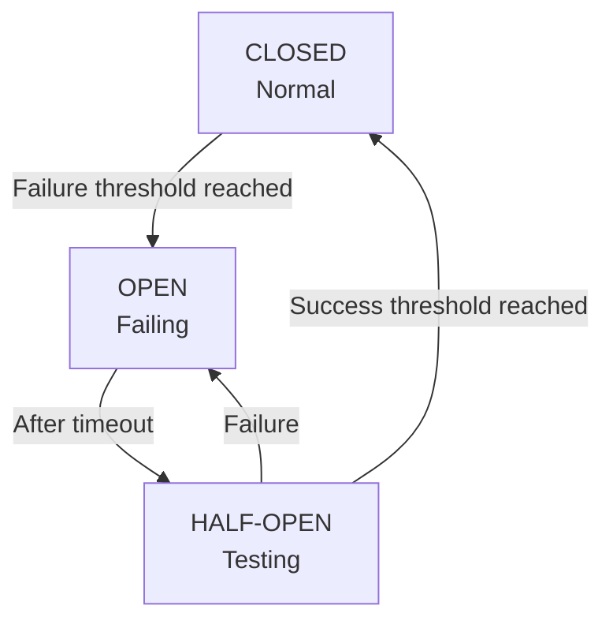

# Circuit Breaker Pattern

## Tổng quan

Circuit Breaker pattern ngăn chặn cascading failures bằng cách phát hiện khi một service không khỏe mạnh và tạm thời chặn requests đến nó, cho phép service có thời gian phục hồi.

## Vấn đề

Không có circuit breaker:

```
API Gateway → Failing Service (5s timeout)
Request 1: Chờ 5s → Fail
Request 2: Chờ 5s → Fail
Request 3: Chờ 5s → Fail
...
Kết quả: Tất cả requests chậm, tài nguyên bị cạn kiệt
```

Với circuit breaker:

```
API Gateway → Circuit Breaker → Service
Request 1: Thử → Fail (5s)
Request 2: Thử → Fail (5s)
Request 3: Circuit OPEN → Fail Fast (1ms) 
Request 4: Circuit OPEN → Fail Fast (1ms) 
...
Sau timeout: Circuit HALF-OPEN → Thử lại
```

## Circuit States



**States:**

- **CLOSED**: Hoạt động bình thường, requests đi qua
- **OPEN**: Service đang fail, fail fast mà không gọi service
- **HALF-OPEN**: Đang kiểm tra xem service đã phục hồi chưa

## Triển khai

### Circuit Breaker cơ bản

```typescript
enum CircuitState {
  CLOSED = 'CLOSED',
  OPEN = 'OPEN',
  HALF_OPEN = 'HALF_OPEN'
}

export class CircuitBreaker {
  private state: CircuitState = CircuitState.CLOSED;
  private failureCount = 0;
  private successCount = 0;
  private lastFailureTime?: number;

  constructor(
    private readonly failureThreshold: number = 5,
    private readonly successThreshold: number = 2,
    private readonly timeout: number = 60000, // 60 seconds
  ) {}

  async execute<T>(fn: () => Promise<T>): Promise<T> {
    if (this.state === CircuitState.OPEN) {
      // Check if timeout elapsed
      if (Date.now() - this.lastFailureTime! >= this.timeout) {
        this.state = CircuitState.HALF_OPEN;
        this.successCount = 0;
      } else {
        throw new Error('Circuit breaker is OPEN');
      }
    }

    try {
      const result = await fn();
      this.onSuccess();
      return result;
    } catch (error) {
      this.onFailure();
      throw error;
    }
  }

  private onSuccess() {
    this.failureCount = 0;

    if (this.state === CircuitState.HALF_OPEN) {
      this.successCount++;
      
      if (this.successCount >= this.successThreshold) {
        this.state = CircuitState.CLOSED;
        console.log('Circuit breaker CLOSED - service recovered');
      }
    }
  }

  private onFailure() {
    this.failureCount++;
    this.lastFailureTime = Date.now();

    if (
      this.state === CircuitState.HALF_OPEN ||
      this.failureCount >= this.failureThreshold
    ) {
      this.state = CircuitState.OPEN;
      console.log('Circuit breaker OPEN - too many failures');
    }
  }

  getState(): CircuitState {
    return this.state;
  }

  reset() {
    this.state = CircuitState.CLOSED;
    this.failureCount = 0;
    this.successCount = 0;
  }
}
```

### NestJS Interceptor

```typescript
// circuit-breaker.interceptor.ts
import { Injectable, NestInterceptor, ExecutionContext, CallHandler } from '@nestjs/common';
import { Observable, throwError } from 'rxjs';
import { catchError, tap } from 'rxjs/operators';

@Injectable()
export class CircuitBreakerInterceptor implements NestInterceptor {
  private circuitBreakers = new Map<string, CircuitBreaker>();

  intercept(context: ExecutionContext, next: CallHandler): Observable<any> {
    const request = context.switchToHttp().getRequest();
    const key = `${request.method}:${request.url}`;

    // Lấy hoặc tạo circuit breaker cho endpoint này
    if (!this.circuitBreakers.has(key)) {
      this.circuitBreakers.set(key, new CircuitBreaker(5, 2, 60000));
    }

    const breaker = this.circuitBreakers.get(key)!;

    // Kiểm tra xem circuit có mở không
    if (breaker.getState() === CircuitState.OPEN) {
      return throwError(() => new ServiceUnavailableException(
        'Service temporarily unavailable (circuit breaker open)'
      ));
    }

    return next.handle().pipe(
      tap(() => breaker.onSuccess()),
      catchError((error) => {
        breaker.onFailure();
        return throwError(() => error);
      })
    );
  }
}
```

**Cách sử dụng:**

```typescript
@Controller('api')
@UseInterceptors(CircuitBreakerInterceptor)
export class GatewayController {
  @Get('users')
  async getUsers() {
    // Nếu user service down, circuit mở sau 5 lần fail
    return this.userService.getUsers();
  }
}
```

### Circuit Breaker dành riêng cho Service

```typescript
@Injectable()
export class UserServiceClient {
  private circuitBreaker: CircuitBreaker;

  constructor(private httpService: HttpService) {
    this.circuitBreaker = new CircuitBreaker(
      5,     // failure threshold
      2,     // success threshold
      60000  // timeout (1 minute)
    );
  }

  async getUsers(): Promise<User[]> {
    return this.circuitBreaker.execute(async () => {
      const response = await this.httpService.axiosRef.get(
        'http://user-service:3001/users',
        { timeout: 5000 }
      );
      return response.data;
    });
  }

  async getUser(id: string): Promise<User> {
    return this.circuitBreaker.execute(async () => {
      const response = await this.httpService.axiosRef.get(
        `http://user-service:3001/users/${id}`,
        { timeout: 5000 }
      );
      return response.data;
    });
  }
}
```

## Advanced Features

### Fallback Response

Trả về dữ liệu cached hoặc mặc định khi circuit mở.

```typescript
export class CircuitBreakerWithFallback<T> extends CircuitBreaker {
  constructor(
    private fallback: () => Promise<T> | T,
    failureThreshold?: number,
    successThreshold?: number,
    timeout?: number
  ) {
    super(failureThreshold, successThreshold, timeout);
  }

  async execute(fn: () => Promise<T>): Promise<T> {
    try {
      return await super.execute(fn);
    } catch (error) {
      if (this.getState() === CircuitState.OPEN) {
        console.log('Circuit open, using fallback');
        return this.fallback();
      }
      throw error;
    }
  }
}
```

**Cách sử dụng:**

```typescript
@Injectable()
export class UserServiceClient {
  private circuitBreaker: CircuitBreakerWithFallback<User[]>;

  constructor(
    private httpService: HttpService,
    private cache: CacheService
  ) {
    this.circuitBreaker = new CircuitBreakerWithFallback(
      // Fallback function
      async () => {
        const cached = await this.cache.get('users');
        return cached || [];
      },
      5, 2, 60000
    );
  }

  async getUsers(): Promise<User[]> {
    return this.circuitBreaker.execute(async () => {
      const response = await this.httpService.axiosRef.get(
        'http://user-service:3001/users'
      );
      
      // Cache successful response
      await this.cache.set('users', response.data, 300);
      
      return response.data;
    });
  }
}
```

### Circuit Breaker dựa trên tỷ lệ lỗi

Mở circuit dựa trên tỷ lệ lỗi, không chỉ số lượng.

```typescript
export class ErrorRateCircuitBreaker extends CircuitBreaker {
  private window: Array<{ success: boolean; timestamp: number }> = [];
  private readonly windowSize = 100; // Last 100 requests
  private readonly errorThresholdPercentage = 50; // 50% errors

  async execute<T>(fn: () => Promise<T>): Promise<T> {
    if (this.state === CircuitState.OPEN) {
      if (Date.now() - this.lastFailureTime! >= this.timeout) {
        this.state = CircuitState.HALF_OPEN;
      } else {
        throw new Error('Circuit breaker is OPEN');
      }
    }

    try {
      const result = await fn();
      this.recordResult(true);
      return result;
    } catch (error) {
      this.recordResult(false);
      throw error;
    }
  }

  private recordResult(success: boolean) {
    this.window.push({ success, timestamp: Date.now() });

    // Keep only last N requests
    if (this.window.length > this.windowSize) {
      this.window.shift();
    }

    // Tính tỷ lệ lỗi
    if (this.window.length >= 10) { // Kích thước mẫu tối thiểu
      const errors = this.window.filter(r => !r.success).length;
      const errorRate = (errors / this.window.length) * 100;

      if (errorRate >= this.errorThresholdPercentage) {
        this.state = CircuitState.OPEN;
        this.lastFailureTime = Date.now();
        console.log(`Circuit OPEN - error rate: ${errorRate.toFixed(1)}%`);
      } else if (this.state === CircuitState.HALF_OPEN && success) {
        this.state = CircuitState.CLOSED;
        this.window = [];
        console.log('Circuit CLOSED - service recovered');
      }
    }
  }
}
```

### Nhiều Circuit Breakers

Quản lý circuit breakers cho nhiều services.

```typescript
@Injectable()
export class CircuitBreakerManager {
  private breakers = new Map<string, CircuitBreaker>();

  getBreaker(serviceName: string): CircuitBreaker {
    if (!this.breakers.has(serviceName)) {
      const config = this.getConfig(serviceName);
      this.breakers.set(
        serviceName,
        new CircuitBreaker(
          config.failureThreshold,
          config.successThreshold,
          config.timeout
        )
      );
    }

    return this.breakers.get(serviceName)!;
  }

  private getConfig(serviceName: string) {
    // Cấu hình dành riêng cho service
    const configs = {
      'user-service': { failureThreshold: 5, successThreshold: 2, timeout: 60000 },
      'order-service': { failureThreshold: 3, successThreshold: 2, timeout: 30000 },
      'payment-service': { failureThreshold: 2, successThreshold: 3, timeout: 120000 }
    };

    return configs[serviceName] || { failureThreshold: 5, successThreshold: 2, timeout: 60000 };
  }

  getStatus() {
    const status = {};
    this.breakers.forEach((breaker, name) => {
      status[name] = breaker.getState();
    });
    return status;
  }
}
```

## Giám sát

```typescript
@Injectable()
export class MonitoredCircuitBreaker extends CircuitBreaker {
  constructor(
    private serviceName: string,
    private metrics: MetricsService,
    failureThreshold?: number,
    successThreshold?: number,
    timeout?: number
  ) {
    super(failureThreshold, successThreshold, timeout);
  }

  protected onSuccess() {
    super.onSuccess();
    
    this.metrics.increment('circuit_breaker_success', {
      service: this.serviceName,
      state: this.getState()
    });
  }

  protected onFailure() {
    const previousState = this.getState();
    super.onFailure();
    const newState = this.getState();

    this.metrics.increment('circuit_breaker_failure', {
      service: this.serviceName,
      state: previousState
    });

    if (previousState !== newState && newState === CircuitState.OPEN) {
      this.metrics.increment('circuit_breaker_opened', {
        service: this.serviceName
      });

      // Cảnh báo khi circuit mở
      this.alerting.send({
        severity: 'warning',
        message: `Circuit breaker opened for ${this.serviceName}`,
        service: this.serviceName
      });
    }
  }
}
```

## Dashboard Endpoint

```typescript
@Controller('admin')
export class CircuitBreakerController {
  constructor(private breakerManager: CircuitBreakerManager) {}

  @Get('circuit-breakers')
  getStatus() {
    return this.breakerManager.getStatus();
  }

  @Post('circuit-breakers/:service/reset')
  resetBreaker(@Param('service') service: string) {
    const breaker = this.breakerManager.getBreaker(service);
    breaker.reset();
    return { message: `Circuit breaker for ${service} reset` };
  }
}
```

## Các phương pháp tốt nhất

### 1. Đặt ngưỡng phù hợp

```typescript
// Critical services - mở nhanh
const paymentBreaker = new CircuitBreaker(2, 3, 120000);

// Non-critical services - khoan dung hơn
const recommendationBreaker = new CircuitBreaker(10, 2, 60000);
```

### 2. Cung cấp Fallbacks

```typescript
//  TỐT: Graceful degradation
async getRecommendations(): Promise<Product[]> {
  try {
    return await this.circuitBreaker.execute(() =>
      this.recommendationService.get()
    );
  } catch (error) {
    // Trả về sản phẩm phổ biến làm fallback
    return this.getPopularProducts();
  }
}
```

### 3. Giám sát thay đổi trạng thái

```typescript
breaker.on('stateChange', (from, to) => {
  console.log(`Circuit breaker: ${from} → ${to}`);
  
  if (to === CircuitState.OPEN) {
    this.alerting.send({
      severity: 'critical',
      message: 'Service degraded - circuit breaker open'
    });
  }
});
```

### 4. Kiểm thử Circuit Breaker

```typescript
describe('Circuit Breaker', () => {
  it('should open after threshold failures', async () => {
    const breaker = new CircuitBreaker(3, 2, 60000);
    const failingFn = jest.fn().mockRejectedValue(new Error('Failed'));

    // 3 lần fail đầu tiên
    for (let i = 0; i < 3; i++) {
      await expect(breaker.execute(failingFn)).rejects.toThrow();
    }

    expect(breaker.getState()).toBe(CircuitState.OPEN);
  });

  it('should use fallback when open', async () => {
    const breaker = new CircuitBreakerWithFallback(
      () => 'fallback',
      1, 1, 1000
    );

    await expect(
      breaker.execute(() => Promise.reject('error'))
    ).rejects.toThrow();

    // Circuit giờ mở, nên dùng fallback
    const result = await breaker.execute(() => Promise.reject('error'));
    expect(result).toBe('fallback');
  });
});
```

## Tích hợp với Hystrix

Để có các tính năng nâng cao, sử dụng Netflix Hystrix (thông qua thư viện opossum):

```typescript
import CircuitBreaker from 'opossum';

const options = {
  timeout: 3000,                  // Nếu function mất thời gian lâu hơn, kích hoạt fallback
  errorThresholdPercentage: 50,   // Mở circuit nếu 50% lỗi
  resetTimeout: 30000             // Thử lại sau 30s
};

const breaker = new CircuitBreaker(asyncFunction, options);

breaker.fallback(() => 'Fallback response');

breaker.on('open', () => console.log('Circuit opened'));
breaker.on('halfOpen', () => console.log('Circuit half-open'));
breaker.on('close', () => console.log('Circuit closed'));

// Thực thi
const result = await breaker.fire(arg1, arg2);
```

## Các bước tiếp theo

- Tìm hiểu về [Retry & Backoff](./retry-backoff.md)
- Khám phá [Service Mesh](./service-mesh.md)
- Kiểm tra [Observability](../observability/index.md)
