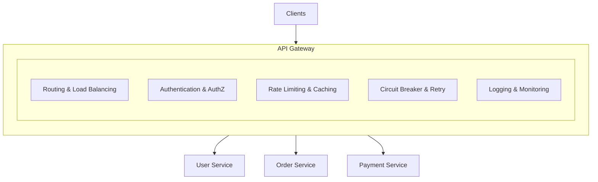

# API Gateway

## Tổng Quan

API Gateway đóng vai trò là điểm vào duy nhất cho tất cả các yêu cầu từ client trong kiến trúc microservices. Nó hoạt động như một reverse proxy, định tuyến các yêu cầu đến các backend service thích hợp đồng thời cung cấp các cross-cutting concerns như xác thực, giới hạn tốc độ và giám sát.

## Tại Sao Cần API Gateway?

Trong kiến trúc microservices, việc cho phép client giao tiếp trực tiếp với từng service tạo ra nhiều vấn đề:

- **Nhiều endpoint**: Client cần biết về nhiều endpoint của service
- **Trùng lặp cross-cutting concerns**: Mỗi service phải triển khai auth, logging, v.v.
- **Không khớp giao thức**: Các service khác nhau có thể sử dụng giao thức khác nhau
- **Bảo mật**: Việc expose các internal service trực tiếp ra internet

Mẫu API Gateway giải quyết những vấn đề này bằng cách cung cấp **giao diện thống nhất** để xử lý tất cả các yêu cầu từ client.

## Kiến Trúc



## Tính Năng Cốt Lõi

### 1. Định Tuyến
- **[Request Routing](./routing.md)** - Chiến lược định tuyến theo path, header, host
- **[Service Discovery](./service-discovery.md)** - Đăng ký và tra cứu service động

### 2. Bảo Mật
- **[Authentication & Authorization](./auth.md)** - JWT, OAuth, RBAC, permissions, MFA
- **[API Key Management](./api-keys.md)** - Xác thực service-to-service

### 3. Quản Lý Traffic
- **[Rate Limiting](./rate-limiting.md)** - Thuật toán fixed window, sliding window, token bucket
- **[Caching](./caching.md)** - Caching đa cấp, mẫu cache-aside, ETags

### 4. Khả Năng Phục Hồi
- **[Circuit Breaker](./circuit-breaker.md)** - Ngăn chặn lỗi lan truyền, phản hồi dự phòng
- [Rate Limiting & Throttling](./rate-limiting.md)
- [Load Balancing](./load-balancing.md)

### 4. Resilience
- [Circuit Breaker](./circuit-breaker.md)
- [Retry & Backoff](./retry-backoff.md)

### 5. Performance
- [Caching Layer](./caching.md)
- [Request Aggregation](./aggregation.md)

### 6. Observability
- [Logging & Monitoring](./logging-monitoring.md)
- [Distributed Tracing](./tracing.md)

### 7. Advanced Topics
- [Blocking vs Non-Blocking](./blocking-non-blocking.md)
- [Filtering & Transformation](./filtering.md)
- [Service Mesh Integration](./service-mesh.md)
- [Protocol Support](./protocols.md)

## Implementation in This Project

Our API Gateway implementation uses NestJS and includes:

- **Framework**: NestJS with Express
- **Routing**: Dynamic routing to User, Order, and Payment services
- **Authentication**: JWT-based authentication with guards
- **Rate Limiting**: Token bucket algorithm with Redis backend
- **Circuit Breaker**: Hystrix-style pattern with fallback responses
- **Aggregation**: `/api/aggregate` endpoint combining data from multiple services
- **Monitoring**: Custom metrics and health checks

### Quick Example

```typescript
// Gateway routing example
@Controller('api')
export class GatewayController {
  @Get('users')
  @UseGuards(AuthGuard, RateLimitGuard)
  @UseInterceptors(CircuitBreakerInterceptor)
  async getUsers() {
    return this.userService.getUsers();
  }
}
```

## Next Steps

- Learn about [Routing](./routing.md) to understand how requests are forwarded
- Explore [Circuit Breaker](./circuit-breaker.md) for resilience patterns
- Check [Rate Limiting](./rate-limiting.md) for traffic control
