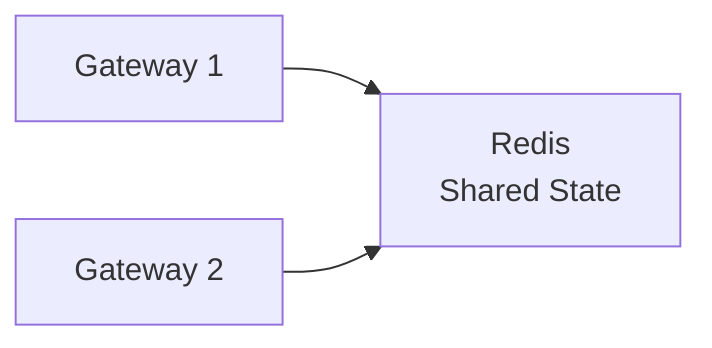

# Rate Limiting & Throttling

## Tổng quan

Rate limiting và throttling bảo vệ API của bạn khỏi lạm dụng, đảm bảo sử dụng công bằng và ngăn chặn quá tải hệ thống. Chúng kiểm soát số lượng yêu cầu mà một client có thể thực hiện trong một khoảng thời gian.

## Rate Limiting vs Throttling

| Rate Limiting | Throttling |
|--------------|------------|
| Giới hạn cứng - từ chối yêu cầu | Giới hạn mềm - trì hoãn/đưa vào hàng đợi yêu cầu |
| Trả về mã trạng thái 429 | Làm chậm quá trình xử lý |
| Tất cả hoặc không gì | Giảm dần dần |
| "Bạn đã vượt quá giới hạn của mình" | "Vui lòng chậm lại" |

## Tại sao Rate Limiting?

1. **Ngăn chặn tấn công DoS/DDoS**: Các tác nhân độc hại làm quá tải hệ thống của bạn
2. **Phân bổ tài nguyên công bằng**: Đảm bảo tất cả người dùng có quyền truy cập công bằng
3. **Kiểm soát chi phí**: Giới hạn các hoạt động tốn kém (đặc biệt là cho các API bên ngoài)
4. **Ổn định hệ thống**: Ngăn chặn các lỗi cascade từ quá tải
5. **Mô hình kinh doanh**: Thực thi các cấp API (miễn phí, cao cấp, doanh nghiệp)

## Thuật toán Rate Limiting

### 1. Fixed Window

Đếm đơn giản được đặt lại ở các khoảng thời gian cố định.

```typescript
@Injectable()
export class FixedWindowRateLimiter {
  private counters = new Map<string, { count: number; resetTime: number }>();

  isAllowed(clientId: string, limit: number, windowMs: number): boolean {
    const now = Date.now();
    const client = this.counters.get(clientId);

    if (!client || now >= client.resetTime) {
      // New window
      this.counters.set(clientId, {
        count: 1,
        resetTime: now + windowMs
      });
      return true;
    }

    if (client.count < limit) {
      client.count++;
      return true;
    }

    return false; // Rate limit exceeded
  }
}
```

**Ưu điểm:**
- Đơn giản để triển khai
- Tiết kiệm bộ nhớ
- Nhanh

**Nhược điểm:**
- Lưu lượng burst ở ranh giới cửa sổ
- Có thể cho phép 2x giới hạn (cuối cửa sổ này + đầu cửa sổ tiếp theo)

**Ví dụ:**
```
Limit: 10 requests/minute
Window: 00:00 - 01:00

00:00:59 → 10 requests 
01:00:01 → 10 requests 
Total: 20 requests in 2 seconds! 
```

### 2. Sliding Window Log

Theo dõi dấu thời gian của mỗi yêu cầu.

```typescript
@Injectable()
export class SlidingWindowLogRateLimiter {
  private logs = new Map<string, number[]>();

  isAllowed(clientId: string, limit: number, windowMs: number): boolean {
    const now = Date.now();
    const requests = this.logs.get(clientId) || [];

    // Remove old requests outside the window
    const validRequests = requests.filter(
      timestamp => now - timestamp < windowMs
    );

    if (validRequests.length < limit) {
      validRequests.push(now);
      this.logs.set(clientId, validRequests);
      return true;
    }

    return false;
  }
}
```

**Ưu điểm:**
- Không có vấn đề burst
- Rate limiting chính xác

**Nhược điểm:**
- Tốn bộ nhớ (lưu trữ tất cả dấu thời gian)
- Chậm hơn (hoạt động lọc trên mỗi yêu cầu)

### 3. Sliding Window Counter

Cách tiếp cận kết hợp - kết hợp fixed window và sliding log.

```typescript
@Injectable()
export class SlidingWindowCounterRateLimiter {
  private windows = new Map<string, {
    currentWindow: { count: number; timestamp: number };
    previousWindow: { count: number; timestamp: number };
  }>();

  isAllowed(clientId: string, limit: number, windowMs: number): boolean {
    const now = Date.now();
    const client = this.windows.get(clientId) || {
      currentWindow: { count: 0, timestamp: now },
      previousWindow: { count: 0, timestamp: now - windowMs }
    };

    const currentWindowStart = Math.floor(now / windowMs) * windowMs;
    
    if (client.currentWindow.timestamp < currentWindowStart) {
      // New window
      client.previousWindow = client.currentWindow;
      client.currentWindow = { count: 0, timestamp: currentWindowStart };
    }

    // Calculate weighted count
    const previousWeight = 
      (windowMs - (now - currentWindowStart)) / windowMs;
    const estimatedCount = 
      client.previousWindow.count * previousWeight + 
      client.currentWindow.count;

    if (estimatedCount < limit) {
      client.currentWindow.count++;
      this.windows.set(clientId, client);
      return true;
    }

    return false;
  }
}
```

**Ưu điểm:**
- Ngăn chặn lưu lượng burst
- Tiết kiệm bộ nhớ
- Độ chính xác tốt

**Nhược điểm:**
- Phức tạp hơn một chút
- Xấp xỉ (không chính xác)

### 4. Token Bucket

Tokens được thêm vào với tốc độ cố định. Mỗi yêu cầu tiêu thụ một token.

```typescript
@Injectable()
export class TokenBucketRateLimiter {
  private buckets = new Map<string, {
    tokens: number;
    lastRefill: number;
  }>();

  isAllowed(
    clientId: string,
    capacity: number,
    refillRate: number // tokens per second
  ): boolean {
    const now = Date.now();
    let bucket = this.buckets.get(clientId);

    if (!bucket) {
      bucket = { tokens: capacity, lastRefill: now };
      this.buckets.set(clientId, bucket);
    }

    // Refill tokens based on elapsed time
    const elapsed = (now - bucket.lastRefill) / 1000;
    const tokensToAdd = elapsed * refillRate;
    bucket.tokens = Math.min(capacity, bucket.tokens + tokensToAdd);
    bucket.lastRefill = now;

    // Try to consume a token
    if (bucket.tokens >= 1) {
      bucket.tokens -= 1;
      return true;
    }

    return false;
  }
}
```

**Ưu điểm:**
- Xử lý burst (lên đến capacity)
- Rate limiting mượt mà
- Linh hoạt (có thể cho phép burst thỉnh thoảng)

**Nhược điểm:**
- Phức tạp hơn
- Yêu cầu cấu hình nhiều hơn

**Hình ảnh:**
```
Bucket Capacity: 10 tokens
Refill Rate: 1 token/second

[🪙🪙🪙🪙🪙🪙🪙🪙🪙🪙] ← Full bucket (10 tokens)
Request 1: Consume 1 token
[🪙🪙🪙🪙🪙🪙🪙🪙🪙  ]
...
After 10 requests:
[                    ] ← Empty
Must wait for refill!
```

### 5. Leaky Bucket

Yêu cầu vào một hàng đợi và được xử lý với tốc độ cố định.

```typescript
@Injectable()
export class LeakyBucketRateLimiter {
  private queues = new Map<string, {
    queue: Array<() => Promise<any>>;
    lastLeak: number;
  }>();

  async throttle<T>(
    clientId: string,
    fn: () => Promise<T>,
    capacity: number,
    leakRate: number // requests per second
  ): Promise<T> {
    let bucket = this.queues.get(clientId);

    if (!bucket) {
      bucket = { queue: [], lastLeak: Date.now() };
      this.queues.set(clientId, bucket);
    }

    // Leak (process) requests
    const now = Date.now();
    const elapsed = (now - bucket.lastLeak) / 1000;
    const requestsToProcess = Math.floor(elapsed * leakRate);
    
    for (let i = 0; i < requestsToProcess && bucket.queue.length > 0; i++) {
      const request = bucket.queue.shift();
      request();
    }
    
    bucket.lastLeak = now;

    // Add new request
    if (bucket.queue.length < capacity) {
      return new Promise((resolve, reject) => {
        bucket.queue.push(async () => {
          try {
            const result = await fn();
            resolve(result);
          } catch (error) {
            reject(error);
          }
        });
      });
    }

    throw new Error('Bucket full - rate limit exceeded');
  }
}
```

**Ưu điểm:**
- Tốc độ đầu ra mượt mà
- Tốt để bảo vệ các dịch vụ downstream
- Không có lưu lượng burst

**Nhược điểm:**
- Độ trễ được thêm vào (đưa vào hàng đợi)
- Triển khai phức tạp

## Triển khai với Redis

Đối với các hệ thống phân tán, sử dụng Redis cho rate limiting:

```typescript
import { Injectable } from '@nestjs/common';
import { Redis } from 'ioredis';

@Injectable()
export class RedisRateLimiter {
  constructor(private readonly redis: Redis) {}

  async isAllowed(
    clientId: string,
    limit: number,
    windowMs: number
  ): Promise<boolean> {
    const key = `rate_limit:${clientId}`;
    const now = Date.now();

    // Use Redis sorted set
    const multi = this.redis.multi();
    
    // Remove old entries
    multi.zremrangebyscore(key, 0, now - windowMs);
    
    // Count current requests
    multi.zcard(key);
    
    // Add current request
    multi.zadd(key, now, `${now}-${Math.random()}`);
    
    // Set expiry
    multi.expire(key, Math.ceil(windowMs / 1000));

    const results = await multi.exec();
    const count = results[1][1] as number;

    return count < limit;
  }
}
```

### Redis Lua Script (Hoạt động Nguyên tử)

```typescript
async isAllowedAtomic(
  clientId: string,
  limit: number,
  windowMs: number
): Promise<{ allowed: boolean; remaining: number }> {
  const script = `
    local key = KEYS[1]
    local limit = tonumber(ARGV[1])
    local window = tonumber(ARGV[2])
    local now = tonumber(ARGV[3])
    
    redis.call('ZREMRANGEBYSCORE', key, 0, now - window)
    local count = redis.call('ZCARD', key)
    
    if count < limit then
      redis.call('ZADD', key, now, now .. '-' .. math.random())
      redis.call('EXPIRE', key, math.ceil(window / 1000))
      return {1, limit - count - 1}
    else
      return {0, 0}
    end
  `;

  const result = await this.redis.eval(
    script,
    1,
    `rate_limit:${clientId}`,
    limit,
    windowMs,
    Date.now()
  ) as [number, number];

  return {
    allowed: result[0] === 1,
    remaining: result[1]
  };
}
```

## Triển khai NestJS

### Rate Limit Guard

```typescript
import { Injectable, CanActivate, ExecutionContext } from '@nestjs/common';
import { Reflector } from '@nestjs/core';
import { ThrottlerException } from '@nestjs/throttler';

@Injectable()
export class RateLimitGuard implements CanActivate {
  constructor(
    private readonly reflector: Reflector,
    private readonly rateLimiter: RedisRateLimiter
  ) {}

  async canActivate(context: ExecutionContext): Promise<boolean> {
    const request = context.switchToHttp().getRequest();
    const limit = this.reflector.get<number>('rateLimit', context.getHandler()) || 100;
    const window = this.reflector.get<number>('rateLimitWindow', context.getHandler()) || 60000;

    // Identify client (by IP, API key, user ID, etc.)
    const clientId = this.getClientId(request);

    const { allowed, remaining } = await this.rateLimiter.isAllowedAtomic(
      clientId,
      limit,
      window
    );

    // Add rate limit headers
    request.res.setHeader('X-RateLimit-Limit', limit);
    request.res.setHeader('X-RateLimit-Remaining', remaining);
    request.res.setHeader('X-RateLimit-Reset', Date.now() + window);

    if (!allowed) {
      throw new ThrottlerException('Too many requests');
    }

    return true;
  }

  private getClientId(request: any): string {
    // Priority: API Key > User ID > IP Address
    return (
      request.headers['x-api-key'] ||
      request.user?.id ||
      request.ip ||
      'anonymous'
    );
  }
}
```

### Sử dụng với Decorators

```typescript
import { SetMetadata } from '@nestjs/common';

export const RateLimit = (limit: number, windowMs: number = 60000) => 
  SetMetadata('rateLimit', limit);

// Controller
@Controller('api')
export class ApiController {
  @Get('search')
  @UseGuards(RateLimitGuard)
  @RateLimit(10, 60000) // 10 requests per minute
  async search() {
    return this.searchService.search();
  }

  @Get('premium')
  @UseGuards(RateLimitGuard, AuthGuard)
  @RateLimit(1000, 60000) // 1000 requests per minute for authenticated users
  async premiumEndpoint() {
    return this.premiumService.getData();
  }
}
```

## Phản hồi Rate Limit

### Headers

Luôn bao gồm headers rate limit trong phản hồi:

```
HTTP/1.1 200 OK
X-RateLimit-Limit: 100
X-RateLimit-Remaining: 85
X-RateLimit-Reset: 1640000000
```

### Phản hồi 429

Khi vượt quá rate limit:

```
HTTP/1.1 429 Too Many Requests
Retry-After: 60
Content-Type: application/json

{
  "statusCode": 429,
  "message": "Too many requests",
  "error": "Too Many Requests",
  "retryAfter": 60
}
```

## Tiered Rate Limiting

Các giới hạn khác nhau cho các cấp người dùng khác nhau:

```typescript
@Injectable()
export class TieredRateLimiter {
  private readonly tiers = {
    free: { limit: 100, window: 3600000 },      // 100/hour
    basic: { limit: 1000, window: 3600000 },    // 1000/hour
    premium: { limit: 10000, window: 3600000 }, // 10000/hour
    enterprise: { limit: 100000, window: 3600000 } // 100000/hour
  };

  async isAllowed(userId: string, userTier: string): Promise<boolean> {
    const config = this.tiers[userTier] || this.tiers.free;
    return this.rateLimiter.isAllowed(userId, config.limit, config.window);
  }
}
```

## Các phương pháp tốt nhất

### 1. Sử dụng Nhiều Chiều

```typescript
// Per IP
await this.rateLimiter.isAllowed(`ip:${ip}`, 100, 60000);

// Per User
await this.rateLimiter.isAllowed(`user:${userId}`, 1000, 60000);

// Per Endpoint
await this.rateLimiter.isAllowed(`endpoint:${path}:${userId}`, 10, 1000);
```

### 2. Giảm dần Graceful

```typescript
if (!await this.rateLimiter.isAllowed(clientId, limit, window)) {
  // Instead of rejecting, serve cached data
  return this.cache.get(`fallback:${clientId}`);
}
```

### 3. Rate Limit theo Chi phí

Các endpoint khác nhau có chi phí khác nhau:

```typescript
const costs = {
  '/api/search': 5,        // Expensive
  '/api/users': 1,         // Cheap
  '/api/analytics': 10     // Very expensive
};

// Consume tokens based on cost
bucket.tokens -= costs[endpoint];
```

### 4. Distributed Rate Limiting

Sử dụng Redis cho các triển khai multi-instance:



## Giám sát

Theo dõi các metrics rate limiting:

```typescript
@Injectable()
export class RateLimitMetrics {
  async recordRateLimitHit(clientId: string, allowed: boolean) {
    await this.metrics.increment('rate_limit_checks', {
      client: clientId,
      allowed: allowed.toString()
    });

    if (!allowed) {
      await this.metrics.increment('rate_limit_exceeded', {
        client: clientId
      });
    }
  }
}
```

## Kiểm thử

Kiểm thử rate limiting:

```bash
# Test rate limit
for i in {1..150}; do
  curl -w "\n%{http_code}\n" http://localhost:3000/api/search
done

# First 100 should return 200
# Next 50 should return 429
```

## Triển khai Dự án

Xem:
- [Triển khai rate limiting](../../../backend/apps/api-gateway/src/guards/)
- [Tài liệu API Gateway](../../../backend/README.md)

## Các Bước Tiếp Theo

- Tìm hiểu về [Circuit Breaker](./circuit-breaker.md)
- Khám phá [Caching](./caching.md)
- Kiểm tra [Monitoring](./logging-monitoring.md)
