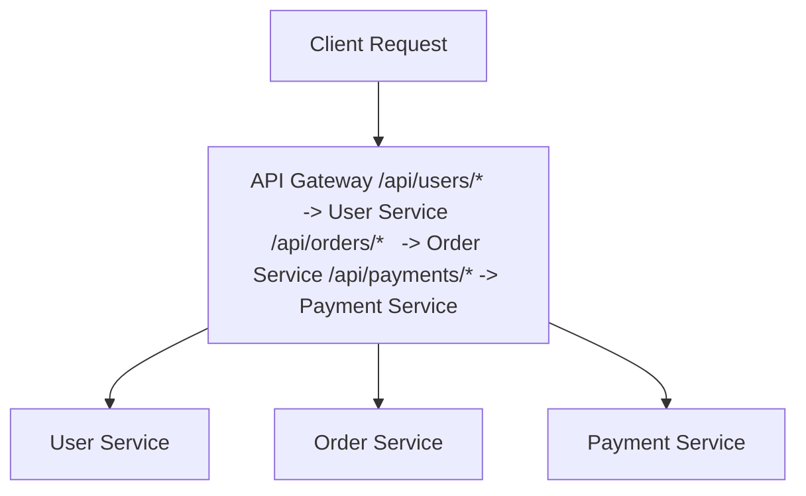

# Routing

## Overview

Routing is the fundamental capability of an API Gateway - directing incoming requests to the appropriate backend microservice based on the request path, headers, or other criteria.

## Routing Strategies

### 1. Path-Based Routing

The most common routing strategy, where the URL path determines the target service.



**Implementation:**

```typescript
// NestJS routing example
@Controller('api')
export class GatewayController {
  constructor(
    private readonly httpService: HttpService,
  ) {}

  @All('users/*')
  async routeToUserService(@Req() req: Request) {
    const targetUrl = `http://user-service:3001${req.url}`;
    return this.proxyRequest(targetUrl, req);
  }

  @All('orders/*')
  async routeToOrderService(@Req() req: Request) {
    const targetUrl = `http://order-service:3002${req.url}`;
    return this.proxyRequest(targetUrl, req);
  }

  private async proxyRequest(url: string, req: Request) {
    const response = await this.httpService.axiosRef({
      method: req.method,
      url: url,
      data: req.body,
      headers: req.headers,
    });
    return response.data;
  }
}
```

### 2. Header-Based Routing

Route based on request headers (e.g., API version, client type).

```typescript
@All('*')
async routeByVersion(@Headers('api-version') version: string, @Req() req: Request) {
  if (version === 'v2') {
    return this.routeToV2Service(req);
  }
  return this.routeToV1Service(req);
}
```

**Use Cases:**
- A/B testing
- Canary deployments
- API versioning
- Client-specific routing (mobile vs web)

### 3. Host-Based Routing

Route based on the request hostname or subdomain.

```
api.example.com      → API Gateway
users.example.com    → User Service
orders.example.com   → Order Service
```

### 4. Method-Based Routing

Route based on HTTP method.

```typescript
@Get('resources')
async handleGet() {
  return this.readService.getResources();
}

@Post('resources')
async handlePost(@Body() data: any) {
  return this.writeService.createResource(data);
}
```

## Dynamic Routing

### Service Registry Integration

Instead of hardcoding service URLs, use a service registry to discover services dynamically.

```typescript
@Injectable()
export class ServiceDiscovery {
  private serviceRegistry = new Map<string, string[]>();

  constructor() {
    // Register services
    this.serviceRegistry.set('user-service', [
      'http://user-service-1:3001',
      'http://user-service-2:3001',
      'http://user-service-3:3001',
    ]);
  }

  getServiceInstance(serviceName: string): string {
    const instances = this.serviceRegistry.get(serviceName);
    if (!instances || instances.length === 0) {
      throw new Error(`No instances available for ${serviceName}`);
    }
    
    // Round-robin load balancing
    const instance = instances[Math.floor(Math.random() * instances.length)];
    return instance;
  }
}
```

**Usage:**

```typescript
@All('users/*')
async routeToUserService(@Req() req: Request) {
  const instance = this.serviceDiscovery.getServiceInstance('user-service');
  const targetUrl = `${instance}${req.url}`;
  return this.proxyRequest(targetUrl, req);
}
```

## Rewrite Rules

Transform the request path before forwarding to backend services.

```typescript
// Client calls: /api/v1/users
// Backend expects: /users

@All('v1/*')
async routeWithRewrite(@Req() req: Request) {
  // Remove '/v1' prefix
  const rewrittenPath = req.url.replace(/^\/v1/, '');
  const targetUrl = `http://backend${rewrittenPath}`;
  return this.proxyRequest(targetUrl, req);
}
```

## Query Parameter Routing

Route based on query parameters.

```typescript
// /api/search?service=user
@Get('search')
async routeSearch(@Query('service') service: string) {
  switch (service) {
    case 'user':
      return this.userService.search();
    case 'order':
      return this.orderService.search();
    default:
      throw new BadRequestException('Unknown service');
  }
}
```

## Weighted Routing

Distribute traffic based on weights (useful for canary deployments).

```typescript
@Injectable()
export class WeightedRouter {
  routeRequest(service: string) {
    const random = Math.random() * 100;
    
    if (service === 'user-service') {
      // 90% to stable version, 10% to canary
      if (random < 90) {
        return 'http://user-service-stable:3001';
      } else {
        return 'http://user-service-canary:3001';
      }
    }
  }
}
```

## Routing Configuration

### Configuration File Approach

```yaml
# routes.yaml
routes:
  - path: /api/users/*
    service: user-service
    port: 3001
    methods: [GET, POST, PUT, DELETE]
    
  - path: /api/orders/*
    service: order-service
    port: 3002
    methods: [GET, POST]
    rateLimit: 100
    
  - path: /api/payments/*
    service: payment-service
    port: 3003
    methods: [POST]
    requiresAuth: true
```

### Dynamic Configuration

```typescript
@Injectable()
export class RouteConfigService {
  private routes: Map<string, RouteConfig> = new Map();

  constructor() {
    this.loadRoutes();
  }

  async loadRoutes() {
    // Load from database or config service
    const routes = await this.fetchRoutesFromDB();
    routes.forEach(route => {
      this.routes.set(route.path, route);
    });
  }

  getRoute(path: string): RouteConfig | undefined {
    return this.routes.get(path);
  }

  // Hot reload routes without restart
  async reloadRoutes() {
    await this.loadRoutes();
  }
}
```

## Best Practices

### 1. Use Consistent Naming

```
 Good:
/api/v1/users
/api/v1/orders
/api/v1/payments

 Bad:
/users
/api/order
/payment-api
```

### 2. Version Your APIs

```typescript
@Controller('api/v1')
export class V1GatewayController { }

@Controller('api/v2')
export class V2GatewayController { }
```

### 3. Handle Trailing Slashes

```typescript
// Both should work:
// /api/users
// /api/users/
```

### 4. Implement Health Checks

```typescript
@Get('health')
async healthCheck() {
  return {
    status: 'healthy',
    timestamp: new Date().toISOString(),
    services: await this.checkServicesHealth(),
  };
}
```

### 5. Add Request Timeouts

```typescript
private async proxyRequest(url: string, req: Request) {
  const response = await this.httpService.axiosRef({
    method: req.method,
    url: url,
    data: req.body,
    headers: req.headers,
    timeout: 5000, // 5 second timeout
  });
  return response.data;
}
```

## Performance Optimization

### 1. Connection Pooling

```typescript
const httpService = new HttpService({
  httpAgent: new http.Agent({
    keepAlive: true,
    maxSockets: 100,
    maxFreeSockets: 10,
  }),
});
```

### 2. Request Caching

```typescript
@Get('users')
@UseInterceptors(CacheInterceptor)
@CacheTTL(60) // Cache for 60 seconds
async getUsers() {
  return this.userService.getUsers();
}
```

### 3. Parallel Requests

For aggregation scenarios, make parallel requests:

```typescript
async getAggregatedData() {
  const [users, orders, payments] = await Promise.all([
    this.userService.getUsers(),
    this.orderService.getOrders(),
    this.paymentService.getPayments(),
  ]);
  
  return { users, orders, payments };
}
```

## Error Handling

```typescript
private async proxyRequest(url: string, req: Request) {
  try {
    const response = await this.httpService.axiosRef({
      method: req.method,
      url: url,
      data: req.body,
      headers: req.headers,
    });
    return response.data;
  } catch (error) {
    if (error.response) {
      // Backend returned error
      throw new HttpException(
        error.response.data,
        error.response.status,
      );
    } else if (error.request) {
      // No response received
      throw new ServiceUnavailableException(
        'Service unavailable',
      );
    } else {
      // Request setup error
      throw new InternalServerErrorException(
        'Failed to route request',
      );
    }
  }
}
```

## Project Implementation

In our project, routing is implemented in:
- [apps/api-gateway/src/gateway.controller.ts](../../../backend/apps/api-gateway/src/gateway.controller.ts)
- [apps/api-gateway/src/gateway.service.ts](../../../backend/apps/api-gateway/src/gateway.service.ts)

## Next Steps

- Learn about [Service Discovery](./service-discovery.md)
- Explore [Load Balancing](./load-balancing.md)
- Check [Circuit Breaker](./circuit-breaker.md) for resilience
