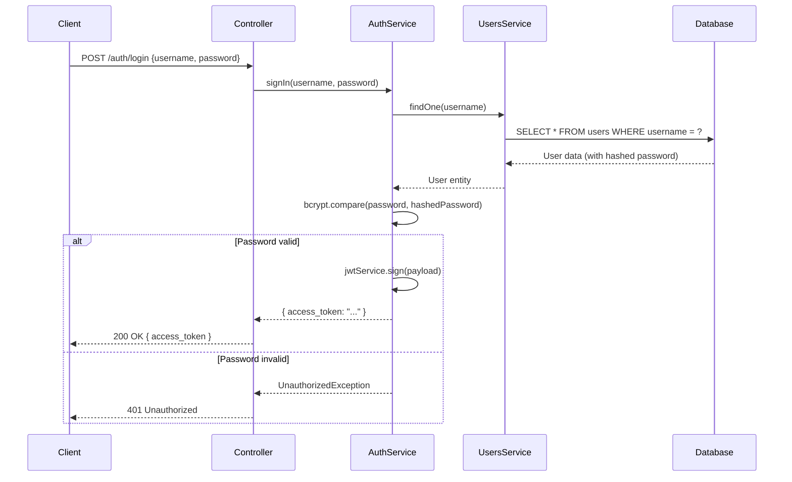

# Authentication Implementation

Complete implementation of authentication features in the backend application.

## 1. Password Hashing with bcrypt

**Location**: [`backend/src/users/entities/user.entity.ts`](../../../backend/src/users/entities/user.entity.ts)

```typescript
import { Entity, PrimaryGeneratedColumn, Column, BeforeInsert } from 'typeorm';

@Entity()
export class User {
  @PrimaryColumn()
  id: number;

  @Column({ unique: true })
  username: string;

  @Column()
  password: string;

  @BeforeInsert()
  async hashPassword() {
    // Hash password before insert to database
    // Avoid storing plain text password in database 
    const bcrypt = await import('bcrypt');
    this.password = await bcrypt.hash(this.password, 10);
  }
}
```

**Key Features:**
- **Automatic hashing**: `@BeforeInsert()` hook ensures passwords are hashed before database insertion
- **Salt rounds**: Uses 10 rounds (2^10 iterations) for optimal security/performance balance
- **One-way encryption**: bcrypt is a one-way hash function, making password recovery impossible

**Why bcrypt?**
- Resistant to rainbow table attacks
- Built-in salt generation
- Computationally expensive (protects against brute force)
- Future-proof (can increase cost factor over time)

## 2. Token-Based Authentication (JWT)

**Location**: [`backend/src/auth/auth.module.ts`](../../../backend/src/auth/auth.module.ts)

```typescript
import { Module } from '@nestjs/common';
import { JwtModule } from '@nestjs/jwt';
import { jwtConstants } from './constants';

@Module({
  imports: [
    UsersModule,
    JwtModule.register({
      global: true,
      secret: jwtConstants.secret,
      signOptions: { expiresIn: '60s' },
    }),
  ],
  providers: [AuthService],
  controllers: [AuthController],
  exports: [AuthService],
})
export class AuthModule {}
```

**JWT Configuration:**
- **Global registration**: JWT module available across all modules
- **Secret key**: Stored in `constants.ts` (should be in environment variables in production)
- **Token expiration**: 60 seconds (demo purposes - increase for production)

**Production Recommendations:**
```typescript
// .env
JWT_SECRET=your-super-secret-key-change-in-production
JWT_EXPIRATION=1h  // or 15m for access tokens

// auth.module.ts
JwtModule.register({
  global: true,
  secret: process.env.JWT_SECRET,
  signOptions: { expiresIn: process.env.JWT_EXPIRATION },
})
```

## 3. Sign-In Flow

**Location**: [`backend/src/auth/auth.service.ts`](../../../backend/src/auth/auth.service.ts)

```typescript
import { Injectable, UnauthorizedException } from '@nestjs/common';
import { UsersService } from '../users/users.service';
import { JwtService } from '@nestjs/jwt';
import { compare } from 'bcrypt';

@Injectable()
export class AuthService {
  constructor(
    private usersService: UsersService,
    private jwtService: JwtService
  ) {}

  async signIn(username: string, pass: string) {
    const user = await this.usersService.findOne(username);
    
    if (!user) {
      throw new UnauthorizedException('User not found');
    }

    // Compare plain password with hashed password
    if (!(await compare(pass, user.password))) {
      throw new UnauthorizedException('Invalid credentials');
    }
    
    return user;
  }
}
```

**Authentication Flow:**



## 4. Auth Controller

**Location**: [`backend/src/auth/auth.controller.ts`](../../../backend/src/auth/auth.controller.ts)

```typescript
import { Body, Controller, Post, HttpCode, HttpStatus } from '@nestjs/common';
import { AuthService } from './auth.service';
import { SignInDto } from './dto/signIn.dto';

@Controller('auth')
export class AuthController {
  constructor(private authService: AuthService) {}

  @HttpCode(HttpStatus.OK)
  @Post('login')
  signIn(@Body() signInDto: SignInDto) {
    return this.authService.signIn(signInDto.username, signInDto.password);
  }
}
```

**Endpoint**: `POST /auth/login`

**Request Body**:
```json
{
  "username": "john_doe",
  "password": "SecurePassword123"
}
```

**Response** (200 OK):
```json
{
  "id": 1,
  "username": "john_doe"
}
```

**Note**: Currently returns user object. In production, should return JWT token:
```typescript
async signIn(username: string, pass: string) {
  const user = await this.usersService.findOne(username);
  
  if (!user || !(await compare(pass, user.password))) {
    throw new UnauthorizedException('Invalid credentials');
  }
  
  const payload = { sub: user.id, username: user.username };
  return {
    access_token: await this.jwtService.signAsync(payload),
  };
}
```

## 5. Input Validation

**Location**: [`backend/src/auth/dto/signIn.dto.ts`](../../../backend/src/auth/dto/signIn.dto.ts)

```typescript
import { IsString } from 'class-validator';

export class SignInDto {
  @IsString()
  username: string;

  @IsString()
  password: string;
}
```

**User Creation DTO**: [`backend/src/users/dto/createUser.dto.ts`](../../../backend/src/users/dto/createUser.dto.ts)

```typescript
import { IsString, IsNotEmpty, MinLength } from "class-validator";

export class CreateUserDto {
  @IsNotEmpty()
  @IsString()
  username: string;

  @IsNotEmpty()
  @IsString()
  @MinLength(8)
  password: string;
}
```

**Validation Rules:**
- `@IsString()`: Ensures field is a string
- `@IsNotEmpty()`: Field cannot be empty
- `@MinLength(8)`: Password must be at least 8 characters

## 6. Authentication Guards

**Location**: [`backend/apps/api-gateway/src/guards/fake-jwt.guard.ts`](../../../backend/apps/api-gateway/src/guards/fake-jwt.guard.ts)

```typescript
import { Injectable, CanActivate, ExecutionContext } from '@nestjs/common';

@Injectable()
export class FakeJwtGuard implements CanActivate {
  canActivate(context: ExecutionContext): boolean {
    const request = context.switchToHttp().getRequest();
    const authHeader = request.headers['authorization'];
    
    // Simple fake JWT validation - just checks for specific token
    return authHeader === 'Bearer demo-token';
  }
}
```

**Usage in Controllers**:
```typescript
import { UseGuards } from '@nestjs/common';
import { FakeJwtGuard } from './guards/fake-jwt.guard';

@Controller('users')
export class UsersController {
  @Get('profile')
  @UseGuards(FakeJwtGuard)
  getProfile(@Request() req) {
    return req.user;
  }
}
```

**Production JWT Guard**:
```typescript
import { Injectable, CanActivate, ExecutionContext, UnauthorizedException } from '@nestjs/common';
import { JwtService } from '@nestjs/jwt';
import { Request } from 'express';

@Injectable()
export class JwtAuthGuard implements CanActivate {
  constructor(private jwtService: JwtService) {}

  async canActivate(context: ExecutionContext): Promise<boolean> {
    const request = context.switchToHttp().getRequest();
    const token = this.extractTokenFromHeader(request);
    
    if (!token) {
      throw new UnauthorizedException('Token not found');
    }
    
    try {
      const payload = await this.jwtService.verifyAsync(token, {
        secret: process.env.JWT_SECRET
      });
      
      // Attach user to request
      request['user'] = payload;
    } catch {
      throw new UnauthorizedException('Invalid token');
    }
    
    return true;
  }

  private extractTokenFromHeader(request: Request): string | undefined {
    const [type, token] = request.headers.authorization?.split(' ') ?? [];
    return type === 'Bearer' ? token : undefined;
  }
}
```
