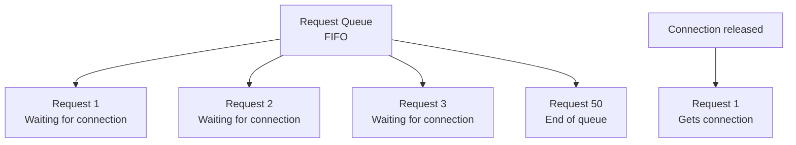
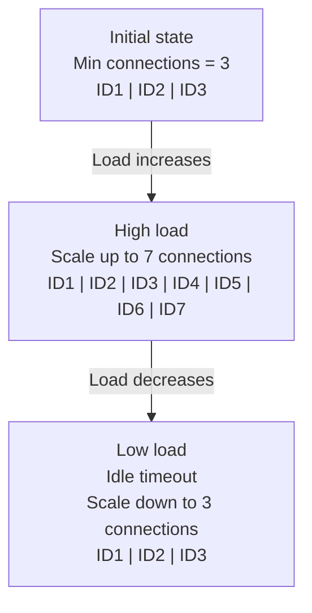

# Intro

## Giới Thiệu

Connection Pool (Bể kết nối) là một kỹ thuật quản lý tập hợp các kết nối được tái sử dụng để cải thiện hiệu suất và tối ưu hóa việc sử dụng tài nguyên. Thay vì tạo và đóng kết nối mỗi khi cần, ứng dụng sẽ lấy kết nối từ pool, sử dụng, rồi trả lại để tái sử dụng.

## Tại Sao Cần Connection Pool?

### Vấn Đề Khi Không Sử Dụng Pool

```typescript
// Không hiệu quả - tạo kết nối mới mỗi lần
async function executeQuery(query: string) {
  const connection = await createConnection(); // Tốn thời gian
  const result = await connection.query(query);
  await connection.close(); // Lãng phí tài nguyên
  return result;
}
```

**Nhược điểm:**
- Tốn thời gian tạo/đóng kết nối
- Lãng phí tài nguyên hệ thống
- Hiệu suất kém khi có nhiều request
- Quá tải server database

### Giải Pháp Với Connection Pool

```typescript
// Hiệu quả - tái sử dụng kết nối
async function executeQuery(query: string) {
  const connection = await pool.acquire(); // Nhanh
  try {
    const result = await connection.query(query);
    return result;
  } finally {
    await pool.release(connection); // Trả lại để tái sử dụng
  }
}
```

**Ưu điểm:**
- Nhanh hơn 10-100 lần
- Sử dụng tài nguyên hiệu quả
- Quản lý kết nối tốt hơn
- Bảo vệ database khỏi quá tải

## Các Tính Năng Chính

### 1. Pool Manager

Quản lý toàn bộ vòng đời của các kết nối:

```typescript
const poolManager = new ConnectionPoolManager({
  minConnections: 3,      // Số kết nối tối thiểu
  maxConnections: 10,     // Số kết nối tối đa
});
```

**Chức năng:**
- Khởi tạo và duy trì kết nối
- Tự động mở rộng khi cần
- Tự động thu hẹp khi rảnh
- Theo dõi trạng thái và thống kê

### 2. Connection Objects

Mỗi kết nối có các trạng thái:

```typescript
enum ConnectionState {
  IDLE = 'IDLE',              // Rảnh, sẵn sàng sử dụng
  IN_USE = 'IN_USE',          // Đang được sử dụng
  CONNECTING = 'CONNECTING',   // Đang kết nối
  DISCONNECTED = 'DISCONNECTED', // Đã ngắt kết nối
  FAILED = 'FAILED',          // Lỗi
}
```

**Thuộc tính theo dõi:**
- ID duy nhất
- Thời gian tạo
- Lần sử dụng cuối
- Số lần thất bại
- Trạng thái sức khỏe

### 3. Acquisition/Release Logic

#### Lấy Kết Nối (Acquire)

```typescript
// Cách 1: Tự động (Khuyên dùng)
const result = await poolManager.executeWithConnection(async (conn) => {
  return await conn.executeQuery('SELECT * FROM users');
});

// Cách 2: Thủ công
const conn = await poolManager.acquire();
try {
  const result = await conn.executeQuery('SELECT * FROM users');
  return result;
} finally {
  await poolManager.release(conn); // Phải trả lại!
}
```

**Quy trình lấy kết nối:**
1. Kiểm tra có kết nối rảnh không?
   - Có → Trả về ngay lập tức
   - Không → Chuyển bước 2
2. Có thể tạo kết nối mới không?
   - Có (chưa đạt max) → Tạo mới
   - Không → Chuyển bước 3
3. Đưa request vào hàng đợi
4. Chờ đến khi có kết nối hoặc timeout

### 4. Queue / Request Handling 

Khi tất cả kết nối đều bận, request được xếp hàng:



**Cấu hình:**
- `maxQueueSize: 50` - Tối đa 50 request trong hàng
- `acquireTimeoutMs: 5000` - Timeout sau 5 giây
- Quá số lượng → Từ chối ngay (backpressure)

### 5. Idle Timeout 

Tự động dọn dẹp kết nối không dùng đến:

```typescript
// Cấu hình
idleTimeoutMs: 30000  // 30 giây

// Quy trình
Kết nối rảnh > 30s → Kiểm tra
  ↓
Đủ số lượng tối thiểu?
  ├─ Không → Giữ lại
  └─ Có → Đóng kết nối
```

**Lợi ích:**
- Tiết kiệm tài nguyên
- Pool luôn gọn nhẹ
- Duy trì số lượng tối ưu

### 6. Max/Min Connections 

#### Minimum Connections
```typescript
minConnections: 3
```
- Luôn có sẵn kết nối
- Response time nhanh
- Chi phí ổn định

#### Maximum Connections (Tối Đa)
```typescript
maxConnections: 10
```
- Bảo vệ database khỏi quá tải
- Kiểm soát tài nguyên
- Kích hoạt backpressure khi đầy

#### Ví Dụ Scaling



### 7. Health Check & Reconnect 

#### Health Check

```typescript
healthCheckIntervalMs: 60000  // Mỗi 60 giây

// Quy trình
Mỗi 60s → Kiểm tra tất cả kết nối IDLE
  ↓
Kết nối có hoạt động tốt?
  ├─ Có → Giữ lại 
  └─ Không → Thử kết nối lại
```

#### Auto Reconnect

```typescript
maxRetries: 3       // Thử lại tối đa 3 lần
retryDelayMs: 1000  // Đợi 1 giây giữa các lần

// Quy trình
Kết nối lỗi
  ↓
Thử lại lần 1 (đợi 1s)
  ↓ Lỗi
Thử lại lần 2 (đợi 1s)
  ↓ Lỗi
Thử lại lần 3 (đợi 1s)
  ↓ Lỗi
Loại bỏ kết nối 
Tạo kết nối mới 
```

### 8. Configuration Options

```typescript
const config: PoolConfig = {
  // === Kích thước pool ===
  minConnections: 3,           // Tối thiểu 3 kết nối
  maxConnections: 10,          // Tối đa 10 kết nối
  
  // === Thời gian chờ ===
  idleTimeoutMs: 30000,        // 30s không dùng → đóng
  acquireTimeoutMs: 5000,      // 5s timeout lấy kết nối
  connectionTimeoutMs: 5000,   // 5s timeout tạo kết nối
  
  // === Health check ===
  healthCheckIntervalMs: 60000, // Kiểm tra mỗi 60s
  maxRetries: 3,               // Thử lại tối đa 3 lần
  retryDelayMs: 1000,          // Đợi 1s giữa các lần thử
  
  // === Hàng đợi ===
  maxQueueSize: 50,            // Tối đa 50 request đợi
  
  // === Tùy chọn khác ===
  validateBeforeUse: true,     // Kiểm tra trước khi dùng
};
```

### 9. Backpressure Handling

Bảo vệ hệ thống khỏi quá tải:

```typescript
maxQueueSize: 50

// Kịch bản
Request 1-10  → Vào pool (có kết nối) 
Request 11-60 → Vào queue (đợi) 
Request 61+   → Từ chối ngay!  "Queue is full"
```

**Lợi ích:**
- Bảo vệ memory khỏi tràn
- Response nhanh thay vì timeout
- Thống kê overflow để scale

## Hướng Dẫn Sử Dụng

### Cài Đặt Module

```typescript
// app.module.ts
import { ConnectionPoolModule } from './connection-pool/connection-pool.module';

@Module({
  imports: [
    ConnectionPoolModule,  // Import module
  ],
})
export class AppModule {}
```

### Sử Dụng Trong Service

```typescript
import { Injectable } from '@nestjs/common';
import { ConnectionPoolManager } from './connection-pool/pool/pool-manager.service';

@Injectable()
export class UserService {
  constructor(
    private readonly poolManager: ConnectionPoolManager
  ) {}

  // Ví dụ 1: Truy vấn đơn giản
  async getUser(id: number) {
    return this.poolManager.executeWithConnection(async (connection) => {
      return await connection.executeQuery(
        `SELECT * FROM users WHERE id = ${id}`
      );
    });
  }

  // Ví dụ 2: Transaction
  async createUserWithAccount(userData: any) {
    return this.poolManager.executeWithConnection(async (connection) => {
      await connection.executeQuery('BEGIN TRANSACTION');
      
      try {
        await connection.executeQuery(
          `INSERT INTO users (name, email) VALUES ('${userData.name}', '${userData.email}')`
        );
        await connection.executeQuery(
          `INSERT INTO accounts (user_id, balance) VALUES (1, 0)`
        );
        await connection.executeQuery('COMMIT');
      } catch (error) {
        await connection.executeQuery('ROLLBACK');
        throw error;
      }
    });
  }

  // Ví dụ 3: Xử lý batch
  async processBatch(items: any[]) {
    const promises = items.map(item =>
      this.poolManager.executeWithConnection(async (connection) => {
        return await connection.executeQuery(
          `INSERT INTO items VALUES (${item.id}, '${item.name}')`
        );
      })
    );
    
    return Promise.all(promises);
  }
}
```

### API Endpoints Demo

#### 1. Lấy Thông Tin Pool

```bash
curl http://localhost:8080/connection-pool/info
```

**Response:**
```json
{
  "message": "Connection pool information",
  "config": {
    "minConnections": 3,
    "maxConnections": 10,
    "idleTimeoutMs": 30000,
    "acquireTimeoutMs": 5000,
    "healthCheckIntervalMs": 60000,
    "maxQueueSize": 50,
    "maxRetries": 3
  },
  "currentState": {
    "totalConnections": 5,
    "idleConnections": 3,
    "activeConnections": 2,
    "pendingRequests": 0,
    "failedConnections": 0
  },
  "lifetimeStats": {
    "totalAcquired": 150,
    "totalReleased": 148,
    "totalCreated": 8,
    "totalDestroyed": 3,
    "queueOverflows": 0
  },
  "utilization": {
    "connectionUtilization": "40.0%",
    "poolCapacity": "5/10",
    "queueCapacity": "0/50"
  }
}
```

#### 2. Thực Thi Query

```bash
curl -X POST http://localhost:8080/connection-pool/query \
  -H "Content-Type: application/json" \
  -d '{"query":"SELECT * FROM users WHERE id = 1"}'
```

#### 3. Test Concurrent (Đồng Thời)

```bash
curl -X POST "http://localhost:8080/connection-pool/test-concurrent?count=10"
```

#### 4. Test Backpressure

```bash
curl -X POST "http://localhost:8080/connection-pool/test-backpressure?count=60"
```

#### 5. Kiểm Tra Sức Khỏe

```bash
curl -X POST http://localhost:8080/connection-pool/health-check
```

#### 6. Test Timeout

```bash
curl -X POST http://localhost:8080/connection-pool/test-timeout
```

#### 7. Demo Transaction

```bash
curl -X POST http://localhost:8080/connection-pool/demo-transaction \
  -H "Content-Type: application/json" \
  -d '{
    "operations": [
      "BEGIN TRANSACTION",
      "INSERT INTO users VALUES (1, \"Alice\")",
      "UPDATE accounts SET balance = 100 WHERE user_id = 1",
      "COMMIT"
    ]
  }'
```

#### 8. Chạy Ví Dụ Code

```bash
# Chạy ví dụ số 1 (Basic Query)
curl "http://localhost:8080/connection-pool/examples/1"

# Chạy ví dụ số 3 (Concurrent Operations)
curl "http://localhost:8080/connection-pool/examples/3"

# Chạy ví dụ số 5 (Backpressure)
curl "http://localhost:8080/connection-pool/examples/5"

# Chạy tất cả 10 ví dụ
curl -X POST http://localhost:8080/connection-pool/examples/run-all
```

