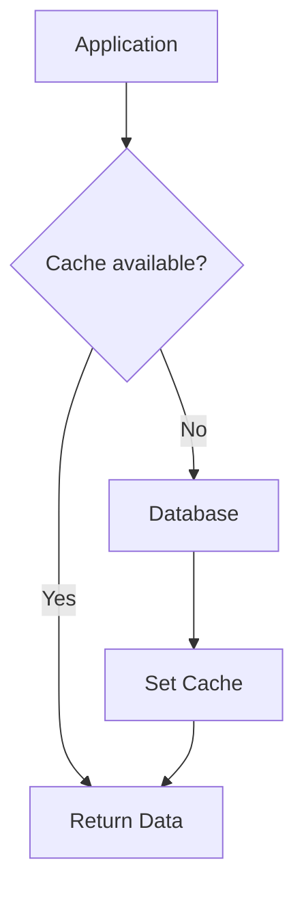
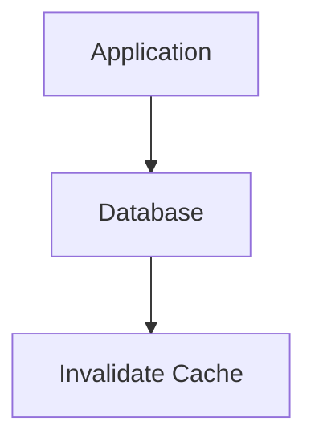

# Cache Aside (Lazy Loading)

Cache Aside, còn được gọi là Lazy Loading, là một trong những chiến lược cache phổ biến nhất. Trong pattern này, application chịu trách nhiệm đọc và ghi vào cả cache và database.

## Đặc Điểm

- **Application-managed**: Application kiểm soát hoàn toàn việc đọc/ghi cache
- **Lazy loading**: Dữ liệu chỉ được load vào cache khi cần thiết
- **Cache invalidation**: Khi update data, cache phải được invalidate thủ công
- **Best for**: Read-heavy workloads với data ít thay đổi

## Flow Diagram

### Read Flow


### Write Flow


## Implementation

### Service Implementation

```typescript
// backend/src/cache/strategies/cache-strategies.service.ts
async cacheAside(productId: number): Promise<{ 
  product: Product | null; 
  source: string; 
  latency: number 
}> {
  const startTime = Date.now();
  const cacheKey = `cache-aside:product:${productId}`;
  
  // Step 1: Try to get from cache
  this.logger.log(`[Cache Aside] Checking cache for product ${productId}`);
  const cached = await this.cacheManager.get<Product>(cacheKey);
  
  if (cached) {
    const latency = Date.now() - startTime;
    this.logger.log(`[Cache Aside] Cache HIT for product ${productId}`);
    return { product: cached, source: 'cache', latency };
  }
  
  // Step 2: Cache miss - read from database
  this.logger.log(`[Cache Aside] Cache MISS for product ${productId} - reading from DB`);
  await this.simulateDbLatency();
  const product = this.database.get(productId) || null;
  
  if (product) {
    // Step 3: Write to cache
    this.logger.log(`[Cache Aside] Writing product ${productId} to cache`);
    await this.cacheManager.set(cacheKey, product, 60000); // 60 seconds TTL
  }
  
  const latency = Date.now() - startTime;
  return { product, source: 'database', latency };
}

async cacheAsideUpdate(productId: number, updates: Partial<Product>): Promise<{ 
  product: Product | null; 
  message: string 
}> {
  const cacheKey = `cache-aside:product:${productId}`;
  
  // Step 1: Update database
  this.logger.log(`[Cache Aside] Updating product ${productId} in DB`);
  await this.simulateDbLatency();
  const product = this.database.get(productId);
  
  if (!product) {
    return { product: null, message: 'Product not found' };
  }
  
  const updatedProduct = { ...product, ...updates, updatedAt: new Date() };
  this.database.set(productId, updatedProduct);
  
  // Step 2: Invalidate cache (remove stale data)
  this.logger.log(`[Cache Aside] Invalidating cache for product ${productId}`);
  await this.cacheManager.del(cacheKey);
  
  return { product: updatedProduct, message: 'Product updated, cache invalidated' };
}
```

### Controller Endpoints

```typescript
// backend/src/cache/strategies/cache-strategies.controller.ts
@Controller('cache-strategies')
export class CacheStrategiesController {
  
  @Get('cache-aside/:id')
  async cacheAsideRead(@Param('id') id: string) {
    return this.cacheStrategiesService.cacheAside(parseInt(id));
  }

  @Put('cache-aside/:id')
  async cacheAsideUpdate(
    @Param('id') id: string,
    @Body() updates: { name?: string; price?: number; stock?: number },
  ) {
    return this.cacheStrategiesService.cacheAsideUpdate(parseInt(id), updates);
  }
}
```

## Usage Examples

### Reading Data

```bash
# First read - Cache miss, reads from DB
curl http://localhost:3000/cache-strategies/cache-aside/1

# Response:
{
  "product": {
    "id": 1,
    "name": "Laptop",
    "price": 999.99,
    "stock": 10,
    "updatedAt": "2024-01-15T10:30:00.000Z"
  },
  "source": "database",
  "latency": 127
}

# Second read - Cache hit
curl http://localhost:3000/cache-strategies/cache-aside/1

# Response:
{
  "product": {
    "id": 1,
    "name": "Laptop",
    "price": 999.99,
    "stock": 10,
    "updatedAt": "2024-01-15T10:30:00.000Z"
  },
  "source": "cache",
  "latency": 3
}
```

### Updating Data

```bash
# Update product
curl -X PUT http://localhost:3000/cache-strategies/cache-aside/1 \
  -H "Content-Type: application/json" \
  -d '{"price": 899.99, "stock": 8}'

# Response:
{
  "product": {
    "id": 1,
    "name": "Laptop",
    "price": 899.99,
    "stock": 8,
    "updatedAt": "2024-01-15T10:35:00.000Z"
  },
  "message": "Product updated, cache invalidated"
}

# Next read will be cache miss (cache was invalidated)
curl http://localhost:3000/cache-strategies/cache-aside/1
# Returns from database with latest data
```

## Ưu Điểm

### 1. Đơn Giản và Rõ Ràng
- Logic cache dễ hiểu và maintain
- Application có full control
- Dễ debug khi có issues

### 2. Resilient
- Cache failure không ảnh hưởng đến application
- Nếu cache down, application vẫn hoạt động (read from DB)
- Data luôn được persist trong database

### 3. Chỉ Cache Data Cần Thiết
- Lazy loading - chỉ cache data được request
- Tiết kiệm memory
- Không waste cache space cho unused data

### 4. Phù Hợp Read-Heavy Workloads
- Giảm DB load cho read operations
- Cải thiện response time đáng kể
- Cache hit rate cao cho frequently accessed data

## Nhược Điểm

### 1. Cache Miss Penalty
- First read luôn chậm (cache miss)
- Cold start performance không tốt
- Có thể tạo latency spikes

### 2. Cache Inconsistency Risk
- Cache và DB có thể out of sync
- Manual invalidation có thể miss cases
- TTL expiration có thể trả về stale data

### 3. Cache Stampede
- Multiple requests cùng lúc khi cache expires
- Nhiều requests đồng thời hit DB
- Cần implement distributed lock để prevent

```typescript
// Without protection - Cache Stampede
async function getProduct(id) {
  let product = await cache.get(id);
  if (!product) {
    // Multiple requests execute this simultaneously!
    product = await db.query(id);
    await cache.set(id, product);
  }
  return product;
}
```

### 4. Stale Data Window
- Khoảng thời gian giữa DB update và cache invalidation
- Race conditions có thể xảy ra
- Cần careful transaction handling

## Best Practices

### 1. Set Appropriate TTL

```typescript
// Short TTL for frequently changing data
await cache.set('product:1', product, 60); // 1 minute

// Long TTL for rarely changing data
await cache.set('category:1', category, 3600); // 1 hour
```

### 2. Implement Cache Warming

```typescript
// Pre-populate cache on application startup
async warmCache() {
  const popularProducts = await db.getPopularProducts();
  for (const product of popularProducts) {
    await cache.set(`product:${product.id}`, product, 3600);
  }
}
```

### 3. Handle Cache Failures Gracefully

```typescript
async getProduct(id: number) {
  try {
    const cached = await cache.get(`product:${id}`);
    if (cached) return cached;
  } catch (error) {
    this.logger.warn('Cache error, falling back to DB', error);
  }
  
  // Always fallback to DB
  return await db.getProduct(id);
}
```

### 4. Use Consistent Cache Keys

```typescript
// Cache key patterns
const CACHE_KEYS = {
  PRODUCT: (id: number) => `product:${id}`,
  PRODUCT_LIST: (page: number) => `products:page:${page}`,
  USER_CART: (userId: number) => `cart:user:${userId}`,
};
```

### 5. Invalidate Related Caches

```typescript
async updateProduct(id: number, updates: Partial<Product>) {
  // Update DB
  const product = await db.updateProduct(id, updates);
  
  // Invalidate all related caches
  await cache.del(`product:${id}`);
  await cache.del(`products:page:*`); // Wildcard delete
  await cache.del(`category:${product.categoryId}`);
  
  return product;
}
```
