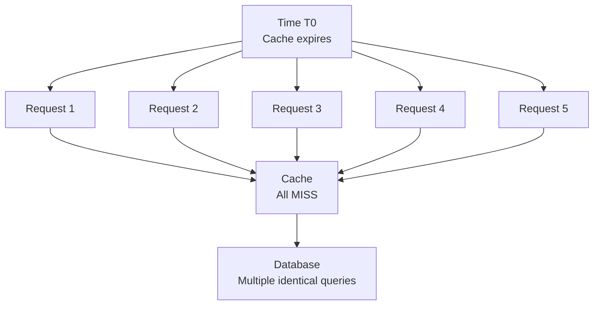
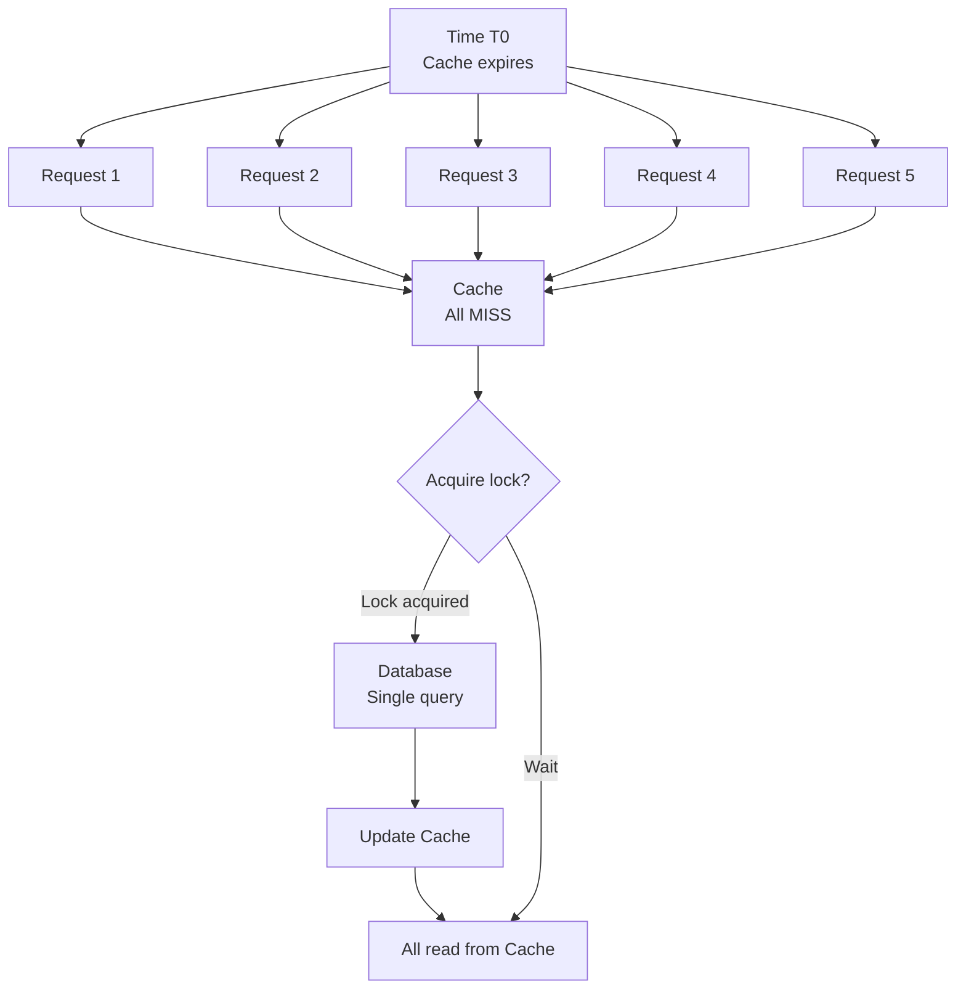

# Distributed Lock + Cache

Distributed Lock + Cache là một pattern kết hợp distributed locking với caching để giải quyết vấn đề **Cache Stampede** (hay **Thundering Herd**). Pattern này đảm bảo chỉ một request load data từ database khi cache miss, trong khi các requests khác đợi và nhận data từ cache.

## Vấn Đề: Cache Stampede

### Cache Stampede là gì?

Cache Stampede xảy ra khi:
1. Cache key expires hoặc được invalidate
2. Nhiều requests đồng thời cố gắng đọc key đó
3. Tất cả requests đều cache miss
4. Tất cả requests đồng thời query database
5. Database bị overwhelmed với duplicate queries



### Impact của Cache Stampede

1. **Database overload**: Spike in DB queries
2. **Increased latency**: All requests chậm
3. **Resource waste**: Duplicate work
4. **Potential cascading failures**: DB can crash

## Giải Pháp: Distributed Lock

Sử dụng distributed lock để:
1. Chỉ một request acquire lock và load từ DB
2. Các requests khác đợi lock holder populate cache
3. Sau khi cache populated, tất cả requests đọc từ cache



## Implementation

### Service Implementation

```typescript
// backend/src/cache/strategies/cache-strategies.service.ts
async distributedLockCache(productId: number): Promise<{ 
  product: Product | null; 
  source: string; 
  latency: number;
  lockAcquired: boolean;
  retries: number;
}> {
  const startTime = Date.now();
  const cacheKey = `lock-cache:product:${productId}`;
  const lockKey = `lock:product:${productId}`;
  let retries = 0;
  let lockAcquired = false;
  
  // Step 1: Check cache
  this.logger.log(`[Distributed Lock] Checking cache for product ${productId}`);
  let product = await this.cacheManager.get<Product>(cacheKey);
  
  if (product) {
    const latency = Date.now() - startTime;
    this.logger.log(`[Distributed Lock] Cache HIT for product ${productId}`);
    return { product, source: 'cache', latency, lockAcquired: false, retries: 0 };
  }
  
  // Step 2: Try to acquire distributed lock
  this.logger.log(`[Distributed Lock] Cache MISS - attempting to acquire lock for product ${productId}`);
  const lockAcquiredResult = await this.acquireLock(lockKey, 10000); // 10 second lock
  
  if (lockAcquiredResult) {
    lockAcquired = true;
    this.logger.log(`[Distributed Lock] Lock ACQUIRED for product ${productId} - loading from DB`);
    
    try {
      // Step 3: Load from database
      await this.simulateDbLatency();
      product = this.database.get(productId) || null;
      
      if (product) {
        // Step 4: Update cache
        this.logger.log(`[Distributed Lock] Updating cache for product ${productId}`);
        await this.cacheManager.set(cacheKey, product, 300000);
      }
    } finally {
      // Step 5: Release lock
      await this.releaseLock(lockKey);
      this.logger.log(`[Distributed Lock] Lock RELEASED for product ${productId}`);
    }
    
    const latency = Date.now() - startTime;
    return { product, source: 'database (lock holder)', latency, lockAcquired: true, retries };
  } else {
    // Lock not acquired - another request is loading data
    this.logger.log(`[Distributed Lock] Lock NOT acquired for product ${productId} - waiting for cache update`);
    
    // Wait and retry reading from cache
    const maxRetries = 5;
    while (retries < maxRetries) {
      await this.sleep(500); // Wait 500ms
      retries++;
      
      product = await this.cacheManager.get<Product>(cacheKey);
      if (product) {
        const latency = Date.now() - startTime;
        this.logger.log(`[Distributed Lock] Cache populated by lock holder after ${retries} retries`);
        return { product, source: 'cache (after wait)', latency, lockAcquired: false, retries };
      }
    }
    
    // Fallback: read from DB directly if cache still not populated
    this.logger.warn(`[Distributed Lock] Cache still empty after ${maxRetries} retries - reading from DB`);
    await this.simulateDbLatency();
    product = this.database.get(productId) || null;
    
    const latency = Date.now() - startTime;
    return { product, source: 'database (fallback)', latency, lockAcquired: false, retries };
  }
}

/**
 * Acquire distributed lock using Redis
 */
private async acquireLock(lockKey: string, ttlMs: number): Promise<boolean> {
  try {
    const result = await this.redis.set(lockKey, '1', {
      PX: ttlMs,  // TTL in milliseconds
      NX: true,   // Only set if not exists
    });
    return result === 'OK';
  } catch (error) {
    this.logger.error(`Failed to acquire lock ${lockKey}`, error);
    return false;
  }
}

/**
 * Release distributed lock
 */
private async releaseLock(lockKey: string): Promise<void> {
  try {
    await this.redis.del(lockKey);
  } catch (error) {
    this.logger.error(`Failed to release lock ${lockKey}`, error);
  }
}

private sleep(ms: number): Promise<void> {
  return new Promise(resolve => setTimeout(resolve, ms));
}
```

### Cache Stampede Simulation

```typescript
/**
 * Simulate cache stampede scenario
 * Multiple concurrent requests for the same resource
 */
async simulateCacheStampede(productId: number): Promise<{
  totalRequests: number;
  dbReads: number;
  cacheHits: number;
  avgLatency: number;
}> {
  const cacheKey = `stampede:product:${productId}`;
  
  // Clear cache to simulate cold start
  await this.cacheManager.del(cacheKey);
  
  this.logger.log(`[Cache Stampede] Simulating 10 concurrent requests for product ${productId}`);
  
  // Without lock - cache stampede
  const requests = Array(10).fill(null).map(async (_, index) => {
    const start = Date.now();
    
    let product = await this.cacheManager.get<Product>(cacheKey);
    let source = 'cache';
    
    if (!product) {
      this.logger.log(`[Cache Stampede] Request ${index + 1} - Cache MISS, reading from DB`);
      await this.simulateDbLatency();
      product = this.database.get(productId) || null;
      source = 'database';
      
      if (product) {
        await this.cacheManager.set(cacheKey, product, 60000);
      }
    } else {
      this.logger.log(`[Cache Stampede] Request ${index + 1} - Cache HIT`);
    }
    
    return { latency: Date.now() - start, source };
  });
  
  const results = await Promise.all(requests);
  const dbReads = results.filter(r => r.source === 'database').length;
  const cacheHits = results.filter(r => r.source === 'cache').length;
  const avgLatency = results.reduce((sum, r) => sum + r.latency, 0) / results.length;
  
  this.logger.log(`[Cache Stampede] Results: ${dbReads} DB reads, ${cacheHits} cache hits, avg latency: ${avgLatency.toFixed(2)}ms`);
  
  return {
    totalRequests: results.length,
    dbReads,
    cacheHits,
    avgLatency,
  };
}
```

### Controller Endpoints

```typescript
// backend/src/cache/strategies/cache-strategies.controller.ts
@Controller('cache-strategies')
export class CacheStrategiesController {
  
  @Get('distributed-lock/:id')
  async distributedLockCache(@Param('id') id: string) {
    return this.cacheStrategiesService.distributedLockCache(parseInt(id));
  }

  @Post('distributed-lock/:id/stampede')
  async simulateCacheStampede(@Param('id') id: string) {
    return this.cacheStrategiesService.simulateCacheStampede(parseInt(id));
  }
}
```

## Usage Examples

### Normal Read with Distributed Lock

```bash
# Single request - normal flow
curl http://localhost:3000/cache-strategies/distributed-lock/1

# Response (lock holder):
{
  "product": {
    "id": 1,
    "name": "Laptop",
    "price": 999.99,
    "stock": 10,
    "updatedAt": "2024-01-15T11:00:00.000Z"
  },
  "source": "database (lock holder)",
  "latency": 132,
  "lockAcquired": true,
  "retries": 0
}

# Subsequent request - cache hit
curl http://localhost:3000/cache-strategies/distributed-lock/1

# Response:
{
  "product": { /* ... */ },
  "source": "cache",
  "latency": 3,
  "lockAcquired": false,
  "retries": 0
}
```

### Cache Stampede Simulation

```bash
# Simulate cache stampede
curl -X POST http://localhost:3000/cache-strategies/distributed-lock/2/stampede

# Response (WITHOUT distributed lock):
{
  "totalRequests": 10,
  "dbReads": 10,        #  All 10 requests hit DB!
  "cacheHits": 0,
  "avgLatency": 125.3
}

# Now test WITH distributed lock implementation
# Clear cache first
curl -X DELETE http://localhost:3000/cache-strategies/clear

# Send 10 concurrent requests
for i in {1..10}; do
  curl http://localhost:3000/cache-strategies/distributed-lock/1 &
done
wait

# Check logs - only 1 DB read occurred! ✓
```

## Ưu Điểm

### 1. Prevents Cache Stampede
- Chỉ 1 request load từ DB
- Các requests khác đợi và read from cache
- Dramatically reduce DB load

```bash
# Without lock: 100 concurrent requests = 100 DB queries 
# With lock:    100 concurrent requests = 1 DB query ✓
```

### 2. Protects Database
- Prevent DB overload
- Avoid cascading failures
- Better system stability

### 3. Consistent Performance
- Predictable latency
- No sudden spikes
- Better user experience

### 4. Resource Efficiency
- No duplicate work
- Better resource utilization
- Lower costs

## Nhược Điểm

### 1. Added Complexity
- Need distributed lock implementation
- More moving parts
- Harder to debug

### 2. Lock Contention
- Requests phải đợi lock
- Potential bottleneck
- May increase latency cho some requests

### 3. Lock Failures
- Lock service unavailable
- Lock timeout issues
- Need fallback strategy

### 4. Lock Management Overhead
- Lock acquisition/release time
- Redis calls overhead
- Network latency

## Advanced Patterns

### 1. Lock with Exponential Backoff

```typescript
class ExponentialBackoffLock {
  async getWithLock(key: string): Promise<Product | null> {
    // Try cache
    let product = await this.cache.get(key);
    if (product) return product;
    
    // Try acquire lock
    if (await this.acquireLock(key)) {
      try {
        product = await this.loadFromDb(key);
        if (product) await this.cache.set(key, product);
        return product;
      } finally {
        await this.releaseLock(key);
      }
    }
    
    // Wait with exponential backoff
    let waitTime = 100; // Start with 100ms
    const maxRetries = 5;
    
    for (let i = 0; i < maxRetries; i++) {
      await this.sleep(waitTime);
      
      product = await this.cache.get(key);
      if (product) return product;
      
      waitTime *= 2; // Exponential backoff: 100, 200, 400, 800, 1600ms
    }
    
    // Fallback
    return await this.loadFromDb(key);
  }
}
```

### 2. Lock with Lua Script (Atomic Operations)

```typescript
class AtomicLockCache {
  // Lua script for atomic lock acquisition
  private lockScript = `
    if redis.call("exists", KEYS[1]) == 0 then
      redis.call("setex", KEYS[1], ARGV[1], ARGV[2])
      return 1
    else
      return 0
    end
  `;
  
  async acquireLock(lockKey: string, ttl: number): Promise<boolean> {
    const result = await this.redis.eval(
      this.lockScript,
      1,
      lockKey,
      ttl,
      '1',
    );
    return result === 1;
  }
  
  // Lua script for atomic lock release with ownership check
  private unlockScript = `
    if redis.call("get", KEYS[1]) == ARGV[1] then
      return redis.call("del", KEYS[1])
    else
      return 0
    end
  `;
  
  async releaseLock(lockKey: string, lockValue: string): Promise<boolean> {
    const result = await this.redis.eval(
      this.unlockScript,
      1,
      lockKey,
      lockValue,
    );
    return result === 1;
  }
}
```

### 3. Redlock Algorithm (Multiple Redis Instances)

```typescript
import Redlock from 'redlock';

class RedlockCache {
  private redlock: Redlock;
  
  constructor(redisClients: RedisClientType[]) {
    this.redlock = new Redlock(redisClients, {
      driftFactor: 0.01,
      retryCount: 10,
      retryDelay: 200,
    });
  }
  
  async getWithRedlock(key: string): Promise<Product | null> {
    const lockKey = `lock:${key}`;
    const ttl = 10000; // 10 seconds
    
    // Try cache
    let product = await this.cache.get(key);
    if (product) return product;
    
    // Try acquire Redlock
    try {
      const lock = await this.redlock.acquire([lockKey], ttl);
      
      try {
        // Load from DB
        product = await this.db.get(key);
        if (product) {
          await this.cache.set(key, product);
        }
        return product;
      } finally {
        await lock.release();
      }
    } catch (error) {
      // Lock not acquired - wait and retry cache
      await this.sleep(500);
      return await this.cache.get(key) || await this.db.get(key);
    }
  }
}
```

### 4. Optimistic Locking with Versioning

```typescript
class OptimisticLockCache {
  async getWithOptimisticLock(key: string): Promise<Product | null> {
    // Try cache
    let product = await this.cache.get(key);
    if (product) return product;
    
    const lockKey = `lock:${key}`;
    const version = Date.now().toString();
    
    // Try set lock with version
    const locked = await this.redis.set(lockKey, version, {
      NX: true,
      PX: 10000,
    });
    
    if (locked === 'OK') {
      // We got the lock
      try {
        product = await this.db.get(key);
        if (product) {
          await this.cache.set(key, product);
        }
      } finally {
        // Only delete if our version (avoid deleting other's lock)
        const currentVersion = await this.redis.get(lockKey);
        if (currentVersion === version) {
          await this.redis.del(lockKey);
        }
      }
      return product;
    }
    
    // Wait for lock holder
    for (let i = 0; i < 5; i++) {
      await this.sleep(500);
      product = await this.cache.get(key);
      if (product) return product;
    }
    
    return await this.db.get(key);
  }
}
```

## Best Practices

### 1. Set Appropriate Lock TTL

```typescript
const LOCK_TTL = {
  FAST_QUERY: 5000,    // 5 seconds for fast queries
  NORMAL_QUERY: 10000,  // 10 seconds for normal queries
  SLOW_QUERY: 30000,   // 30 seconds for slow queries
};

// Use based on expected query time
const lockTtl = isSlowQuery ? LOCK_TTL.SLOW_QUERY : LOCK_TTL.NORMAL_QUERY;
await this.acquireLock(lockKey, lockTtl);
```

### 2. Implement Timeout và Fallback

```typescript
async getWithLockAndTimeout(key: string): Promise<Product | null> {
  const timeout = 5000; // 5 second total timeout
  const startTime = Date.now();
  
  try {
    return await Promise.race([
      this.getWithLock(key),
      this.timeoutPromise(timeout),
    ]);
  } catch (error) {
    if (Date.now() - startTime >= timeout) {
      // Timeout - fallback to direct DB read
      this.logger.warn('Lock timeout, falling back to DB');
      return await this.db.get(key);
    }
    throw error;
  }
}
```

### 3. Monitor Lock Metrics

```typescript
async getWithLockAndMetrics(key: string): Promise<Product | null> {
  const startTime = Date.now();
  
  // Try cache
  const cached = await this.cache.get(key);
  if (cached) {
    this.metrics.increment('lock.cache_hit');
    return cached;
  }
  
  this.metrics.increment('lock.cache_miss');
  
  // Try acquire lock
  const lockStart = Date.now();
  const locked = await this.acquireLock(key);
  this.metrics.histogram('lock.acquire_time', Date.now() - lockStart);
  
  if (locked) {
    this.metrics.increment('lock.acquired');
    try {
      const product = await this.db.get(key);
      if (product) await this.cache.set(key, product);
      return product;
    } finally {
      await this.releaseLock(key);
      this.metrics.increment('lock.released');
    }
  } else {
    this.metrics.increment('lock.wait');
    // Wait logic...
  }
  
  this.metrics.histogram('lock.total_time', Date.now() - startTime);
}
```

### 4. Use with Cache Warming

```typescript
class WarmingLockCache {
  async warmPopularItems(): Promise<void> {
    const popularIds = await this.analytics.getPopularProducts();
    
    // Warm cache with distributed coordination
    for (const id of popularIds) {
      const lockKey = `warm:product:${id}`;
      
      if (await this.acquireLock(lockKey, 60000)) {
        try {
          const product = await this.db.get(id);
          if (product) {
            await this.cache.set(`product:${id}`, product, 3600000);
            this.logger.log(`Warmed cache for product ${id}`);
          }
        } finally {
          await this.releaseLock(lockKey);
        }
      }
    }
  }
}
```