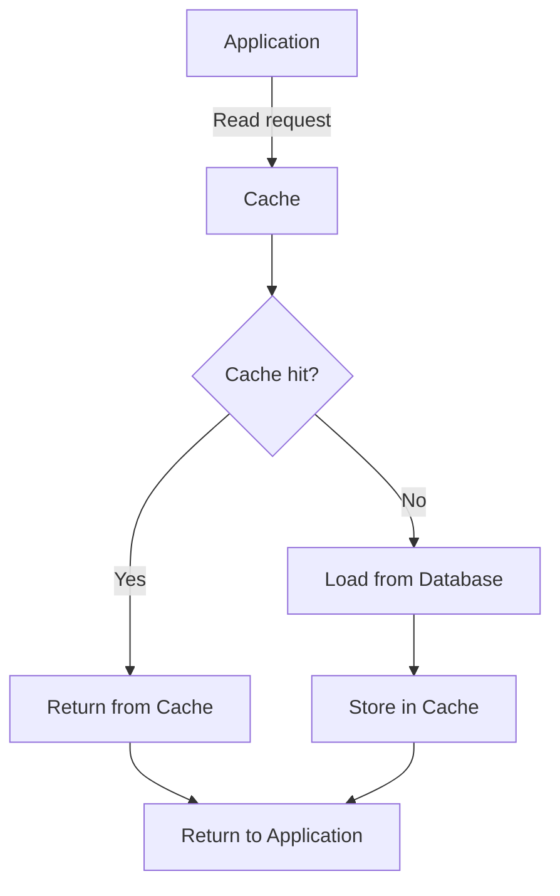

# Read Through

Read Through là một chiến lược caching trong đó cache nằm giữa application và database, và cache tự động chịu trách nhiệm load data từ database khi có cache miss. Application chỉ tương tác với cache layer.

## Đặc Điểm

- **Cache-managed loading**: Cache tự động load từ DB khi miss
- **Transparent to application**: Application chỉ biết về cache
- **Automatic population**: Cache tự populate khi miss
- **Best for**: Read-heavy workloads với predictable access patterns

## Flow Diagram

### Read Flow


### Comparison with Cache Aside
```
CACHE ASIDE (Application loads):
App → Cache → Miss → App → DB → App → Cache → App

READ THROUGH (Cache loads):
App → Cache → Miss → Cache → DB → Cache → App
```

## Implementation

### Service Implementation

```typescript
// backend/src/cache/strategies/cache-strategies.service.ts
async readThrough(productId: number): Promise<{ 
  product: Product | null; 
  source: string; 
  latency: number 
}> {
  const startTime = Date.now();
  const cacheKey = `read-through:product:${productId}`;
  
  // Step 1: Application reads from cache
  this.logger.log(`[Read Through] Checking cache for product ${productId}`);
  let product = await this.cacheManager.get<Product>(cacheKey);
  
  if (product) {
    const latency = Date.now() - startTime;
    this.logger.log(`[Read Through] Cache HIT for product ${productId}`);
    return { product, source: 'cache', latency };
  }
  
  // Step 2: Cache miss - cache is responsible for loading from DB
  this.logger.log(`[Read Through] Cache MISS - cache loading from DB for product ${productId}`);
  await this.simulateDbLatency();
  product = this.database.get(productId) || null;
  
  if (product) {
    // Step 3: Cache automatically stores the data
    this.logger.log(`[Read Through] Cache storing product ${productId}`);
    await this.cacheManager.set(cacheKey, product, 300000); // 5 min TTL
  }
  
  const latency = Date.now() - startTime;
  return { product, source: 'database (via cache)', latency };
}
```

### Advanced Read Through with Cache Provider

```typescript
/**
 * Professional Read Through implementation using cache provider pattern
 */
interface CacheProvider<T> {
  load(key: string): Promise<T | null>;
}

class ProductCacheProvider implements CacheProvider<Product> {
  constructor(private db: Database) {}
  
  async load(key: string): Promise<Product | null> {
    // Extract ID from key
    const id = parseInt(key.split(':')[1]);
    return await this.db.getProduct(id);
  }
}

class ReadThroughCache<T> {
  constructor(
    private cache: Cache,
    private provider: CacheProvider<T>,
    private ttl: number = 300000,
  ) {}
  
  async get(key: string): Promise<T | null> {
    // Try cache first
    let value = await this.cache.get<T>(key);
    
    if (value !== null && value !== undefined) {
      return value; // Cache hit
    }
    
    // Cache miss - use provider to load
    value = await this.provider.load(key);
    
    if (value !== null) {
      // Store in cache
      await this.cache.set(key, value, this.ttl);
    }
    
    return value;
  }
}

// Usage
const productCache = new ReadThroughCache(
  cacheManager,
  new ProductCacheProvider(database),
  300000,
);

const product = await productCache.get('product:1');
```

### Controller Endpoints

```typescript
// backend/src/cache/strategies/cache-strategies.controller.ts
@Controller('cache-strategies')
export class CacheStrategiesController {
  
  @Get('read-through/:id')
  async readThrough(@Param('id') id: string) {
    return this.cacheStrategiesService.readThrough(parseInt(id));
  }
}
```

## Usage Examples

### Basic Read

```bash
# First read - Cache miss, loads from DB
curl http://localhost:3000/cache-strategies/read-through/1

# Response:
{
  "product": {
    "id": 1,
    "name": "Laptop",
    "price": 999.99,
    "stock": 10,
    "updatedAt": "2024-01-15T10:30:00.000Z"
  },
  "source": "database (via cache)",
  "latency": 127
}

# Second read - Cache hit
curl http://localhost:3000/cache-strategies/read-through/1

# Response:
{
  "product": {
    "id": 1,
    "name": "Laptop",
    "price": 999.99,
    "stock": 10,
    "updatedAt": "2024-01-15T10:30:00.000Z"
  },
  "source": "cache",
  "latency": 3
}
```

## Ưu Điểm

### 1. Simple Application Code
- Application không cần biết về DB
- Không cần implement cache loading logic
- Code cleaner và easier to maintain

```typescript
// Application code - Very simple
async getProduct(id: number) {
  // Just ask cache - it handles everything
  return await this.cache.get(`product:${id}`);
}

// vs Cache Aside - More complex
async getProduct(id: number) {
  let product = await this.cache.get(`product:${id}`);
  if (!product) {
    product = await this.db.get(id);
    await this.cache.set(`product:${id}`, product);
  }
  return product;
}
```

### 2. Consistent Data Loading
- Cache loading logic centralized
- Easier to update loading strategy
- DRY principle - no duplicate code

### 3. Automatic Cache Population
- Cache tự động populate on miss
- Không cần manual cache warming
- Lazy loading tự động

### 4. Separation of Concerns
- Application layer: business logic
- Cache layer: data loading và caching
- Clear responsibility boundaries

## Nhược Điểm

### 1. Initial Request Latency
- First request chậm (cache miss)
- Same as Cache Aside
- Cold start problem

```bash
# First request latency
Request 1: 127ms (cache miss + DB load)
Request 2: 3ms   (cache hit)
Request 3: 3ms   (cache hit)
```

### 2. Cache Implementation Complexity
- Cache layer phải implement loading logic
- Not all cache systems support this
- May need custom implementation

### 3. Limited Flexibility
- Application không control loading process
- Hard to customize per request
- May not fit all use cases

### 4. Error Handling Complexity
- Cache layer must handle DB errors
- Error propagation through cache layer
- Debugging có thể khó hơn

## Read Through vs Cache Aside

| Aspect | Read Through | Cache Aside |
|--------|-------------|-------------|
| **Who loads data** | Cache | Application |
| **Application complexity** | Lower | Higher |
| **Flexibility** | Lower | Higher |
| **Code duplication** | None | Possible |
| **Cache vendor lock-in** | Higher | Lower |
| **Customization** | Harder | Easier |
| **Testing** | Cache layer | Application layer |

## Best Practices

### 1. Implement Cache Provider Pattern

```typescript
// Reusable cache providers
class DatabaseCacheProvider<T> implements CacheProvider<T> {
  constructor(
    private tableName: string,
    private db: Database,
  ) {}
  
  async load(key: string): Promise<T | null> {
    const id = this.extractId(key);
    return await this.db.query(this.tableName, id);
  }
  
  private extractId(key: string): number {
    return parseInt(key.split(':').pop()!);
  }
}

// Usage for different entities
const userCache = new ReadThroughCache(
  cache,
  new DatabaseCacheProvider('users', db),
);

const productCache = new ReadThroughCache(
  cache,
  new DatabaseCacheProvider('products', db),
);
```

### 2. Handle Cache Failures Gracefully

```typescript
class ResilientReadThroughCache<T> {
  async get(key: string): Promise<T | null> {
    try {
      // Try cache first
      const cached = await this.cache.get<T>(key);
      if (cached) return cached;
    } catch (cacheError) {
      this.logger.warn('Cache read failed, loading from DB', cacheError);
    }
    
    // Load from provider (DB)
    const value = await this.provider.load(key);
    
    if (value) {
      try {
        await this.cache.set(key, value, this.ttl);
      } catch (cacheError) {
        this.logger.warn('Cache write failed', cacheError);
        // Continue - we have the data
      }
    }
    
    return value;
  }
}
```

### 3. Implement Timeouts

```typescript
class TimeoutReadThroughCache<T> {
  constructor(
    private cache: Cache,
    private provider: CacheProvider<T>,
    private timeout: number = 5000,
  ) {}
  
  async get(key: string): Promise<T | null> {
    const cached = await this.cache.get<T>(key);
    if (cached) return cached;
    
    // Load with timeout
    const value = await Promise.race([
      this.provider.load(key),
      this.timeoutPromise(),
    ]);
    
    if (value) {
      await this.cache.set(key, value, this.ttl);
    }
    
    return value;
  }
  
  private timeoutPromise(): Promise<null> {
    return new Promise((resolve) => {
      setTimeout(() => resolve(null), this.timeout);
    });
  }
}
```

### 4. Add Metrics và Monitoring

```typescript
class MonitoredReadThroughCache<T> {
  async get(key: string): Promise<T | null> {
    const startTime = Date.now();
    
    // Try cache
    const cached = await this.cache.get<T>(key);
    if (cached) {
      this.metrics.increment('cache.hit');
      this.metrics.histogram('cache.latency', Date.now() - startTime);
      return cached;
    }
    
    // Cache miss
    this.metrics.increment('cache.miss');
    
    const loadStart = Date.now();
    const value = await this.provider.load(key);
    this.metrics.histogram('cache.load_latency', Date.now() - loadStart);
    
    if (value) {
      await this.cache.set(key, value, this.ttl);
      this.metrics.increment('cache.populate');
    }
    
    this.metrics.histogram('cache.total_latency', Date.now() - startTime);
    return value;
  }
}
```

### 5. Combine with Cache Warming

```typescript
class PreloadReadThroughCache<T> {
  async warmup(keys: string[]): Promise<void> {
    this.logger.log(`Warming up cache with ${keys.length} keys`);
    
    // Load all keys in parallel
    const promises = keys.map(async (key) => {
      const value = await this.provider.load(key);
      if (value) {
        await this.cache.set(key, value, this.ttl);
      }
    });
    
    await Promise.all(promises);
    this.logger.log('Cache warmup complete');
  }
  
  // On application startup
  async onModuleInit() {
    const popularProducts = [1, 2, 3, 4, 5];
    const keys = popularProducts.map(id => `product:${id}`);
    await this.warmup(keys);
  }
}
```

## Advanced Patterns

### 1. Multi-Level Read Through

```typescript
class MultiLevelReadThroughCache<T> {
  constructor(
    private l1Cache: Cache,  // Local in-memory cache
    private l2Cache: Cache,  // Redis cache
    private provider: CacheProvider<T>,
  ) {}
  
  async get(key: string): Promise<T | null> {
    // L1 cache check
    let value = await this.l1Cache.get<T>(key);
    if (value) {
      this.logger.log('L1 cache hit');
      return value;
    }
    
    // L2 cache check
    value = await this.l2Cache.get<T>(key);
    if (value) {
      this.logger.log('L2 cache hit, populating L1');
      await this.l1Cache.set(key, value, 60000); // Short TTL for L1
      return value;
    }
    
    // Both cache miss - load from provider
    this.logger.log('Cache miss, loading from provider');
    value = await this.provider.load(key);
    
    if (value) {
      // Populate both levels
      await Promise.all([
        this.l1Cache.set(key, value, 60000),
        this.l2Cache.set(key, value, 300000),
      ]);
    }
    
    return value;
  }
}
```

### 2. Bulk Read Through

```typescript
class BulkReadThroughCache<T> {
  async getMany(keys: string[]): Promise<Map<string, T>> {
    const results = new Map<string, T>();
    const missingKeys: string[] = [];
    
    // Check cache for all keys
    for (const key of keys) {
      const cached = await this.cache.get<T>(key);
      if (cached) {
        results.set(key, cached);
      } else {
        missingKeys.push(key);
      }
    }
    
    if (missingKeys.length === 0) {
      return results; // All cache hits
    }
    
    // Bulk load missing keys
    this.logger.log(`Loading ${missingKeys.length} missing keys`);
    const loaded = await this.provider.loadMany(missingKeys);
    
    // Store in cache and add to results
    for (const [key, value] of loaded.entries()) {
      await this.cache.set(key, value, this.ttl);
      results.set(key, value);
    }
    
    return results;
  }
}
```

### 3. Refresh-Ahead Read Through

```typescript
class RefreshAheadReadThroughCache<T> {
  private refreshThreshold = 0.8; // Refresh when 80% TTL passed
  
  async get(key: string): Promise<T | null> {
    const cached = await this.cache.get<T>(key);
    
    if (cached) {
      // Check if refresh needed
      const ttlRemaining = await this.cache.ttl(key);
      const totalTtl = this.ttl;
      
      if (ttlRemaining < totalTtl * (1 - this.refreshThreshold)) {
        // Refresh in background
        this.refreshInBackground(key);
      }
      
      return cached;
    }
    
    // Cache miss - load synchronously
    const value = await this.provider.load(key);
    if (value) {
      await this.cache.set(key, value, this.ttl);
    }
    
    return value;
  }
  
  private async refreshInBackground(key: string): Promise<void> {
    try {
      const value = await this.provider.load(key);
      if (value) {
        await this.cache.set(key, value, this.ttl);
        this.logger.log(`Refreshed cache for ${key}`);
      }
    } catch (error) {
      this.logger.error(`Failed to refresh cache for ${key}`, error);
    }
  }
}
```
