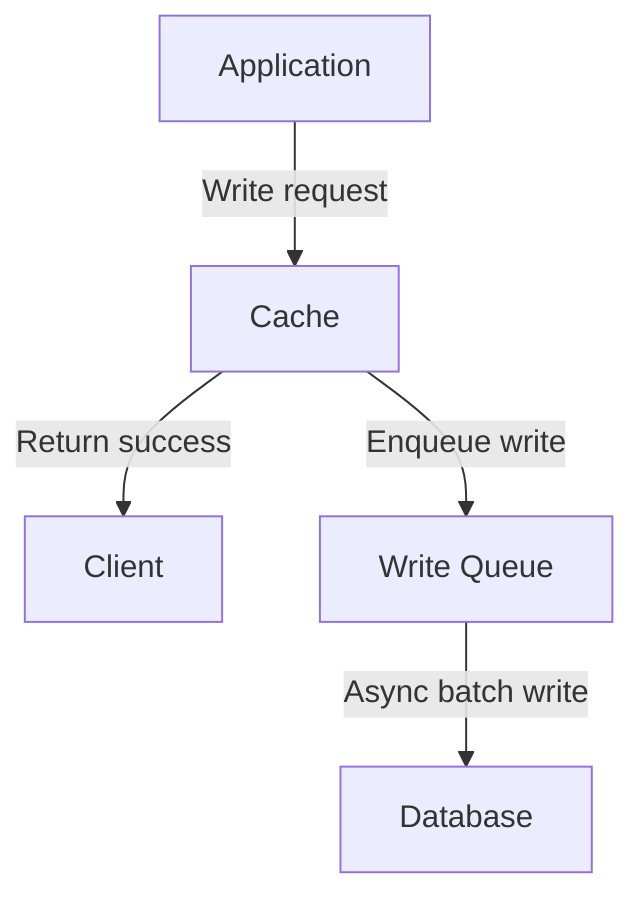
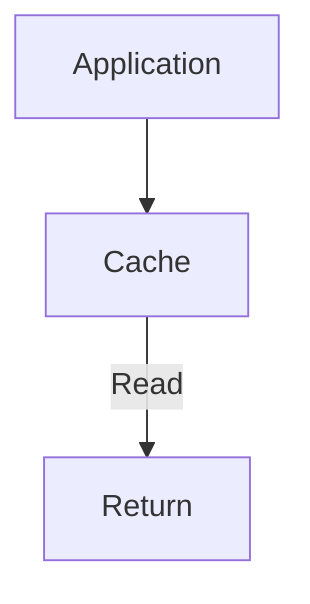

# Write Behind (Write Back)

Write Behind, còn gọi là Write Back, là một chiến lược caching trong đó writes được ghi vào cache ngay lập tức, sau đó asynchronously được ghi xuống database trong background. Đây là pattern có performance cao nhất cho write operations.

## Đặc Điểm

- **Asynchronous writes**: Write vào cache ngay, DB update sau
- **Fastest write performance**: User không phải đợi DB write
- **Batching potential**: Có thể batch nhiều writes thành một DB transaction
- **Best for**: Write-heavy workloads với eventual consistency acceptable

## Flow Diagram

### Write Flow


### Read Flow


## Implementation

### Service Implementation

```typescript
// backend/src/cache/strategies/cache-strategies.service.ts

interface WriteOperation {
  id: number;
  data: Partial<Product>;
  timestamp: number;
}

@Injectable()
export class CacheStrategiesService {
  // Write-behind queue
  private writeQueue: WriteOperation[] = [];
  private writeQueueInterval: NodeJS.Timeout | null = null;

  constructor(
    @Inject(CACHE_MANAGER) private cacheManager: Cache,
  ) {
    // Start background processor
    this.startWriteBehindProcessor();
  }

  async writeBehind(productId: number, updates: Partial<Product>): Promise<{ 
    product: Product | null; 
    message: string; 
    latency: number 
  }> {
    const startTime = Date.now();
    const cacheKey = `write-behind:product:${productId}`;
    
    const product = this.database.get(productId);
    if (!product) {
      return { product: null, message: 'Product not found', latency: 0 };
    }
    
    const updatedProduct = { ...product, ...updates, updatedAt: new Date() };
    
    // Step 1: Write to cache immediately (FAST)
    this.logger.log(`[Write Behind] Writing product ${productId} to cache`);
    await this.cacheManager.set(cacheKey, updatedProduct, 300000);
    
    // Step 2: Add to write queue for async DB update
    this.logger.log(`[Write Behind] Adding product ${productId} to write queue`);
    this.writeQueue.push({
      id: productId,
      data: updatedProduct,
      timestamp: Date.now(),
    });
    
    const latency = Date.now() - startTime;
    this.logger.log(`[Write Behind] Write completed in ${latency}ms (DB write pending)`);
    
    return { 
      product: updatedProduct, 
      message: `Product updated in cache, DB write queued (queue size: ${this.writeQueue.length})`, 
      latency 
    };
  }

  /**
   * Background processor for write-behind queue
   * Processes queued writes every 5 seconds
   */
  private startWriteBehindProcessor() {
    this.writeQueueInterval = setInterval(async () => {
      if (this.writeQueue.length === 0) return;
      
      this.logger.log(`[Write Behind Processor] Processing ${this.writeQueue.length} queued writes`);
      
      const operations = [...this.writeQueue];
      this.writeQueue = []; // Clear queue
      
      for (const op of operations) {
        try {
          await this.simulateDbLatency();
          this.database.set(op.id, op.data as Product);
          this.logger.log(`[Write Behind Processor] Wrote product ${op.id} to DB`);
        } catch (error) {
          this.logger.error(`[Write Behind Processor] Failed to write product ${op.id}`, error);
          // In production: implement retry logic, dead letter queue, etc.
          this.writeQueue.push(op); // Re-queue for retry
        }
      }
    }, 5000); // Process every 5 seconds
  }

  getWriteBehindQueueStatus(): { 
    queueSize: number; 
    pendingWrites: WriteOperation[] 
  } {
    return {
      queueSize: this.writeQueue.length,
      pendingWrites: this.writeQueue,
    };
  }

  onModuleDestroy() {
    if (this.writeQueueInterval) {
      clearInterval(this.writeQueueInterval);
    }
  }
}
```

### Controller Endpoints

```typescript
// backend/src/cache/strategies/cache-strategies.controller.ts
@Controller('cache-strategies')
export class CacheStrategiesController {
  
  @Put('write-behind/:id')
  async writeBehind(
    @Param('id') id: string,
    @Body() updates: { name?: string; price?: number; stock?: number },
  ) {
    return this.cacheStrategiesService.writeBehind(parseInt(id), updates);
  }

  @Get('write-behind/queue/status')
  getWriteBehindQueueStatus() {
    return this.cacheStrategiesService.getWriteBehindQueueStatus();
  }
}
```

## Usage Examples

### Writing Data

```bash
# Fast write to cache
curl -X PUT http://localhost:3000/cache-strategies/write-behind/1 \
  -H "Content-Type: application/json" \
  -d '{"price": 849.99, "stock": 15}'

# Response (FAST - only cache write):
{
  "product": {
    "id": 1,
    "name": "Laptop",
    "price": 849.99,
    "stock": 15,
    "updatedAt": "2024-01-15T10:45:00.000Z"
  },
  "message": "Product updated in cache, DB write queued (queue size: 1)",
  "latency": 5
}
```

### Checking Queue Status

```bash
# Check write queue
curl http://localhost:3000/cache-strategies/write-behind/queue/status

# Response:
{
  "queueSize": 3,
  "pendingWrites": [
    {
      "id": 1,
      "data": {
        "id": 1,
        "name": "Laptop",
        "price": 849.99,
        "stock": 15,
        "updatedAt": "2024-01-15T10:45:00.000Z"
      },
      "timestamp": 1705318500000
    },
    {
      "id": 2,
      "data": { /* ... */ },
      "timestamp": 1705318501000
    }
  ]
}

# After 5 seconds, check again
curl http://localhost:3000/cache-strategies/write-behind/queue/status

# Response:
{
  "queueSize": 0,
  "pendingWrites": []
}
# Queue processed, all writes committed to DB
```

## Ưu Điểm

### 1. Extremely Fast Writes
- Chỉ cần write vào cache (in-memory)
- Latency thấp nhất trong tất cả strategies
- Better user experience cho write operations

```bash
# Write latency comparison
Write Behind:  ~5ms  (cache only)
Write Through: ~125ms (cache + DB sync)
Cache Aside:   ~122ms (DB + invalidate)

Improvement: 25x faster than synchronous writes
```

### 2. Write Batching
- Có thể combine multiple writes thành một DB transaction
- Giảm DB load significantly
- Optimize DB performance

```typescript
// Batching example
async processBatch(operations: WriteOperation[]) {
  // Instead of 100 individual DB writes
  // Do 1 batch write
  await db.transaction(async (tx) => {
    for (const op of operations) {
      await tx.update('products', op.id, op.data);
    }
  });
}
```

### 3. Resilience to DB Slowness
- Application performance không bị ảnh hưởng bởi DB latency
- DB có thể chậm mà user không nhận ra
- Better system decoupling

### 4. Write Coalescing
- Multiple updates to same key có thể merged
- Chỉ write final state vào DB
- Further reduce DB load

```typescript
// Coalescing example
// User updates product 3 times in 5 seconds
writeBehind(1, { price: 100 });  // Queued
writeBehind(1, { price: 110 });  // Queued
writeBehind(1, { price: 120 });  // Queued

// When flushed to DB: Only write final state { price: 120 }
// Instead of 3 separate writes
```

## Nhược Điểm

### 1. Data Loss Risk
- Nếu cache crash trước khi flush to DB → mất data
- Queued writes có thể bị mất
- Cần persistent queue cho critical data

```typescript
// Risk scenario
await writeBehind(1, updates);  // ✓ Cache updated
// User sees success
// Server crashes before DB write
// Data lost!
```

### 2. Complexity
- Cần implement write queue management
- Retry logic cho failed writes
- Dead letter queue cho persistent failures
- Monitoring và alerting

### 3. Eventual Consistency
- Cache và DB có thể out of sync tạm thời
- Read from DB trực tiếp có thể thấy stale data
- Cần careful design cho cross-system reads

```typescript
// Consistency issue
await writeBehind(1, { stock: 10 });  // Cache: stock = 10
// DB still has stock = 15 (not written yet)

// Another service reads directly from DB
const product = await db.query('SELECT * FROM products WHERE id = 1');
// Returns stock = 15 (stale!)
```

### 4. Write Failure Handling
- Failed writes cần special handling
- Cần retry strategy
- May need manual intervention
- Complexity in error recovery

## Advanced Implementation

### 1. Persistent Write Queue

```typescript
class PersistentWriteBehindService {
  // Use Redis List as persistent queue
  async writeBehind(id: number, updates: Partial<Product>) {
    const cacheKey = `product:${id}`;
    const queueKey = 'write-behind:queue';
    
    // Update cache
    await this.cache.set(cacheKey, updates);
    
    // Add to persistent queue (Redis List)
    await this.redis.rPush(queueKey, JSON.stringify({
      id,
      data: updates,
      timestamp: Date.now(),
    }));
    
    return updates;
  }
  
  async processQueue() {
    const queueKey = 'write-behind:queue';
    
    // Pop from queue
    const item = await this.redis.lPop(queueKey);
    if (!item) return;
    
    const operation = JSON.parse(item);
    
    try {
      await this.db.update(operation.id, operation.data);
      // Success - item already removed from queue
    } catch (error) {
      // Failure - push back to queue or dead letter queue
      await this.redis.rPush('write-behind:dlq', item);
    }
  }
}
```

### 2. Write Coalescing

```typescript
class CoalescingWriteBehindService {
  private writeMap: Map<number, WriteOperation> = new Map();
  
  async writeBehind(id: number, updates: Partial<Product>) {
    const cacheKey = `product:${id}`;
    const existing = this.database.get(id);
    const updated = { ...existing, ...updates };
    
    // Update cache
    await this.cache.set(cacheKey, updated);
    
    // Coalesce writes - only keep latest for each ID
    this.writeMap.set(id, {
      id,
      data: updated,
      timestamp: Date.now(),
    });
    
    return updated;
  }
  
  async flushWrites() {
    const operations = Array.from(this.writeMap.values());
    this.writeMap.clear();
    
    // Batch write to DB
    await this.db.batchUpdate(operations);
  }
}
```

### 3. Smart Batching

```typescript
class SmartBatchingService {
  private batchSize = 100;
  private batchTimeout = 5000; // 5 seconds
  
  async processBatch() {
    const batch: WriteOperation[] = [];
    const deadline = Date.now() + this.batchTimeout;
    
    // Collect batch
    while (batch.length < this.batchSize && Date.now() < deadline) {
      const op = await this.queue.pop();
      if (op) batch.push(op);
      else await this.sleep(100); // Wait for more items
    }
    
    if (batch.length === 0) return;
    
    // Write batch to DB
    await this.db.transaction(async (tx) => {
      for (const op of batch) {
        await tx.update('products', op.id, op.data);
      }
    });
    
    this.logger.log(`Batch write: ${batch.length} operations`);
  }
}
```

## Best Practices

### 1. Monitor Queue Size

```typescript
// Alert when queue grows too large
if (this.writeQueue.length > 1000) {
  this.logger.error('Write queue size exceeded threshold', {
    queueSize: this.writeQueue.length,
  });
  this.alerting.sendAlert('write-behind-queue-overflow');
}
```

### 2. Implement Retry Logic

```typescript
interface WriteOperationWithRetry extends WriteOperation {
  retryCount: number;
  maxRetries: number;
}

async processWithRetry(operation: WriteOperationWithRetry) {
  try {
    await this.db.update(operation.id, operation.data);
  } catch (error) {
    if (operation.retryCount < operation.maxRetries) {
      operation.retryCount++;
      this.writeQueue.push(operation); // Retry
    } else {
      // Max retries exceeded - move to DLQ
      await this.deadLetterQueue.push(operation);
      this.logger.error('Write failed after max retries', {
        operation,
        error,
      });
    }
  }
}
```

### 3. Graceful Shutdown

```typescript
async onModuleDestroy() {
  this.logger.log('Shutting down - flushing write queue');
  
  // Stop accepting new writes
  clearInterval(this.writeQueueInterval);
  
  // Flush remaining writes
  if (this.writeQueue.length > 0) {
    await this.flushAllWrites();
  }
  
  this.logger.log('All writes flushed successfully');
}

async flushAllWrites() {
  const operations = [...this.writeQueue];
  this.writeQueue = [];
  
  for (const op of operations) {
    await this.db.update(op.id, op.data);
  }
}
```

### 4. Use for Right Use Cases

```typescript
class HybridCachingService {
  // Critical data: Use Write Through
  async updateUserBalance(userId: number, balance: number) {
    return this.writeThrough(`user:${userId}:balance`, { balance });
  }
  
  // Analytics data: Use Write Behind
  async trackPageView(pageId: number) {
    return this.writeBehind(`analytics:page:${pageId}`, { 
      views: increment(1) 
    });
  }
  
  // Session data: Use Write Behind
  async updateSessionData(sessionId: string, data: any) {
    return this.writeBehind(`session:${sessionId}`, data);
  }
}
```
