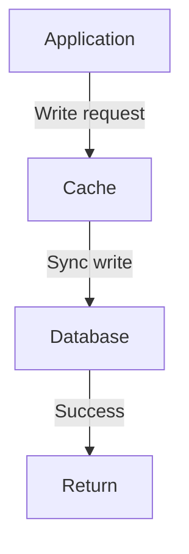
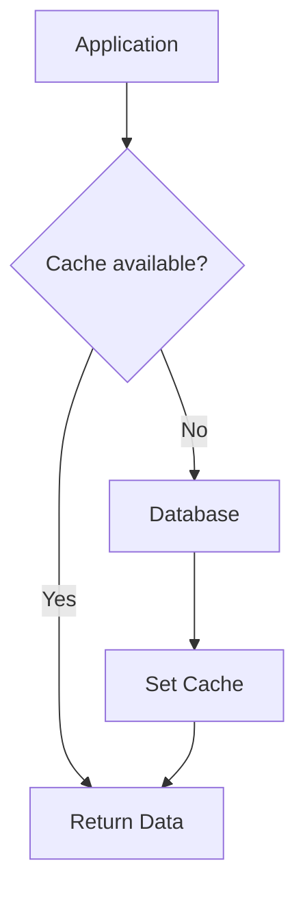

# Write Through

Write Through là một chiến lược caching trong đó cache nằm giữa application và database. Mọi write operation đều phải đi qua cache trước, sau đó cache đồng bộ ghi xuống database.

## Đặc Điểm

- **Synchronous writes**: Write đến cache và DB đồng thời
- **Cache as primary interface**: Application chỉ tương tác với cache
- **Data consistency**: Cache và DB luôn sync
- **Best for**: Write-heavy workloads cần data consistency

## Flow Diagram

### Write Flow


### Read Flow


## Implementation

### Service Implementation

```typescript
// backend/src/cache/strategies/cache-strategies.service.ts
async writeThrough(productId: number, updates: Partial<Product>): Promise<{ 
  product: Product | null; 
  message: string; 
  latency: number 
}> {
  const startTime = Date.now();
  const cacheKey = `write-through:product:${productId}`;
  
  const product = this.database.get(productId);
  if (!product) {
    return { product: null, message: 'Product not found', latency: 0 };
  }
  
  const updatedProduct = { ...product, ...updates, updatedAt: new Date() };
  
  // Step 1: Write to cache first
  this.logger.log(`[Write Through] Writing product ${productId} to cache`);
  await this.cacheManager.set(cacheKey, updatedProduct, 300000); // 5 min TTL
  
  // Step 2: Synchronously write to database
  this.logger.log(`[Write Through] Synchronously writing product ${productId} to DB`);
  await this.simulateDbLatency();
  this.database.set(productId, updatedProduct);
  
  const latency = Date.now() - startTime;
  this.logger.log(`[Write Through] Write completed in ${latency}ms`);
  
  return { 
    product: updatedProduct, 
    message: 'Product updated via write-through', 
    latency 
  };
}

async writeThroughRead(productId: number): Promise<{ 
  product: Product | null; 
  source: string; 
  latency: number 
}> {
  const startTime = Date.now();
  const cacheKey = `write-through:product:${productId}`;
  
  // Try cache first
  const cached = await this.cacheManager.get<Product>(cacheKey);
  if (cached) {
    const latency = Date.now() - startTime;
    this.logger.log(`[Write Through Read] Cache HIT for product ${productId}`);
    return { product: cached, source: 'cache', latency };
  }
  
  // On miss, read from DB and populate cache
  this.logger.log(`[Write Through Read] Cache MISS - reading from DB`);
  await this.simulateDbLatency();
  const product = this.database.get(productId) || null;
  
  if (product) {
    await this.cacheManager.set(cacheKey, product, 300000);
  }
  
  const latency = Date.now() - startTime;
  return { product, source: 'database', latency };
}
```

### Controller Endpoints

```typescript
// backend/src/cache/strategies/cache-strategies.controller.ts
@Controller('cache-strategies')
export class CacheStrategiesController {
  
  @Put('write-through/:id')
  async writeThrough(
    @Param('id') id: string,
    @Body() updates: { name?: string; price?: number; stock?: number },
  ) {
    return this.cacheStrategiesService.writeThrough(parseInt(id), updates);
  }

  @Get('write-through/:id')
  async writeThroughRead(@Param('id') id: string) {
    return this.cacheStrategiesService.writeThroughRead(parseInt(id));
  }
}
```

## Usage Examples

### Writing Data

```bash
# Write data using write-through
curl -X PUT http://localhost:3000/cache-strategies/write-through/1 \
  -H "Content-Type: application/json" \
  -d '{"price": 949.99, "stock": 12}'

# Response:
{
  "product": {
    "id": 1,
    "name": "Laptop",
    "price": 949.99,
    "stock": 12,
    "updatedAt": "2024-01-15T10:40:00.000Z"
  },
  "message": "Product updated via write-through",
  "latency": 132
}
```

### Reading Data

```bash
# Read after write - Cache hit (data already in cache from write)
curl http://localhost:3000/cache-strategies/write-through/1

# Response:
{
  "product": {
    "id": 1,
    "name": "Laptop",
    "price": 949.99,
    "stock": 12,
    "updatedAt": "2024-01-15T10:40:00.000Z"
  },
  "source": "cache",
  "latency": 3
}
```

## Ưu Điểm

### 1. Data Consistency
- Cache và database luôn đồng bộ
- Không có stale data trong cache
- Write completion đảm bảo data đã persist

```typescript
// Data consistency guaranteed
await writeThrough(productId, updates);
// At this point, both cache and DB have the same data
```

### 2. Read Performance
- Reads thường nhanh vì data đã có trong cache
- Recent writes có trong cache
- Giảm cache miss rate cho recently written data

### 3. Simple Read Logic
- Reads không cần lo logic invalidation
- Cache được update tự động qua writes
- Dễ reasoning về cache state

### 4. Durability
- Mọi write đều được persist ngay
- Không mất data nếu cache crash
- Safe cho critical data

## Nhược Điểm

### 1. Write Latency
- Write chậm hơn vì phải đợi cả cache và DB
- Latency = Cache write time + DB write time
- User experience có thể bị ảnh hưởng

```bash
# Write Through latency breakdown
Cache write: 2ms
DB write: 120ms
Total: 122ms (user waits for both)
```

### 2. Unnecessary Cache Pollution
- Mọi write đều vào cache, kể cả data ít dùng
- Waste cache memory cho infrequently accessed data
- Cache eviction có thể xảy ra thường xuyên

```typescript
// Problem: Write once, never read
await writeThrough(tempDataId, data); // Goes to cache
// This data might never be read, wasting cache space
```

### 3. Cache Failure Impact
- Nếu cache unavailable, write fails
- Cần fallback strategy
- Có thể impact availability

### 4. Write-Heavy Overhead
- Với write-heavy workloads, benefit không nhiều
- Cache write overhead cho data ít được read
- Better patterns tồn tại cho write-heavy cases

## Best Practices

### 1. Combine with Cache Aside for Reads

```typescript
// Write: Use Write Through
async updateProduct(id: number, updates: Partial<Product>) {
  return this.writeThrough(id, updates);
}

// Read: Use Cache Aside
async getProduct(id: number) {
  return this.cacheAside(id);
}
```

### 2. Set Appropriate TTL

```typescript
// Balance between consistency and cache efficiency
const TTL = {
  HOT_DATA: 300000,    // 5 minutes for frequently accessed
  WARM_DATA: 600000,   // 10 minutes for moderately accessed
  COLD_DATA: 1800000,  // 30 minutes for rarely accessed
};

await cache.set(key, value, TTL.HOT_DATA);
```

### 3. Implement Write Failure Handling

```typescript
async writeThrough(id: number, updates: Partial<Product>) {
  const cacheKey = `product:${id}`;
  const product = { ...existingProduct, ...updates };
  
  try {
    // Try write to cache first
    await cache.set(cacheKey, product, TTL);
  } catch (cacheError) {
    this.logger.warn('Cache write failed, continuing to DB', cacheError);
    // Don't fail the entire operation
  }
  
  // Always write to DB (source of truth)
  await db.update(id, product);
  
  return product;
}
```

### 4. Monitor Write Performance

```typescript
async writeThrough(id: number, updates: Partial<Product>) {
  const startTime = Date.now();
  
  // Write to cache
  const cacheStart = Date.now();
  await cache.set(key, value);
  const cacheLatency = Date.now() - cacheStart;
  
  // Write to DB
  const dbStart = Date.now();
  await db.update(id, updates);
  const dbLatency = Date.now() - dbStart;
  
  this.metrics.recordWriteThrough({
    totalLatency: Date.now() - startTime,
    cacheLatency,
    dbLatency,
  });
}
```

### 5. Use Batching for Multiple Writes

```typescript
async batchWriteThrough(products: Product[]) {
  // Batch cache writes
  const cacheOps = products.map(p => 
    cache.set(`product:${p.id}`, p, TTL)
  );
  await Promise.all(cacheOps);
  
  // Batch DB writes
  await db.batchUpdate(products);
}
```