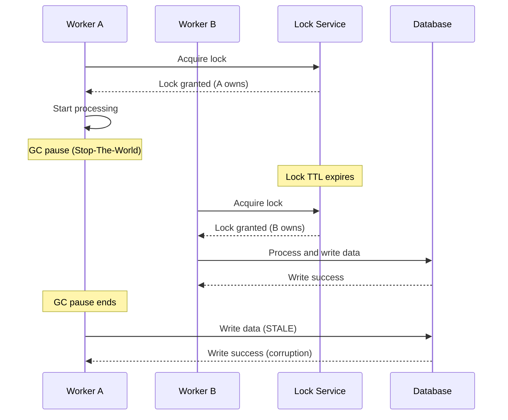
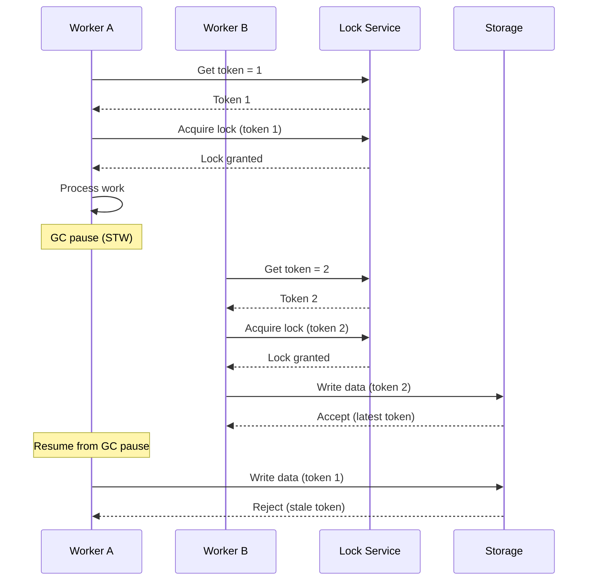

# Fenced Tokens

## Vấn đề: Lock Expiration

Ngay cả với distributed locks, vẫn có một lỗi tinh tế có thể gây hỏng dữ liệu.

### Kịch bản



**Worker A ghi dữ liệu cũ** ngay cả khi nó không còn giữ lock!

## Tại sao Locks Không Đủ

Distributed locks giải quyết **mutual exclusion** nhưng không phải **timing bugs**:

1. Chỉ một tiến trình giữ lock tại một thời điểm
2. Tiến trình có thể tiếp tục sau khi lock hết hạn
3. Tiến trình bị trễ ghi dữ liệu cũ

## Giải pháp: Fenced Tokens

Martin Kleppmann (tác giả của "Designing Data-Intensive Applications") đề xuất **fenced tokens** để giải quyết điều này.

### Cách Hoạt động

1. **Token tăng** với mỗi lần acquire lock
2. **Storage validate** token trước khi chấp nhận write
3. **Stale tokens bị reject** tự động

### Implementation

```typescript
// Token generation (monotonically increasing)
const token = await redis.incr('fence:resource:123');
// Returns: 1, 2, 3, 4, 5, ...
```

### Luồng Hoàn chỉnh



**Storage reject token=1** vì token hiện tại là 2!

## Ví dụ Code

### Acquire Lock với Token

```typescript
async function processOrder(orderId: string) {
  const resource = `order:${orderId}`;
  
  // 1. Get fenced token (increments automatically)
  const fencedToken = await redis.incr(`fence:${resource}`);
  console.log(`Got token: ${fencedToken}`);
  
  // 2. Acquire distributed lock
  const lockToken = await redis.set(
    `lock:${resource}`,
    'worker-1',
    'NX',
    'PX',
    5000
  );
  
  if (!lockToken) {
    throw new Error('Failed to acquire lock');
  }
  
  try {
    // 3. Do processing (might take long time)
    await processOrder(orderId);
    
    // 4. Before writing, validate token
    const currentToken = await redis.get(`fence:${resource}`);
    
    if (parseInt(currentToken) !== fencedToken) {
      throw new Error('Stale operation - token outdated');
    }
    
    // 5. Safe to write
    await database.save(order);
    
  } finally {
    await redis.del(`lock:${resource}`);
  }
}
```

### Validation Bên Storage

```typescript
async function saveToDatabase(data, token) {
  const currentToken = await redis.get(`fence:${data.resource}`);
  
  // Reject if token is stale
  if (token < parseInt(currentToken)) {
    throw new Error(
      `Stale write rejected: token ${token} < current ${currentToken}`
    );
  }
  
  // Token is valid, proceed with write
  await db.save(data);
}
```

## Tại sao Điều này Hoạt động

### Thuộc tính Token

1. **Tăng đơn điệu**: Không bao giờ giảm
   ```
   Token: 1 → 2 → 3 → 4 → 5 ...
   ```

2. **Tạo atomic**: Redis INCR là atomic
   ```typescript
   await redis.incr('fence:key'); // Thread-safe
   ```

3. **Độc lập với Lock**: Token tồn tại ngay cả sau khi lock hết hạn
   ```
   Lock hết hạn → Tiến trình mới nhận lock + token mới
   Tiến trình cũ → Cố ghi với token cũ → Bị reject
   ```

## Trường hợp Sử dụng

### Khi Bạn PHẢI Sử dụng Fenced Tokens

 **Giao dịch tài chính**
- Chuyển tiền
- Xử lý thanh toán
- Cập nhật số dư tài khoản

 **Quản lý kho hàng**
- Cập nhật số lượng hàng tồn
- Hệ thống đặt chỗ
- Đặt vé

 **Cập nhật trạng thái quan trọng**
- Quyền người dùng
- Thay đổi cấu hình
- Migration database

### Khi Fenced Tokens Là Tùy chọn

 **Hoạt động best-effort**
- Thu thập metrics
- Cập nhật cache
- Tổng hợp log

 **Hoạt động idempotent**
- Gửi email (với deduplication)
- Xuất bản events (với message IDs)

## So sánh

| Phương pháp             | Mutual Exclusion | Ngăn Stale Writes                   | Độ phức tạp |
| ----------------------- | ---------------- | ----------------------------------- | ----------- |
| **Không Lock**          | Không          |  Không                             | Thấp        |
| **Distributed Lock**    |  Có             |  Không (có thể xảy ra stale write) | Trung bình  |
| **Lock + Fenced Token** | Có             |  Có                                | Cao         |

## Mẹo Triển khai

### 1. Tạo Token Trước Lock

```typescript
//  Correct order
const token = await getToken();
const lock = await acquireLock();

//  Wrong order - lock might expire before token generated
const lock = await acquireLock();
const token = await getToken();
```

### 2. Lưu Token với Data

```typescript
await database.save({
  ...data,
  fencedToken: token,  // Store token with data
  timestamp: Date.now()
});
```

### 3. Validate trên Mọi Write

```typescript
// Always validate before critical writes
await validateToken(resource, token);
await database.save(data);
```

## Ví dụ Thực tế: Chuyển khoản Ngân hàng

```typescript
async function transferMoney(from: string, to: string, amount: number) {
  const resource = `account:${from}`;
  
  // Get fenced token
  const token = await redis.incr(`fence:${resource}`);
  
  // Acquire lock
  const lock = await acquireLock(resource, 5000);
  
  try {
    // Read balance
    const balance = await getBalance(from);
    
    // Check sufficient funds
    if (balance < amount) {
      throw new Error('Insufficient funds');
    }
    
    // Simulate slow processing (network delay, GC pause, etc.)
    await sleep(3000);
    
    // Validate token before writing
    if (!await validateToken(resource, token)) {
      throw new Error('Transfer aborted - stale operation');
    }
    
    // Execute transfer
    await debit(from, amount, token);
    await credit(to, amount, token);
    
  } finally {
    await releaseLock(resource, lock);
  }
}
```

## Những Điểm Chính

1. **Distributed locks** giải quyết mutual exclusion
2. **Fenced tokens** giải quyết timing bugs
3. **Luôn sử dụng cả hai** cho hoạt động quan trọng
4. **Token tăng** tự động (Redis INCR)
5. **Storage validate** token trước write
6. **Thiết yếu** cho hệ thống tài chính

Tiếp theo: Khám phá thuật toán Redlock cho thiết lập Redis đa node
