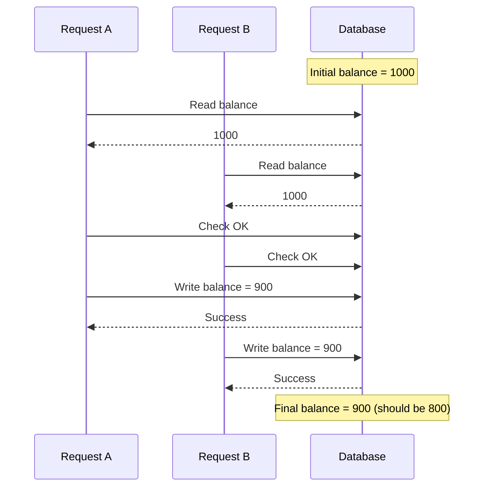

# Race Conditions trong Hệ thống Phân tán

## Race Condition là gì?

Một **race condition** xảy ra khi nhiều tiến trình truy cập và sửa đổi dữ liệu chia sẻ đồng thời, và kết quả cuối cùng phụ thuộc vào thời gian thực thi.

## Ví dụ: Vấn đề Lost Update

### Kịch bản: Xử lý Thanh toán

```typescript
let balance = 1000; // Shared account balance

async function processPayment(amount: number) {
  // Step 1: Read current balance
  const current = balance;
  
  // Step 2: Check sufficient funds
  if (current >= amount) {
    // Step 3: Deduct amount
    balance = current - amount;
    return 'Payment successful';
  }
  
  return 'Insufficient funds';
}
```

### Điều gì xảy ra với Yêu cầu Đồng thời?



**Dự kiến:** $800  
**Thực tế:** $900  
**Mất:** $100 

## Tại sao Điều này xảy ra?

Điều này được gọi là **check-then-act** race condition:

1. Cả hai yêu cầu **đọc** cùng giá trị (1000)
2. Cả hai **kiểm tra** đủ tiền (OK)
3. Cả hai **ghi** cùng kết quả (900)
4. Ghi thứ hai **ghi đè** ghi đầu tiên

## Các Loại Race Conditions

### 1. Read-Modify-Write

```typescript
// Both read counter = 10
counter++;
// Both write counter = 11 (should be 12!)
```

### 2. Check-Then-Act

```typescript
if (!exists(file)) {  // Both check: false
  create(file);       // Both create: error!
}
```

### 3. Time-of-Check to Time-of-Use (TOCTOU)

```typescript
if (hasPermission(user)) {  // Check at T1
  // Permission revoked at T2
  performAction();           // Use at T3 - Wrong!
}
```

## Tại sao Local Locks Không Hoạt động trong Hệ thống Phân tán

### Single Process Lock (XẤU cho Microservices)

```typescript
let locked = false;

async function processPayment() {
  if (locked) {
    return 'Busy';
  }
  
  locked = true;
  
  try {
    // Critical section
    balance -= 100;
  } finally {
    locked = false;
  }
}
```

### Tại sao Điều này Thất bại

```
Instance 1:
  locked = false  ← Local variable
  acquires lock
  processes payment

Instance 2:
  locked = false  ← Different memory!
  also acquires lock
  also processes payment 
```

**Vấn đề:** Mỗi instance có biến `locked` riêng!

## Ví dụ Thực tế

### 1. Kho hàng E-commerce

```
2 customers buy last item simultaneously
→ Both see "1 in stock"
→ Both complete purchase
→ Oversold! 
```

### 2. Chuyển khoản Ngân hàng

```
Account has $100
Transfer A: -$100
Transfer B: -$50
→ Both see $100
→ Final balance: -$50 
```

### 3. Đặt vé

```
Last seat available
User A: Reserve seat 1A
User B: Reserve seat 1A
→ Both get confirmation
→ Double booking! 
```

## Xem trước Giải pháp

Giải pháp là **distributed locking**:

```typescript
// Acquire distributed lock
const lock = await redis.set('lock:balance', 'worker-1', 'NX', 'PX', 5000);

if (!lock) {
  return 'Resource busy';
}

try {
  // Critical section - only ONE instance executes
  balance -= 100;
} finally {
  // Release lock
  await redis.del('lock:balance');
}
```

Chúng ta sẽ khám phá các giải pháp distributed locking chi tiết trong các phần tiếp theo.
