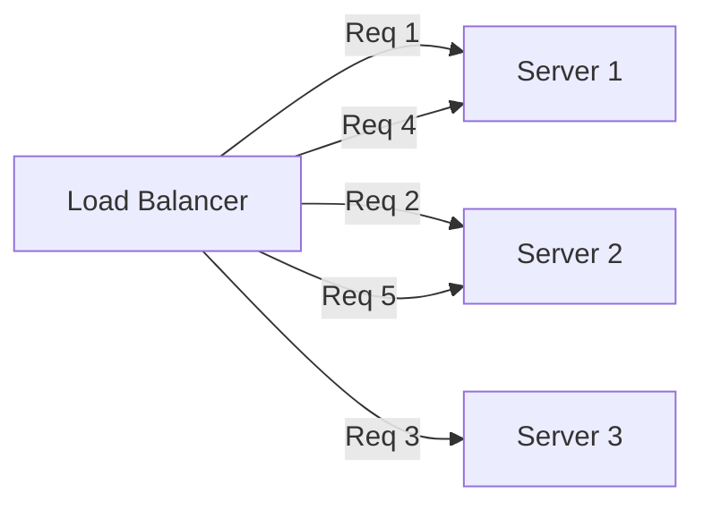

## Thuật toán Load Balancing

### Static Algorithms

#### 1. Round Robin

Phân phối requests tuần tự theo thứ tự vòng tròn.



**Nginx Configuration:**
```nginx
upstream backend {
    server api-gateway-1:3000;
    server api-gateway-2:3000;
    server api-gateway-3:3000;
}

server {
    listen 80;
    location / {
        proxy_pass http://backend;
    }
}
```

**Ưu điểm:**
-  Đơn giản và dễ triển khai
-  Phân phối đều (nếu requests tương tự)

**Nhược điểm:**
-  Không tính đến load của server
-  Không tối ưu nếu servers có capacity khác nhau

#### 2. Weighted Round Robin

Gán weights cho servers dựa trên capacity của chúng.

```nginx
upstream backend {
    server powerful-server:3000 weight=5;    # 5x capacity
    server medium-server:3000 weight=3;      # 3x capacity
    server weak-server:3000 weight=1;        # 1x capacity
}
```

```
9 requests distributed:
powerful-server: 5 requests (55%)
medium-server: 3 requests (33%)
weak-server: 1 request (12%)
```

**Use Case:** Khi servers có hardware specs khác nhau.

#### 3. IP Hash

Route dựa trên client IP address (sticky sessions).

```nginx
upstream backend {
    ip_hash;
    server server1:3000;
    server server2:3000;
    server server3:3000;
}
```

```
Client A (IP: 192.168.1.10) → Always → Server 1
Client B (IP: 192.168.1.20) → Always → Server 2
Client C (IP: 192.168.1.30) → Always → Server 3
```

**Ưu điểm:**
-  Session persistence (user đi đến cùng server)
-  Tốt cho stateful applications

**Nhược điểm:**
-  Phân phối không đều (nếu ít clients)
-  Server failure làm gián đoạn sessions

### Dynamic Algorithms

#### 4. Least Connections

Route đến server với ít active connections nhất.

```nginx
upstream backend {
    least_conn;
    server server1:3000;
    server server2:3000;
    server server3:3000;
}
```

```
Server 1: 10 connections
Server 2: 5 connections   ← New request goes here
Server 3: 8 connections
```

**Triển khai:**
```typescript
@Injectable()
export class LeastConnectionsLoadBalancer {
  private servers = [
    { url: 'http://server1:3000', connections: 0 },
    { url: 'http://server2:3000', connections: 0 },
    { url: 'http://server3:3000', connections: 0 }
  ];

  getNextServer() {
    // Find server with least connections
    const server = this.servers.reduce((min, curr) => 
      curr.connections < min.connections ? curr : min
    );
    
    server.connections++;
    return server;
  }

  releaseConnection(serverUrl: string) {
    const server = this.servers.find(s => s.url === serverUrl);
    if (server) {
      server.connections--;
    }
  }
}
```

**Ưu điểm:**
-  Tốt hơn cho long-running requests
-  Phân phối đều hơn

**Nhược điểm:**
-  Chi phí nhẹ hơn một chút

#### 5. Least Response Time

Route đến server với average response time thấp nhất.

```typescript
@Injectable()
export class LeastResponseTimeLoadBalancer {
  private servers = [
    { url: 'http://server1:3000', avgResponseTime: 0, requests: [] },
    { url: 'http://server2:3000', avgResponseTime: 0, requests: [] },
    { url: 'http://server3:3000', avgResponseTime: 0, requests: [] }
  ];

  getNextServer() {
    return this.servers.reduce((fastest, curr) => 
      curr.avgResponseTime < fastest.avgResponseTime ? curr : fastest
    );
  }

  recordResponseTime(serverUrl: string, responseTime: number) {
    const server = this.servers.find(s => s.url === serverUrl);
    if (server) {
      server.requests.push(responseTime);
      
      // Keep last 100 requests
      if (server.requests.length > 100) {
        server.requests.shift();
      }
      
      // Calculate average
      server.avgResponseTime = 
        server.requests.reduce((a, b) => a + b, 0) / server.requests.length;
    }
  }
}
```

**Tốt nhất cho:** Khi servers có performance khác nhau.

#### 6. Resource-Based (CPU, Memory)

Route dựa trên server resource utilization.

```typescript
@Injectable()
export class ResourceBasedLoadBalancer {
  async getNextServer() {
    const serverMetrics = await Promise.all(
      this.servers.map(async server => ({
        url: server.url,
        cpu: await this.getCpuUsage(server.url),
        memory: await this.getMemoryUsage(server.url)
      }))
    );

    // Choose server with lowest combined load
    return serverMetrics.reduce((min, curr) => {
      const currLoad = curr.cpu + curr.memory;
      const minLoad = min.cpu + min.memory;
      return currLoad < minLoad ? curr : min;
    });
  }

  private async getCpuUsage(serverUrl: string): Promise<number> {
    const response = await fetch(`${serverUrl}/metrics/cpu`);
    return response.json();
  }
}
```