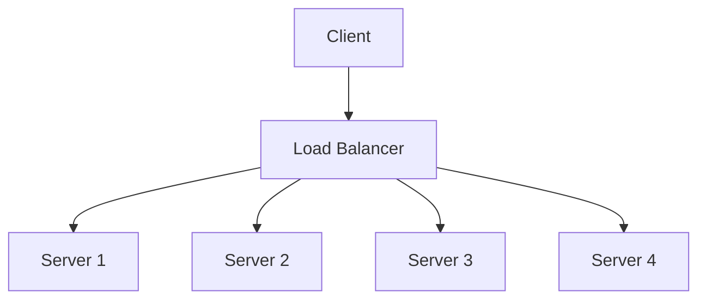
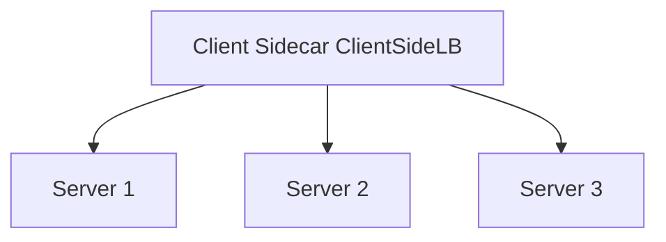

## Client-Side vs Server-Side Load Balancing

### Server-Side (Truyền thống)



### Client-Side (Service Mesh)



**Ví dụ Client-Side:**
```typescript
@Injectable()
export class ClientSideLoadBalancer {
  private services: string[] = [];
  private currentIndex = 0;

  constructor(private serviceRegistry: ServiceRegistry) {
    // Discover services
    this.discoverServices();
  }

  private async discoverServices() {
    // Get list from service registry (Consul, Eureka, etc.)
    this.services = await this.serviceRegistry.getServices('user-service');
  }

  async call(endpoint: string): Promise<any> {
    // Round-robin selection
    const service = this.services[this.currentIndex];
    this.currentIndex = (this.currentIndex + 1) % this.services.length;

    try {
      return await fetch(`${service}${endpoint}`);
    } catch (error) {
      // Remove failed service and retry
      this.services.splice(this.currentIndex, 1);
      return this.call(endpoint);
    }
  }
}
```