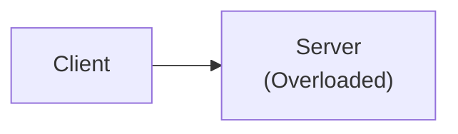
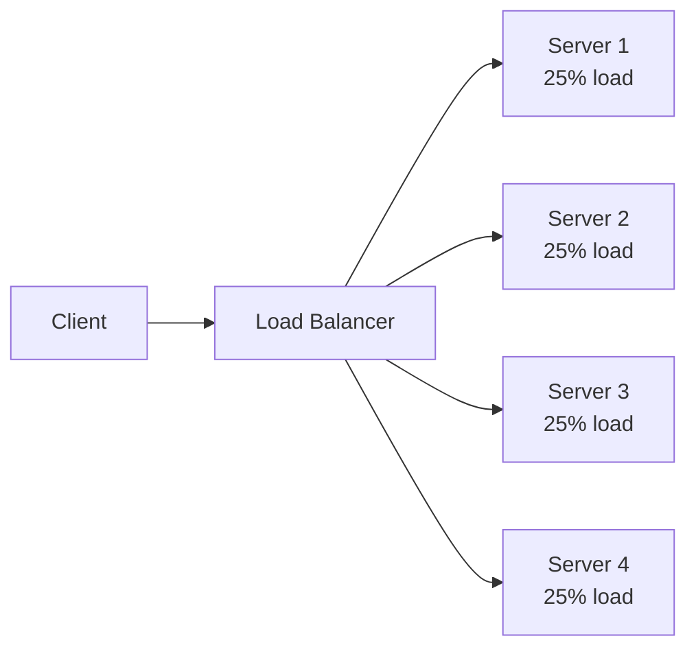
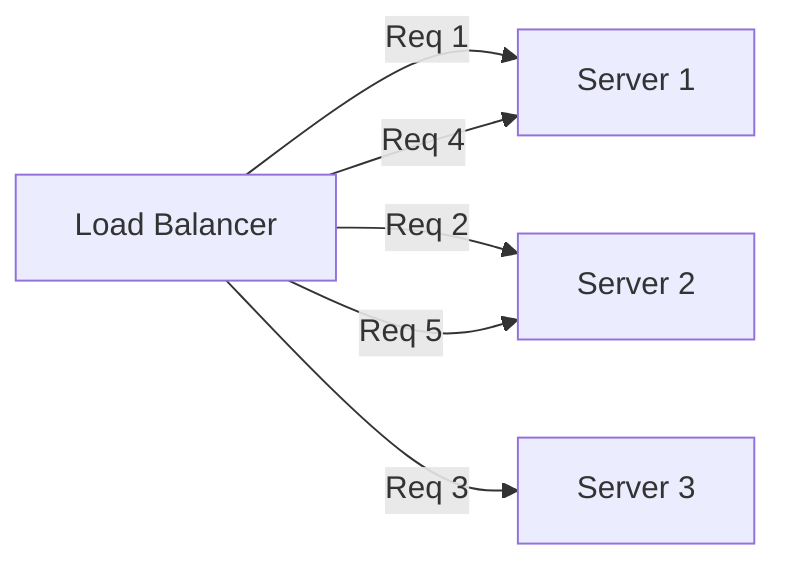
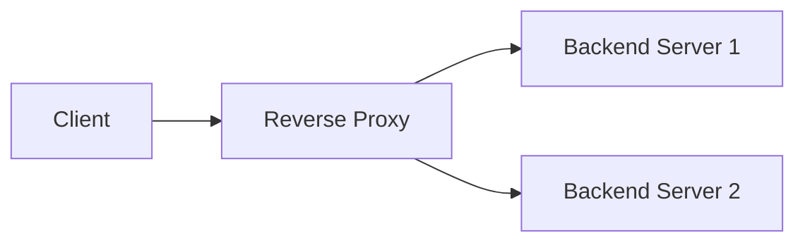
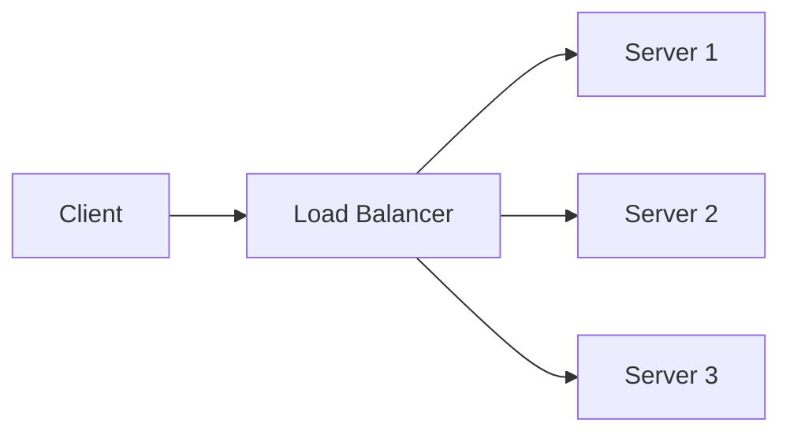
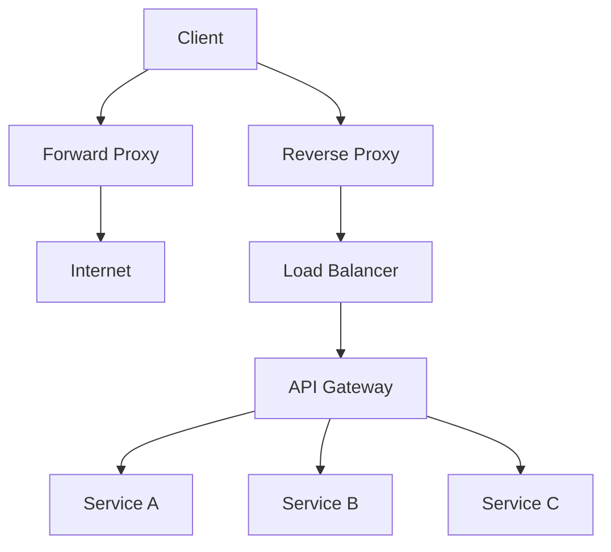

# Load Balancer

## Tổng quan

Load balancer phân phối traffic mạng đến trên nhiều servers để đảm bảo không có server nào bị quá tải. Nó rất cần thiết cho horizontal scaling, high availability, và fault tolerance.

## Tại sao Load Balancing?
- Without Load Balancer (Overloaded)

- With Load Balancer (Even Distribution)


**Lợi ích:**
- **High availability**: Nếu một server fail, các server khác tiếp tục
- **Scalability**: Thêm/bớt servers mà không downtime
- **Performance**: Phân phối load đều
- **Maintenance**: Update servers từng cái một (zero downtime)

## Thuật toán Load Balancing

### Static Algorithms

#### 1. Round Robin

Phân phối requests tuần tự theo thứ tự vòng tròn.



**Nginx Configuration:**
```nginx
upstream backend {
    server api-gateway-1:3000;
    server api-gateway-2:3000;
    server api-gateway-3:3000;
}

server {
    listen 80;
    location / {
        proxy_pass http://backend;
    }
}
```

**Ưu điểm:**
-  Đơn giản và dễ triển khai
-  Phân phối đều (nếu requests tương tự)

**Nhược điểm:**
-  Không tính đến load của server
-  Không tối ưu nếu servers có capacity khác nhau

#### 2. Weighted Round Robin

Gán weights cho servers dựa trên capacity của chúng.

```nginx
upstream backend {
    server powerful-server:3000 weight=5;    # 5x capacity
    server medium-server:3000 weight=3;      # 3x capacity
    server weak-server:3000 weight=1;        # 1x capacity
}
```

```
9 requests distributed:
powerful-server: 5 requests (55%)
medium-server: 3 requests (33%)
weak-server: 1 request (12%)
```

**Use Case:** Khi servers có hardware specs khác nhau.

#### 3. IP Hash

Route dựa trên client IP address (sticky sessions).

```nginx
upstream backend {
    ip_hash;
    server server1:3000;
    server server2:3000;
    server server3:3000;
}
```

```
Client A (IP: 192.168.1.10) → Always → Server 1
Client B (IP: 192.168.1.20) → Always → Server 2
Client C (IP: 192.168.1.30) → Always → Server 3
```

**Ưu điểm:**
-  Session persistence (user đi đến cùng server)
-  Tốt cho stateful applications

**Nhược điểm:**
-  Phân phối không đều (nếu ít clients)
-  Server failure làm gián đoạn sessions

### Dynamic Algorithms

#### 4. Least Connections

Route đến server với ít active connections nhất.

```nginx
upstream backend {
    least_conn;
    server server1:3000;
    server server2:3000;
    server server3:3000;
}
```

```
Server 1: 10 connections
Server 2: 5 connections   ← New request goes here
Server 3: 8 connections
```

**Triển khai:**
```typescript
@Injectable()
export class LeastConnectionsLoadBalancer {
  private servers = [
    { url: 'http://server1:3000', connections: 0 },
    { url: 'http://server2:3000', connections: 0 },
    { url: 'http://server3:3000', connections: 0 }
  ];

  getNextServer() {
    // Find server with least connections
    const server = this.servers.reduce((min, curr) => 
      curr.connections < min.connections ? curr : min
    );
    
    server.connections++;
    return server;
  }

  releaseConnection(serverUrl: string) {
    const server = this.servers.find(s => s.url === serverUrl);
    if (server) {
      server.connections--;
    }
  }
}
```

**Ưu điểm:**
-  Tốt hơn cho long-running requests
-  Phân phối đều hơn

**Nhược điểm:**
-  Chi phí nhẹ hơn một chút

#### 5. Least Response Time

Route đến server với average response time thấp nhất.

```typescript
@Injectable()
export class LeastResponseTimeLoadBalancer {
  private servers = [
    { url: 'http://server1:3000', avgResponseTime: 0, requests: [] },
    { url: 'http://server2:3000', avgResponseTime: 0, requests: [] },
    { url: 'http://server3:3000', avgResponseTime: 0, requests: [] }
  ];

  getNextServer() {
    return this.servers.reduce((fastest, curr) => 
      curr.avgResponseTime < fastest.avgResponseTime ? curr : fastest
    );
  }

  recordResponseTime(serverUrl: string, responseTime: number) {
    const server = this.servers.find(s => s.url === serverUrl);
    if (server) {
      server.requests.push(responseTime);
      
      // Keep last 100 requests
      if (server.requests.length > 100) {
        server.requests.shift();
      }
      
      // Calculate average
      server.avgResponseTime = 
        server.requests.reduce((a, b) => a + b, 0) / server.requests.length;
    }
  }
}
```

**Tốt nhất cho:** Khi servers có performance khác nhau.

#### 6. Resource-Based (CPU, Memory)

Route dựa trên server resource utilization.

```typescript
@Injectable()
export class ResourceBasedLoadBalancer {
  async getNextServer() {
    const serverMetrics = await Promise.all(
      this.servers.map(async server => ({
        url: server.url,
        cpu: await this.getCpuUsage(server.url),
        memory: await this.getMemoryUsage(server.url)
      }))
    );

    // Choose server with lowest combined load
    return serverMetrics.reduce((min, curr) => {
      const currLoad = curr.cpu + curr.memory;
      const minLoad = min.cpu + min.memory;
      return currLoad < minLoad ? curr : min;
    });
  }

  private async getCpuUsage(serverUrl: string): Promise<number> {
    const response = await fetch(`${serverUrl}/metrics/cpu`);
    return response.json();
  }
}
```

## Health Checks

### Active Health Checks

Load balancer actively probes servers.

```nginx
upstream backend {
    server server1:3000 max_fails=3 fail_timeout=30s;
    server server2:3000 max_fails=3 fail_timeout=30s;
    server server3:3000 max_fails=3 fail_timeout=30s;
}
```

**Cấu hình:**
- `max_fails=3`: Mark server as down after 3 failed attempts
- `fail_timeout=30s`: Wait 30s before retrying

```typescript
@Injectable()
export class HealthChecker {
  private readonly CHECK_INTERVAL = 10000; // 10 seconds

  constructor() {
    this.startHealthChecks();
  }

  private startHealthChecks() {
    setInterval(async () => {
      for (const server of this.servers) {
        try {
          const response = await fetch(`${server.url}/health`, {
            timeout: 2000
          });
          
          if (response.ok) {
            server.healthy = true;
            server.consecutiveFailures = 0;
          } else {
            this.handleUnhealthy(server);
          }
        } catch (error) {
          this.handleUnhealthy(server);
        }
      }
    }, this.CHECK_INTERVAL);
  }

  private handleUnhealthy(server: Server) {
    server.consecutiveFailures++;
    
    if (server.consecutiveFailures >= 3) {
      server.healthy = false;
      console.warn(`Server ${server.url} marked as unhealthy`);
    }
  }
}
```

### Passive Health Checks

Monitor actual traffic to detect failures.

```typescript
@Injectable()
export class PassiveHealthChecker {
  monitorRequest(serverUrl: string, success: boolean, responseTime: number) {
    const server = this.servers.find(s => s.url === serverUrl);
    
    if (!success) {
      server.failureCount++;
      
      // Mark unhealthy after 5% error rate
      if (server.failureCount / server.requestCount > 0.05) {
        server.healthy = false;
      }
    }
    
    // Monitor response time
    if (responseTime > 5000) {
      server.slowResponseCount++;
      
      // Too many slow responses
      if (server.slowResponseCount > 10) {
        server.healthy = false;
      }
    }
  }
}
```

### Health Check Endpoint

```typescript
@Controller()
export class HealthController {
  constructor(
    private readonly databaseService: DatabaseService,
    private readonly redisService: RedisService
  ) {}

  @Get('health')
  async check() {
    const checks = {
      database: await this.checkDatabase(),
      redis: await this.checkRedis(),
      memory: this.checkMemory(),
      cpu: this.checkCpu()
    };

    const healthy = Object.values(checks).every(check => check.status === 'ok');

    return {
      status: healthy ? 'ok' : 'error',
      checks,
      timestamp: new Date().toISOString(),
      uptime: process.uptime()
    };
  }

  private async checkDatabase(): Promise<HealthCheck> {
    try {
      await this.databaseService.query('SELECT 1');
      return { status: 'ok' };
    } catch (error) {
      return { status: 'error', message: error.message };
    }
  }

  private checkMemory(): HealthCheck {
    const usage = process.memoryUsage();
    const heapUsedPercent = (usage.heapUsed / usage.heapTotal) * 100;
    
    return {
      status: heapUsedPercent < 90 ? 'ok' : 'warning',
      heapUsed: usage.heapUsed,
      heapTotal: usage.heapTotal,
      percentage: heapUsedPercent
    };
  }
}
```

## Load Balancer vs Reverse Proxy vs API Gateway

| Tiêu chí       | Load Balancer           | Reverse Proxy          | API Gateway                   |
| -------------- | ----------------------- | ---------------------- | ----------------------------- |
| Mục đích chính | Phân phối tải           | Bảo mật & cache        | Quản lý API                   |
| Layer          | Layer 4 / 7             | Layer 7                | Layer 7                       |
| Routing        | Cơ bản                  | Nâng cao               | Nâng cao                      |
| SSL / TLS      | Không                   | Có                     | Có                            |
| Caching        | Không                   | Có                     | Có                            |
| Authentication | Không                   | Cơ bản                 | Nâng cao                      |
| Rate Limiting  | Cơ bản                  | Cơ bản                 | Nâng cao                      |
| Transformation | Không                   | Không                  | Có                            |
| Aggregation    | Không                   | Không                  | Có                            |
| Ví dụ          | Nginx, HAProxy, AWS ELB | Nginx, Apache, Traefik | Kong, Apigee, AWS API Gateway |


### So Sánh Trực Quan
**Forward Proxy (Client-side)**


**Reverse Proxy (Server-side)**

**Load Balancer**

**API Gateway**

## Client-Side vs Server-Side Load Balancing

### Server-Side (Truyền thống)

```
┌────────┐
│ Client │
└───┬────┘
    │
    ▼
┌────────────┐
│Load Balance│ ← Tập trung
└──────┬─────┘
       │
   ┌───┼───┐
   ▼   ▼   ▼
  S1  S2  S3
```

### Client-Side (Service Mesh)

```
┌──────────────────┐
│ Client + Sidecar │ ← Client biết tất cả servers
└─────────┬────────┘   Quyết định locally
          │
      ┌───┼───┐
      ▼   ▼   ▼
     S1  S2  S3
```

**Ví dụ Client-Side:**
```typescript
@Injectable()
export class ClientSideLoadBalancer {
  private services: string[] = [];
  private currentIndex = 0;

  constructor(private serviceRegistry: ServiceRegistry) {
    // Discover services
    this.discoverServices();
  }

  private async discoverServices() {
    // Get list from service registry (Consul, Eureka, etc.)
    this.services = await this.serviceRegistry.getServices('user-service');
  }

  async call(endpoint: string): Promise<any> {
    // Round-robin selection
    const service = this.services[this.currentIndex];
    this.currentIndex = (this.currentIndex + 1) % this.services.length;

    try {
      return await fetch(`${service}${endpoint}`);
    } catch (error) {
      // Remove failed service and retry
      this.services.splice(this.currentIndex, 1);
      return this.call(endpoint);
    }
  }
}
```

## Kubernetes Load Balancing

### 1. kube-proxy

Every node runs kube-proxy, which handles load balancing at the network level.

```yaml
# Service uses kube-proxy for load balancing
apiVersion: v1
kind: Service
metadata:
  name: api-gateway
spec:
  selector:
    app: api-gateway
  ports:
  - port: 80
    targetPort: 3000
```

**Cách hoạt động:**
```
Client → kube-proxy → Pod 1
                   ├→ Pod 2
                   └→ Pod 3
```

### 2. ClusterIP (Internal Load Balancing)

```yaml
apiVersion: v1
kind: Service
metadata:
  name: user-service
spec:
  type: ClusterIP  # Default, internal only
  selector:
    app: user-service
  ports:
  - port: 3001
    targetPort: 3001
```

**Truy cập:**
```
Other pods in cluster → user-service:3001
External clients →  Not accessible
```

### 3. NodePort (External Access)

```yaml
apiVersion: v1
kind: Service
metadata:
  name: api-gateway
spec:
  type: NodePort
  selector:
    app: api-gateway
  ports:
  - port: 80
    targetPort: 3000
    nodePort: 30080  # Exposed on all nodes
```

**Truy cập:**
```
http://<any-node-ip>:30080 → API Gateway
```

### 4. LoadBalancer (Cloud Provider)

```yaml
apiVersion: v1
kind: Service
metadata:
  name: api-gateway
spec:
  type: LoadBalancer  # Creates cloud load balancer
  selector:
    app: api-gateway
  ports:
  - port: 80
    targetPort: 3000
```

**Điều gì xảy ra:**
- Cloud provider (AWS, GCP, Azure) tạo load balancer
- Tự động nhận external IP
- Phân phối traffic đến tất cả pods

### 5. Ingress (L7 Load Balancing)

```yaml
apiVersion: networking.k8s.io/v1
kind: Ingress
metadata:
  name: api-ingress
  annotations:
    nginx.ingress.kubernetes.io/rewrite-target: /
spec:
  rules:
  - host: api.example.com
    http:
      paths:
      - path: /users
        pathType: Prefix
        backend:
          service:
            name: user-service
            port:
              number: 3001
      - path: /orders
        pathType: Prefix
        backend:
          service:
            name: order-service
            port:
              number: 3002
```

**Tính năng:**
- Path-based routing
- Host-based routing
- SSL/TLS termination
- URL rewriting

### 6. Service Mesh (Istio/Linkerd)

```yaml
apiVersion: networking.istio.io/v1alpha3
kind: VirtualService
metadata:
  name: user-service
spec:
  hosts:
  - user-service
  http:
  - route:
    - destination:
        host: user-service
        subset: v1
      weight: 90  # 90% to v1
    - destination:
        host: user-service
        subset: v2
      weight: 10  # 10% to v2 (canary)
```

**Tính năng nâng cao:**
- Traffic splitting (A/B testing, canary)
- Circuit breaking
- Retries and timeouts
- Mutual TLS
- Observability (metrics, tracing)

## Best Practices

### 1. Sử dụng Health Checks

```nginx
upstream backend {
    server server1:3000 max_fails=3 fail_timeout=30s;
    server server2:3000 max_fails=3 fail_timeout=30s;
    
    # Health check
    check interval=3000 rise=2 fall=3 timeout=1000;
}
```

### 2. Bật Keep-Alive

```nginx
upstream backend {
    server server1:3000;
    keepalive 32;  # Maintain 32 connections
}

server {
    location / {
        proxy_pass http://backend;
        proxy_http_version 1.1;
        proxy_set_header Connection "";
    }
}
```

### 3. Thiết lập Timeouts

```nginx
upstream backend {
    server server1:3000;
}

server {
    location / {
        proxy_pass http://backend;
        proxy_connect_timeout 10s;
        proxy_send_timeout 10s;
        proxy_read_timeout 10s;
    }
}
```

### 4. Giám sát Metrics

```typescript
@Injectable()
export class LoadBalancerMetrics {
  recordRequest(server: string, success: boolean, duration: number) {
    this.prometheus.increment('lb_requests_total', {
      server,
      success: success.toString()
    });
    
    this.prometheus.observe('lb_request_duration', duration, {
      server
    });
  }
}
```

## Testing

```bash
# Test load distribution
for i in {1..100}; do
  curl -s http://localhost/api/health | jq -r '.instance'
done | sort | uniq -c

# Expected output (round-robin):
#  33 instance-1
#  33 instance-2
#  34 instance-3
```

## Project Implementation

See:
- [Load balancer docs](../../../backend/PHASE3-LOAD-BALANCER.md)
- [Nginx configurations](../../../backend/infra/nginx/)
- [Kubernetes manifests](../../../backend/infra/k8s/)
- [Test scripts](../../../backend/test-load-balancing.sh)

## Next Steps

- Học về [Scaling](../scaling/index.md)
- Khám phá [Connection Pool](../connection-pool/index.md)
- Kiểm tra [Distributed Locking](../distributed-locking/index.md)
