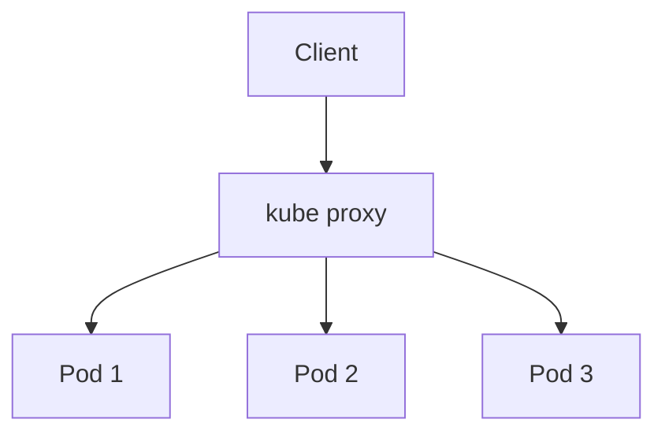

## Kubernetes Load Balancing

### 1. kube-proxy

Every node runs kube-proxy, which handles load balancing at the network level.

```yaml
# Service uses kube-proxy for load balancing
apiVersion: v1
kind: Service
metadata:
  name: api-gateway
spec:
  selector:
    app: api-gateway
  ports:
  - port: 80
    targetPort: 3000
```

**Cách hoạt động:**


### 2. ClusterIP (Internal Load Balancing)

```yaml
apiVersion: v1
kind: Service
metadata:
  name: user-service
spec:
  type: ClusterIP  # Default, internal only
  selector:
    app: user-service
  ports:
  - port: 3001
    targetPort: 3001
```

**Truy cập:**
```
Other pods in cluster → user-service:3001
External clients →  Not accessible
```

### 3. NodePort (External Access)

```yaml
apiVersion: v1
kind: Service
metadata:
  name: api-gateway
spec:
  type: NodePort
  selector:
    app: api-gateway
  ports:
  - port: 80
    targetPort: 3000
    nodePort: 30080  # Exposed on all nodes
```

**Truy cập:**
```
http://<any-node-ip>:30080 → API Gateway
```

### 4. LoadBalancer (Cloud Provider)

```yaml
apiVersion: v1
kind: Service
metadata:
  name: api-gateway
spec:
  type: LoadBalancer  # Creates cloud load balancer
  selector:
    app: api-gateway
  ports:
  - port: 80
    targetPort: 3000
```

**Điều gì xảy ra:**
- Cloud provider (AWS, GCP, Azure) tạo load balancer
- Tự động nhận external IP
- Phân phối traffic đến tất cả pods

### 5. Ingress (L7 Load Balancing)

```yaml
apiVersion: networking.k8s.io/v1
kind: Ingress
metadata:
  name: api-ingress
  annotations:
    nginx.ingress.kubernetes.io/rewrite-target: /
spec:
  rules:
  - host: api.example.com
    http:
      paths:
      - path: /users
        pathType: Prefix
        backend:
          service:
            name: user-service
            port:
              number: 3001
      - path: /orders
        pathType: Prefix
        backend:
          service:
            name: order-service
            port:
              number: 3002
```

**Tính năng:**
- Path-based routing
- Host-based routing
- SSL/TLS termination
- URL rewriting

### 6. Service Mesh (Istio/Linkerd)

```yaml
apiVersion: networking.istio.io/v1alpha3
kind: VirtualService
metadata:
  name: user-service
spec:
  hosts:
  - user-service
  http:
  - route:
    - destination:
        host: user-service
        subset: v1
      weight: 90  # 90% to v1
    - destination:
        host: user-service
        subset: v2
      weight: 10  # 10% to v2 (canary)
```

**Tính năng nâng cao:**
- Traffic splitting (A/B testing, canary)
- Circuit breaking
- Retries and timeouts
- Mutual TLS
- Observability (metrics, tracing)