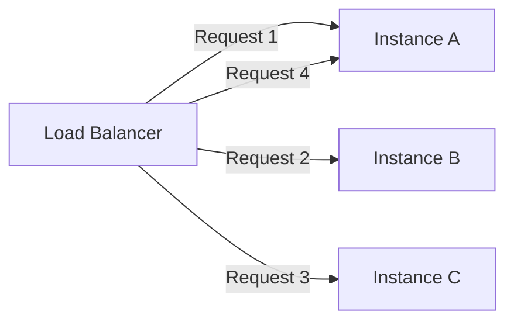
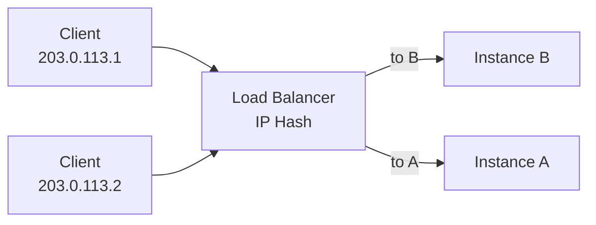
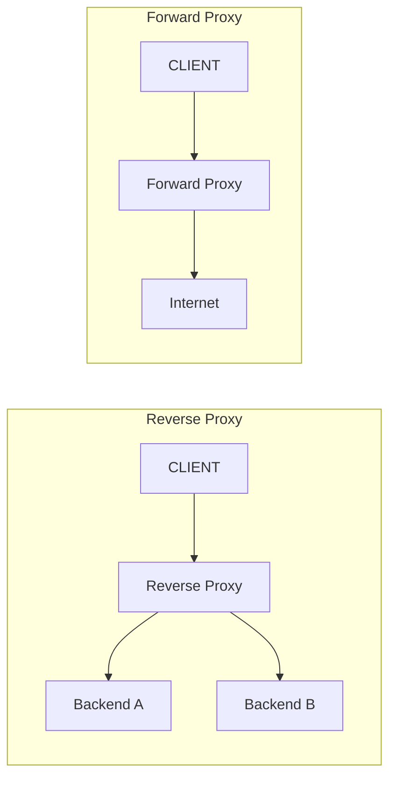
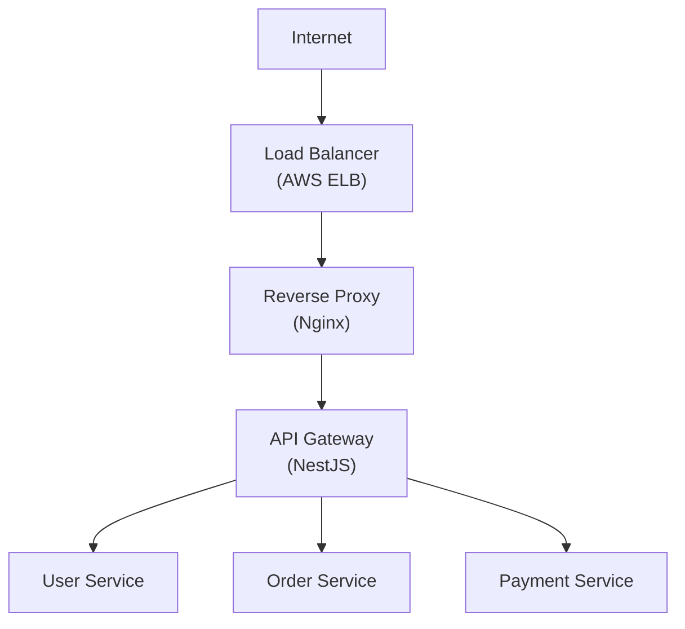
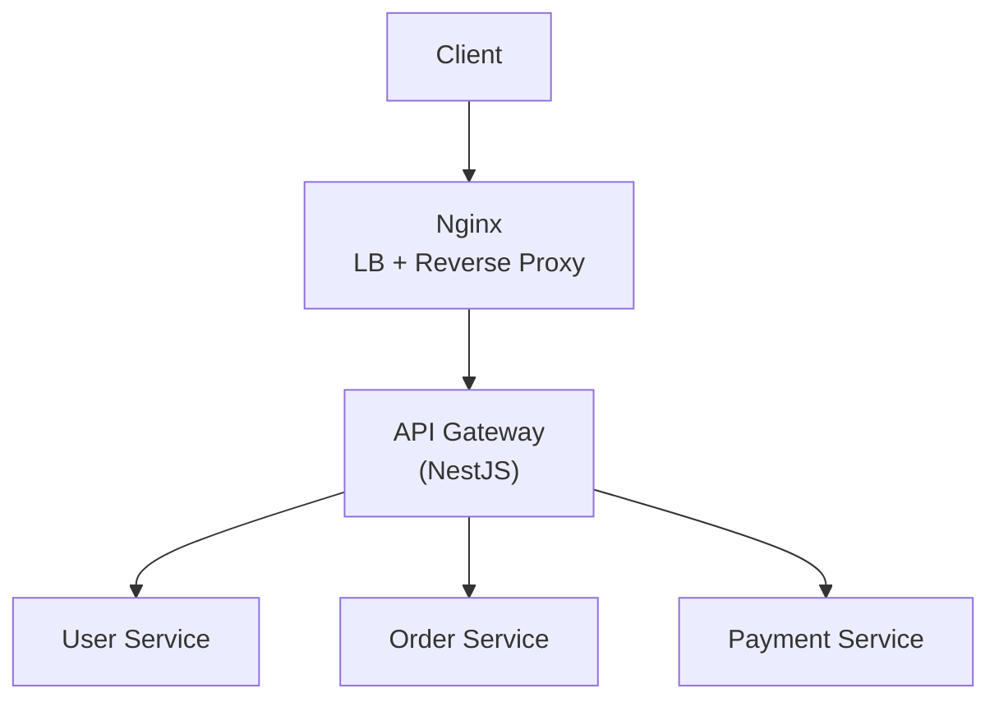
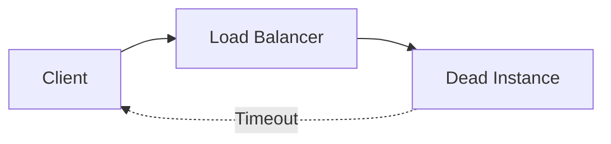
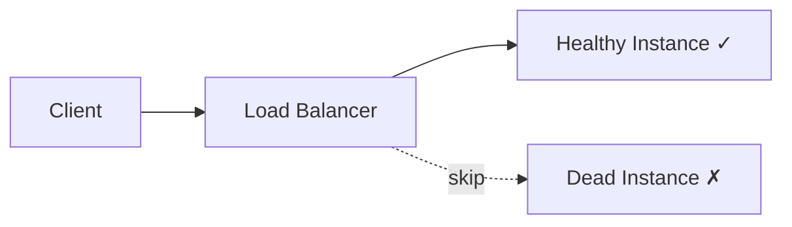
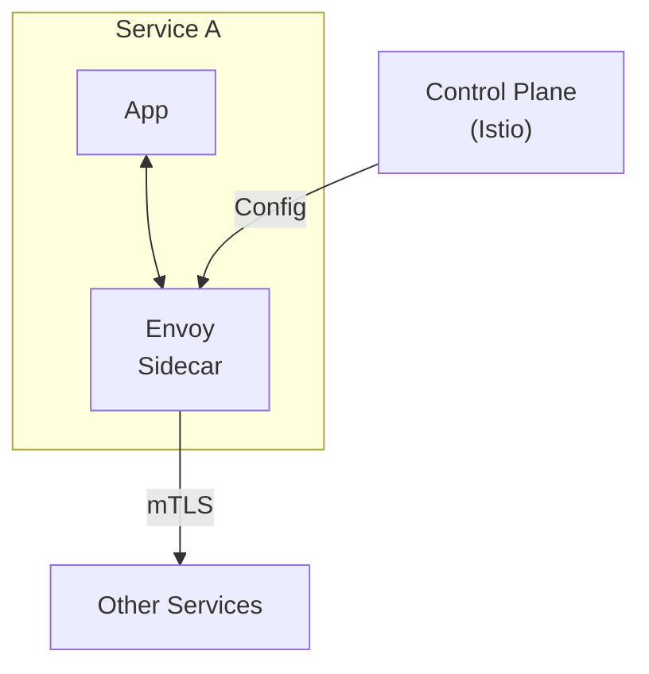

# Load Balancer & Kubernetes Networking

## Tổng quan

Phase 3 khám phá các chiến lược load balancing, các loại proxy, và các khái niệm networking của Kubernetes thông qua các ví dụ thực tế và giải thích chi tiết.

## 🎯 Mục tiêu Học tập

Đến cuối phase này, bạn sẽ hiểu:

- Các thuật toán load balancing và khi nào sử dụng từng loại
- Sự khác biệt quan trọng giữa Load Balancer, Reverse Proxy, Forward Proxy, và API Gateway
- Các chiến lược health check (passive vs active)
- Các loại Kubernetes Service và networking
- Các pattern service discovery
- Các khái niệm service mesh

---

## Thuật toán Load Balancing

### Round Robin (Mặc định)

**Khái niệm**: Phân phối yêu cầu tuần tự đến từng instance.



**Cấu hình**:
```nginx
upstream api_gateway {
    server api-gateway:3000;
    # Round-robin is default
}
```

**Ưu điểm**: Đơn giản, phân phối công bằng  
**Nhược điểm**: Bỏ qua tải của instance  
**Tốt nhất cho**: Các workload đồng nhất

---

### Least Connections

**Khái niệm**: Định tuyến đến instance có ít kết nối hoạt động nhất.

```
Instance A: 5 connections → Don't send here
Instance B: 2 connections → Send here! ✓
Instance C: 3 connections
```

**Cấu hình**:
```nginx
upstream api_gateway {
    least_conn;
    server api-gateway:3000;
}
```

**Ưu điểm**: Nhận thức tải, thích ứng động  
**Nhược điểm**: Chi phí nhẹ  
**Tốt nhất cho**: Các kết nối dài hạn (WebSocket, SSE, uploads)

---

### IP Hash (Sticky Sessions)

**Khái niệm**: Cùng client IP luôn định tuyến đến cùng instance.



**Cấu hình**:
```nginx
upstream api_gateway {
    ip_hash;
    server api-gateway:3000;
}
```

**Ưu điểm**: Duy trì session  
**Nhược điểm**: Tải không đều, không hoạt động với NAT  
**Tốt nhất cho**: Các ứng dụng legacy (giải pháp tạm thời)

:::note
Cảnh báo: Ưu tiên thiết kế stateless với Redis/JWT thay thế!
:::


---

## Giải thích Các Loại Proxy

### So sánh Kiến trúc



---

### Reverse Proxy

**Hướng**: Client → Proxy → Backend

**Mục đích**: Ẩn và bảo vệ backend servers

**Tính năng**:
- Load balancing
- SSL termination
- Caching
- Compression

**Ví dụ**: Nginx, HAProxy, Envoy

**Được sử dụng trong**: Dự án này ✓

---

### Forward Proxy

**Hướng**: Client → Proxy → Internet

**Mục đích**: Ẩn và bảo vệ danh tính client

**Tính năng**:
- Lọc nội dung
- Vô danh
- Kiểm soát truy cập

**Ví dụ**: VPN, Squid, Corporate proxy

**Được sử dụng trong**: Dự án này ✗

---

### Load Balancer vs Reverse Proxy

| Tính năng | Load Balancer | Reverse Proxy |
|---------|--------------|---------------|
| **Mục đích Chính** | Phân phối traffic | Chuyển tiếp yêu cầu |
| **OSI Layer** | Layer 4 hoặc 7 | Layer 7 |
| **Health Checks** | Có | Tùy chọn |
| **SSL Termination** | Đôi khi | Có |
| **Caching** | Không | Có |

**Thông tin Chính**: Nginx có thể là CẢ HAI!

---

### API Gateway

**Hướng**: Client → Gateway → Multiple Services

**Mục đích**: Routing và policies nhận thức business

**Tính năng**:
- Authentication & Authorization
- Rate limiting
- Request aggregation
- Protocol translation
- API versioning

**Ví dụ**: Kong, AWS API Gateway, Ứng dụng NestJS của chúng ta

**Layer**: Application (Layer 7)

---

### Ngăn xếp Hoàn chỉnh

**Kiến trúc Best Practice**:



**Thiết lập Docker của chúng ta**:



---

## Health Checks

### Vấn đề

Không có health checks:


Với health checks:


---

### Passive Health Checks

**Cách hoạt động**: Giám sát traffic thực, đánh dấu instance down sau khi thất bại

**Cấu hình**:
```nginx
upstream api_gateway {
    server api-gateway:3000 max_fails=3 fail_timeout=30s;
}
```

**Hành vi**:
1. Yêu cầu thất bại
2. Đếm thất bại
3. Sau 3 thất bại → đánh dấu down trong 30s
4. Sau 30s → thử lại

**Ưu điểm**: Không có yêu cầu thêm  
**Nhược điểm**: Reactive (một số người dùng thấy thất bại)

---

### Active Health Checks

**Cách hoạt động**: Định kỳ gửi yêu cầu health

**Ví dụ Khái niệm** (Nginx Plus):
```nginx
health_check interval=5s fails=3 passes=2 uri=/health;
```

**Hành vi**:
1. Mỗi 5s, gửi GET /health
2. Nếu 3 kiểm tra thất bại → đánh dấu down
3. Nếu 2 kiểm tra thành công → đánh dấu up

**Ưu điểm**: Phát hiện chủ động  
**Nhược điểm**: Yêu cầu Nginx Plus hoặc cloud LB

---

### Kubernetes Health Probes

Ba loại probes:

#### Liveness Probe
**Câu hỏi**: Container còn sống không?  
**Thất bại**: Khởi động lại container  
**Trường hợp sử dụng**: Phát hiện deadlock

```yaml
livenessProbe:
  httpGet:
    path: /health
    port: 3000
  failureThreshold: 3
```

#### Readiness Probe
**Câu hỏi**: Sẵn sàng cho traffic không?  
**Thất bại**: Loại bỏ khỏi Service  
**Trường hợp sử dụng**: Khởi động chậm, dependencies

```yaml
readinessProbe:
  httpGet:
    path: /health
    port: 3000
  failureThreshold: 3
```

#### Startup Probe
**Câu hỏi**: Đã khởi động chưa?  
**Thất bại**: Khởi động lại  
**Trường hợp sử dụng**: Các ứng dụng rất chậm

```yaml
startupProbe:
  httpGet:
    path: /health
    port: 3000
  failureThreshold: 30  # 150s timeout
```

---

## Kubernetes Services

### ClusterIP (Chỉ Nội bộ)

**Mục đích**: Giao tiếp service-to-service nội bộ

```yaml
apiVersion: v1
kind: Service
spec:
  type: ClusterIP
  ports:
    - port: 80
      targetPort: 3001
```

**Truy cập**: `http://user-service` (chỉ bên trong cluster)

**DNS**: `user-service.default.svc.cluster.local`

**Trường hợp sử dụng**: Tất cả microservices nội bộ

---

### NodePort (Development)

**Mục đích**: Truy cập bên ngoài mà không cần cloud LB

```yaml
spec:
  type: NodePort
  ports:
    - port: 80
      targetPort: 3000
      nodePort: 30080
```

**Truy cập**: `http://<node-ip>:30080`

**Trường hợp sử dụng**: Testing, development

**Cảnh báo**: Không khuyến nghị cho production

---

### LoadBalancer (Production)

**Mục đích**: Truy cập bên ngoài native cloud

```yaml
spec:
  type: LoadBalancer
  ports:
    - port: 80
      targetPort: 3000
```

**Truy cập**: `http://<cloud-lb-dns>` (tự động cung cấp)

**Trường hợp sử dụng**: Production single service

**Providers**: AWS ELB, GCP LB, Azure LB

---

### Ingress (Layer 7 Routing)

**Mục đích**: Điểm vào duy nhất cho nhiều services

```yaml
apiVersion: networking.k8s.io/v1
kind: Ingress
spec:
  rules:
    - host: api.example.com
      http:
        paths:
          - path: /users
            backend:
              service:
                name: user-service
          - path: /orders
            backend:
              service:
                name: order-service
```

**Truy cập**:
- `http://api.example.com/users` → user-service
- `http://api.example.com/orders` → order-service

**Trường hợp sử dụng**: Production với nhiều services (hiệu quả về chi phí)

---

### So sánh Service

| Loại | Bên ngoài | Layer | Chi phí | Tốt nhất cho |
|------|----------|-------|------|----------|
| ClusterIP |  | - | Miễn phí | Nội bộ |
| NodePort |  | 4 | Miễn phí | Dev/Test |
| LoadBalancer |  | 4 | $$ | Single service |
| Ingress |  | 7 | $ | Nhiều services |

**Best Practice**:
- Nội bộ: ClusterIP
- Bên ngoài: Ingress (chia sẻ LB)

---

## Service Discovery

### Không có Registry (Static)

```typescript
// Hardcoded URLs 
const USER_SERVICE = 'http://192.168.1.10:3001';
```

**Vấn đề**: Dễ vỡ, cập nhật thủ công, không failover

---

### Với Registry (Dynamic)

```
Service → Register → Registry (Consul)
                         ↓
Client  → Query    → Get healthy instances
        → Connect  → Direct to instance
```

**Lợi ích**: Động, tự động failover, scales

**Ví dụ**: Consul, Eureka, Kubernetes DNS

---

### Kubernetes Built-in Discovery

```yaml
apiVersion: v1
kind: Service
metadata:
  name: user-service
```

**Tự động tạo DNS**: `user-service.default.svc.cluster.local`

**Sử dụng**:
```typescript
// Just works! ✓
http://user-service/users
```

**kube-proxy** xử lý:
- Service → Pod IP translation
- Load balancing
- Health checks

---

## Service Mesh (Nâng cao)

### Kiến trúc



### Cung cấp gì

 Tự động mTLS encryption  
 Retries và circuit breaking  
 Traffic routing (canary, blue-green)  
 Observability (tracing, metrics)  
 Load balancing (client-side)

**Không cần viết code!**

### Khi nào Sử dụng

** Sử dụng khi:**
- Nhiều microservices (> 10)
- Cần mTLS everywhere
- Routing phức tạp
- Yêu cầu bảo mật cao

** Không sử dụng khi:**
- Kiến trúc đơn giản (< 5 services)
- Team thiếu chuyên môn
- Overhead hiệu suất là vấn đề

### Công cụ

- **Istio**: Feature-rich, phức tạp
- **Linkerd**: Lightweight, đơn giản hơn
- **Consul Connect**: Multi-cloud

---

## Kiểm thử

### Kiểm thử Round Robin

```bash
cd backend
./test-load-balancing.sh
```

**Mong đợi**: Phân phối đều trên 3 instances

### Kiểm thử Least Connections

```bash
# Start CPU-bound work
curl http://localhost/api/cpu-bound &

# New requests go to other instances
curl http://localhost/api/users
```

**Mong đợi**: Phản hồi nhanh (định tuyến đến instance rảnh)

### Kiểm thử IP Hash

```bash
# Make multiple requests
for i in {1..10}; do curl http://localhost/api/count; done
```

**Mong đợi**: Tất cả hit cùng instance (cùng count tăng dần)

---

## Những điểm Chính

1. **Load Balancer ≠ API Gateway**
   - LB phân phối, Gateway áp dụng business logic
   - Sử dụng cả hai cùng nhau

2. **Chọn Thuật toán theo Workload**
   - Round Robin: Mặc định, hoạt động cho hầu hết
   - Least Conn: Các kết nối dài hạn
   - IP Hash: Chỉ khi thực sự cần thiết

3. **Health Checks rất Quan trọng**
   - Luôn triển khai endpoint /health
   - Sử dụng Kubernetes probes trong production
   - Giám sát probe failures

4. **Kubernetes Trừu tượng hóa Độ phức tạp**
   - Services cung cấp endpoints ổn định
   - kube-proxy xử lý load balancing
   - Ingress cho truy cập bên ngoài hiệu quả về chi phí

5. **Service Mesh cho Scale**
   - Sử dụng khi lợi ích vượt quá độ phức tạp
   - Bổ sung (không thay thế) API Gateway

---

## Tham khảo Files

### Nginx Configurations
- `infra/nginx/nginx-round-robin.conf`
- `infra/nginx/nginx-least-conn.conf`
- `infra/nginx/nginx-ip-hash.conf`
- `infra/nginx/nginx-health-checks.conf`

### Kubernetes Examples
- `infra/k8s/01-service-clusterip.yaml`
- `infra/k8s/02-service-nodeport.yaml`
- `infra/k8s/03-service-loadbalancer.yaml`
- `infra/k8s/04-ingress.yaml`
- `infra/k8s/05-deployment-with-probes.yaml`

### Tests
- `test-load-balancing.sh` - Automated demonstrations

---

## Tài nguyên

- [Nginx Load Balancing Guide](https://nginx.org/en/docs/http/load_balancing.html)
- [Kubernetes Services Concepts](https://kubernetes.io/docs/concepts/services-networking/service/)
- [Istio Documentation](https://istio.io/latest/docs/)
- [CNCF Service Mesh Landscape](https://landscape.cncf.io/card-mode?category=service-mesh)
