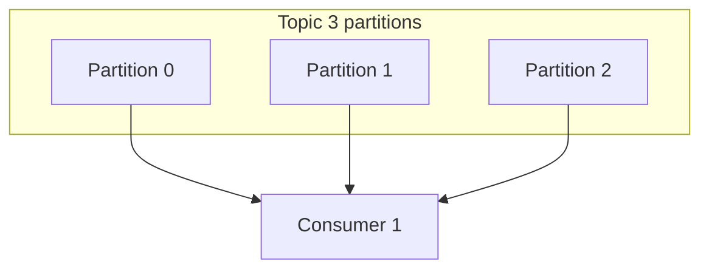
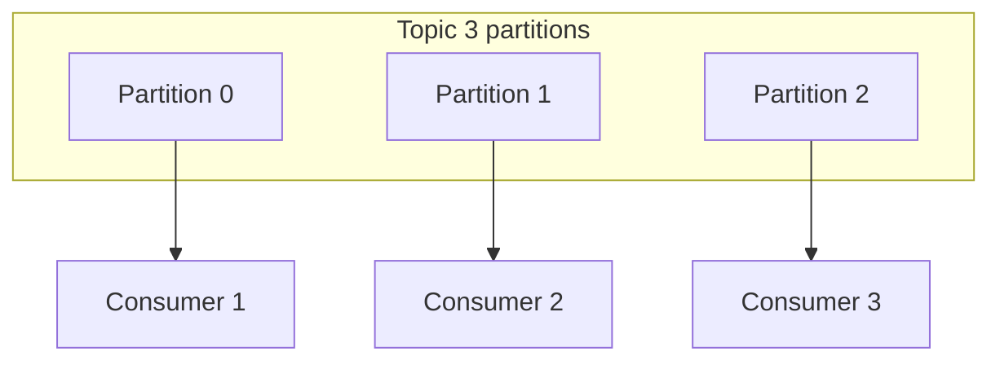
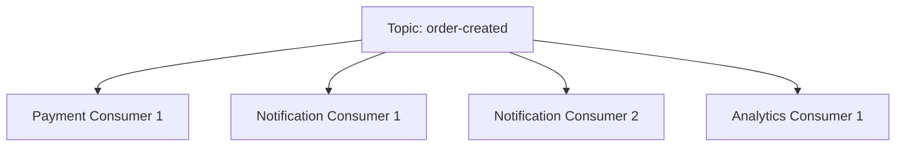
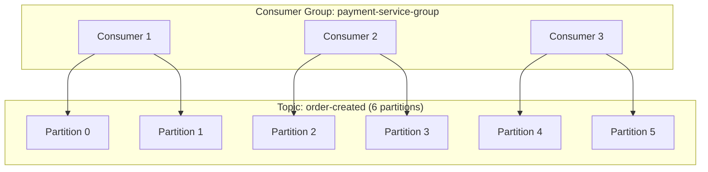
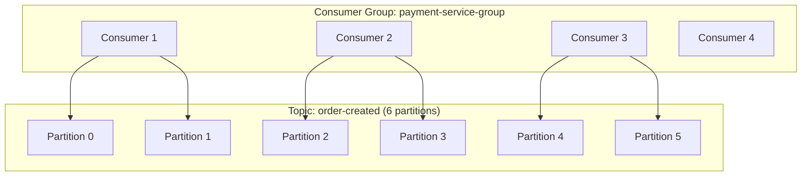
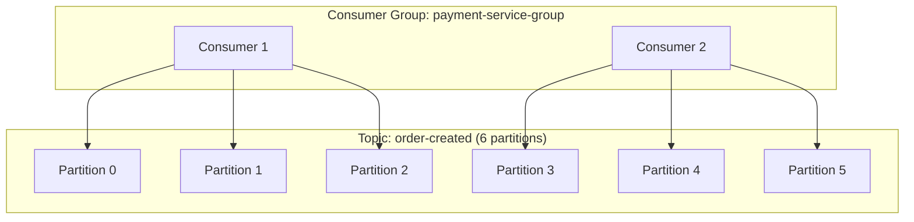
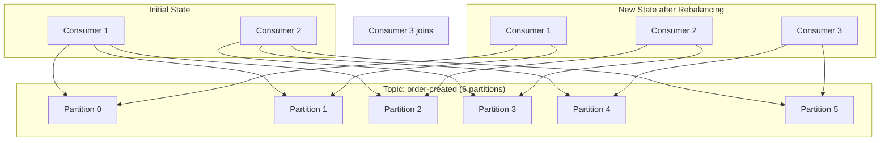

# Consumer Groups

## Tổng quan

Consumer Groups cho phép **xử lý song song** tin nhắn trong khi duy trì khả năng mở rộng và khả năng chịu lỗi. Nhiều consumer trong cùng nhóm làm việc cùng nhau để xử lý tin nhắn từ một topic, với mỗi tin nhắn được tiêu thụ bởi chỉ MỘT consumer trong nhóm.

## Cách Consumer Groups Hoạt động

### Single Consumer



### Consumer Group (Multiple Consumers)



### Nguyên tắc Chính

1. **Trong một nhóm**: Mỗi tin nhắn được tiêu thụ bởi chỉ MỘT consumer
2. **Qua các nhóm**: Mỗi nhóm nhận TẤT CẢ tin nhắn
3. **Gán partition**: Mỗi partition được gán cho chính xác một consumer trong nhóm
4. **Cân bằng lại**: Khi consumer tham gia/rời đi, partitions được gán lại

## Kafka Consumer Groups

### Configuration

```typescript
// kafka.module.ts
@Module({
  imports: [
    ClientsModule.register([{
      name: 'KAFKA_SERVICE',
      transport: Transport.KAFKA,
      options: {
        client: {
          clientId: 'payment-service',
          brokers: ['kafka:9092']
        },
        consumer: {
          groupId: 'payment-service-group',  // ← Consumer Group ID
          sessionTimeout: 30000,              // 30s - consumer must heartbeat
          heartbeatInterval: 3000,            // 3s - heartbeat frequency
          maxBytes: 10485760,                 // 10MB - max fetch size
          rebalanceTimeout: 60000,            // 60s - time for rebalance
        }
      }
    }])
  ]
})
export class PaymentModule {}
```

### Multiple Services, Multiple Groups

```typescript
// Service 1: Payment Service
consumer: {
  groupId: 'payment-service-group'
}

// Service 2: Notification Service
consumer: {
  groupId: 'notification-service-group'
}

// Service 3: Analytics Service
consumer: {
  groupId: 'analytics-service-group'
}
```

**Kết quả:**


### Partition Assignment

#### Scenario 1: Balanced (3 consumers, 6 partitions)



#### Scenario 2: Unbalanced (4 consumers, 6 partitions)



#### Scenario 3: Overloaded (2 consumers, 6 partitions)



**Quy tắc:** Để đạt song song tối đa, tạo **ít nhất nhiều partitions** như số consumer tối đa dự kiến.

```typescript
// Create topic with enough partitions
await admin.createTopics({
  topics: [{
    topic: 'order-created',
    numPartitions: 10,  // Support up to 10 parallel consumers
    replicationFactor: 3
  }]
});
```

## Rebalancing

### When Rebalancing Occurs

1. **Consumer joins** the group
2. **Consumer leaves** (graceful shutdown or crash)
3. **Consumer timeout** (missed heartbeats)
4. **New partition** added to topic

### Rebalance Process



### Handling Rebalance

```typescript
@Injectable()
export class OrderConsumer implements OnModuleInit {
  private consumer: Consumer;

  async onModuleInit() {
    this.consumer = kafka.consumer({
      groupId: 'order-consumer-group'
    });

    await this.consumer.connect();

    // Listen to rebalance events
    this.consumer.on('consumer.group_join', ({ payload }) => {
      console.log('Consumer joined group', payload.memberId);
    });

    this.consumer.on('consumer.rebalancing', ({ payload }) => {
      console.log('Rebalancing started');
      // Save state, pause processing
    });

    this.consumer.on('consumer.rebalanced', ({ payload }) => {
      console.log('Rebalancing complete');
      console.log('Assigned partitions:', payload.assignment);
      // Resume processing
    });

    await this.consumer.subscribe({
      topic: 'order-created',
      fromBeginning: false
    });

    await this.consumer.run({
      eachMessage: async ({ topic, partition, message }) => {
        await this.handleMessage(message);
      }
    });
  }
}
```

### Minimizing Rebalance Impact

```typescript
consumer: {
  groupId: 'order-group',
  sessionTimeout: 30000,        // 30s (increase for slow processing)
  heartbeatInterval: 3000,      // 3s (heartbeat 10x per session timeout)
  maxPollInterval: 300000,      // 5 minutes (max time between polls)
  rebalanceTimeout: 60000       // 1 minute (time to complete rebalance)
}
```

**Best Practices:**
- Keep message processing fast (&lt;5s)
- Send heartbeats regularly
- Handle shutdown gracefully
- Use sticky partition assignment

## Offset Management

### Auto Commit (Simplest)

```typescript
consumer: {
  groupId: 'order-group',
  autoCommit: true,               // ← Auto-commit enabled
  autoCommitInterval: 5000,       // Commit every 5s
}

@EventPattern('order-created')
async handleOrder(data: OrderEvent) {
  await this.processOrder(data);
  // Offset auto-committed after 5s
}
```

**Issue:** If consumer crashes between commits, messages are reprocessed.

### Manual Commit (Recommended)

```typescript
consumer: {
  groupId: 'order-group',
  autoCommit: false,              // ← Manual control
}

@EventPattern('order-created')
async handleOrder(data: OrderEvent, context: KafkaContext) {
  try {
    await this.processOrder(data);
    
    // Commit offset after successful processing
    await context.commit();
  } catch (error) {
    console.error('Failed to process, not committing offset');
    // Message will be retried
  }
}
```

### Commit Strategies

#### 1. After Each Message

```typescript
await this.consumer.run({
  eachMessage: async ({ topic, partition, message }) => {
    await this.handleMessage(message);
    
    // Commit immediately after processing
    await this.consumer.commitOffsets([{
      topic,
      partition,
      offset: (parseInt(message.offset) + 1).toString()
    }]);
  }
});
```

**Pros:** No message loss  
**Cons:** High overhead (many commits)

#### 2. Batch Commit

```typescript
await this.consumer.run({
  eachBatch: async ({ batch, heartbeat, commitOffsetsIfNecessary }) => {
    for (const message of batch.messages) {
      await this.handleMessage(message);
      
      // Heartbeat to prevent timeout
      await heartbeat();
    }
    
    // Commit entire batch at once
    await commitOffsetsIfNecessary();
  }
});
```

**Pros:** Lower overhead  
**Cons:** If crash, entire batch reprocessed

#### 3. Time-Based Commit

```typescript
let lastCommit = Date.now();
const COMMIT_INTERVAL = 5000; // 5 seconds

await this.consumer.run({
  eachMessage: async ({ topic, partition, message }) => {
    await this.handleMessage(message);
    
    // Commit every 5 seconds
    if (Date.now() - lastCommit > COMMIT_INTERVAL) {
      await this.consumer.commitOffsets([{
        topic,
        partition,
        offset: (parseInt(message.offset) + 1).toString()
      }]);
      lastCommit = Date.now();
    }
  }
});
```

## Scaling Patterns

### Pattern 1: Independent Services

Different services, different groups.

```typescript
// Order Service
@Module({
  imports: [
    ClientsModule.register([{
      name: 'KAFKA',
      consumer: { groupId: 'order-service' }
    }])
  ]
})

// Payment Service
@Module({
  imports: [
    ClientsModule.register([{
      name: 'KAFKA',
      consumer: { groupId: 'payment-service' }
    }])
  ]
})

// Both receive ALL messages
```

### Pattern 2: Scale Single Service

Multiple instances, same group.

```bash
# Start 3 instances of payment service
docker-compose up --scale payment-service=3

# All 3 instances share same groupId
# Partitions distributed among them
```

```typescript
// payment-service instance 1, 2, 3
consumer: {
  groupId: 'payment-service-group'  // Same group
}

// Kafka automatically distributes partitions:
// Instance 1 → Partitions [0, 1]
// Instance 2 → Partitions [2, 3]
// Instance 3 → Partitions [4, 5]
```

### Pattern 3: Workload Segregation

Different groups for different workloads.

```typescript
// High-priority orders
consumer: {
  groupId: 'payment-priority-group',
  // Process partition 0 (priority orders routed here)
}

// Regular orders
consumer: {
  groupId: 'payment-regular-group',
  // Process partitions 1-5
}
```

## Monitoring Consumer Groups

### Lag Monitoring

**Consumer lag** = Number of messages consumer is behind.

```typescript
@Injectable()
export class ConsumerLagMonitor {
  async getConsumerLag(groupId: string, topic: string): Promise<number> {
    const admin = kafka.admin();
    await admin.connect();

    // Get consumer group offsets
    const groupOffsets = await admin.fetchOffsets({
      groupId,
      topic
    });

    // Get topic end offsets
    const topicOffsets = await admin.fetchTopicOffsets(topic);

    let totalLag = 0;

    groupOffsets.forEach((partition, index) => {
      const consumerOffset = parseInt(partition.offset);
      const topicOffset = parseInt(topicOffsets[index].high);
      const lag = topicOffset - consumerOffset;
      totalLag += lag;
    });

    await admin.disconnect();

    return totalLag;
  }
}

// Alert if lag > threshold
setInterval(async () => {
  const lag = await monitor.getConsumerLag('payment-service', 'orders');
  
  if (lag > 10000) {
    console.error(`High lag detected: ${lag} messages behind`);
    // Alert ops team
  }
}, 60000); // Check every minute
```

### Consumer Group Status

```typescript
async getConsumerGroupInfo(groupId: string) {
  const admin = kafka.admin();
  await admin.connect();

  const groups = await admin.describeGroups([groupId]);
  const group = groups.groups[0];

  console.log('Group:', group.groupId);
  console.log('State:', group.state);
  console.log('Members:', group.members.length);

  group.members.forEach(member => {
    console.log(`  Member: ${member.memberId}`);
    console.log(`  Partitions:`, member.memberAssignment);
  });

  await admin.disconnect();
}
```

## Best Practices

### 1. Choose Appropriate Group ID

```typescript
//  GOOD: Descriptive, service-specific
'payment-service-consumer-group'
'notification-service-consumer-group'
'analytics-service-consumer-group'

//  BAD: Generic, ambiguous
'consumers'
'group1'
'service-group'
```

### 2. Size Partitions for Max Consumers

```typescript
// If you expect max 10 consumers
await admin.createTopics({
  topics: [{
    topic: 'orders',
    numPartitions: 10  // 1 partition per consumer
  }]
});
```

### 3. Handle Reprocessing (Idempotency)

```typescript
@EventPattern('order-created')
async handleOrder(event: OrderEvent) {
  // Check if already processed
  const processed = await this.redis.get(`processed:${event.orderId}`);
  
  if (processed) {
    console.log('Already processed, skipping');
    return;
  }

  await this.processOrder(event);

  // Mark as processed
  await this.redis.set(`processed:${event.orderId}`, 'true', 'EX', 86400);
}
```

### 4. Graceful Shutdown

```typescript
async onModuleDestroy() {
  console.log('Shutting down consumer...');
  
  // Stop consuming new messages
  await this.consumer.pause([{ topic: 'orders' }]);
  
  // Wait for in-flight messages
  await this.waitForInflightMessages();
  
  // Disconnect
  await this.consumer.disconnect();
  
  console.log('Consumer shutdown complete');
}
```

## Next Steps

- Learn about [Delivery Semantics](./delivery-semantics.md)
- Explore offset management and commit strategies
- Study partitioning strategies for optimal performance
