# Delivery Semantics

## Tổng quan

Delivery semantics định nghĩa các đảm bảo xung quanh việc phân phối tin nhắn giữa producer và consumer. Hiểu các trade-off này rất quan trọng để xây dựng hệ thống phân tán đáng tin cậy.

## Ba Đảm bảo


## At-Most-Once Delivery

### Cách Hoạt động

Tin nhắn được coi là đã phân phối **trước** khi xử lý. Nếu xử lý thất bại, tin nhắn bị mất.

```mermaid
flowchart TD
    A[Consumer nhận tin nhắn] --> B[Commit offset ngay lập tức]
    B --> C[Consumer xử lý tin nhắn]
    C --> D{Xử lý thành công?}
    D -- Thất bại --> E[Tin nhắn bị MẤT]
    D -- Thành công --> F[Message processed]

```



### Implementation

```typescript
@Injectable()
export class AtMostOnceConsumer {
  @EventPattern('log-event')
  async handleLog(event: LogEvent, context: KafkaContext) {
    // Commit BEFORE processing
    await context.commit();
    
    try {
      await this.logService.write(event);
    } catch (error) {
      // Message lost - already committed
      console.error('Failed to write log, message lost');
    }
  }
}
```

### Configuration

```typescript
consumer: {
  groupId: 'log-consumer',
  autoCommit: true,           // Auto-commit before processing
  autoCommitInterval: 1000,   // Commit every 1 second
}
```

### Use Cases

 **Good for:**
- Logging and metrics (some data loss acceptable)
- Real-time monitoring
- Non-critical analytics
- Performance-critical scenarios

 **Bad for:**
- Financial transactions
- Order processing
- Critical business events
- Anything requiring reliability

### Example: Metrics Collection

```typescript
@Controller()
export class MetricsConsumer {
  @EventPattern('user-action')
  async trackAction(event: UserActionEvent, context: KafkaContext) {
    // Fire-and-forget metrics
    await context.commit();
    
    try {
      await this.metrics.increment('user.actions', {
        action: event.action,
        userId: event.userId
      });
    } catch (error) {
      // Not critical if some metrics are lost
      console.error('Metrics tracking failed');
    }
  }
}
```

## At-Least-Once Delivery

### How It Works

Messages are committed **after** successful processing. If processing fails, the message is retried.

```
1. Consumer nhận tin nhắn
2. Consumer xử lý tin nhắn 
3. Consumer commit offset 
4. (Nếu crash trước khi commit, tin nhắn được phân phối lại)
```

### Implementation

```typescript
@Injectable()
export class AtLeastOnceConsumer {
  @EventPattern('order-created')
  async handleOrder(event: OrderEvent, context: KafkaContext) {
    try {
      // Process first
      await this.orderService.processOrder(event);
      
      // Commit AFTER successful processing
      await context.commit();
    } catch (error) {
      console.error('Processing failed, will retry');
      // Don't commit - message will be redelivered
      throw error;
    }
  }
}
```

### Configuration

```typescript
consumer: {
  groupId: 'order-consumer',
  autoCommit: false,          // Manual commit control
  sessionTimeout: 30000,
  maxPollInterval: 300000,    // 5 min max processing time
}
```

### Handling Duplicates (Idempotency)

Since messages can be delivered multiple times, your handler must be **idempotent**.

```typescript
@Injectable()
export class IdempotentOrderConsumer {
  @EventPattern('order-created')
  async handleOrder(event: OrderEvent, context: KafkaContext) {
    // Check if already processed
    const exists = await this.redis.get(`order:${event.orderId}:processed`);
    
    if (exists) {
      console.log(`Order ${event.orderId} already processed, skipping`);
      await context.commit();
      return;
    }

    // Process order
    await this.db.transaction(async (tx) => {
      // Create order
      await tx.order.create({
        id: event.orderId,
        userId: event.userId,
        amount: event.amount
      });

      // Mark as processed (within same transaction)
      await tx.processedEvent.create({
        eventId: event.eventId,
        processedAt: new Date()
      });
    });

    // Cache processed state
    await this.redis.set(
      `order:${event.orderId}:processed`,
      'true',
      'EX',
      86400  // 24 hours
    );

    await context.commit();
  }
}
```

### Idempotency Patterns

#### Pattern 1: Database Unique Constraint

```typescript
// Database schema
CREATE TABLE orders (
  id VARCHAR(255) PRIMARY KEY,  -- Unique constraint prevents duplicates
  user_id VARCHAR(255),
  amount DECIMAL(10, 2),
  created_at TIMESTAMP
);

// Handler
async handleOrder(event: OrderEvent) {
  try {
    await this.orderRepository.insert({
      id: event.orderId,  // Will fail if duplicate
      userId: event.userId,
      amount: event.amount
    });
  } catch (error) {
    if (error.code === 'ER_DUP_ENTRY') {
      console.log('Order already exists, idempotent retry');
      return; // Already processed
    }
    throw error;
  }
}
```

#### Pattern 2: Processed Events Table

```typescript
// Schema
CREATE TABLE processed_events (
  event_id VARCHAR(255) PRIMARY KEY,
  event_type VARCHAR(100),
  processed_at TIMESTAMP
);

// Handler with transaction
async handleOrder(event: OrderEvent) {
  await this.db.transaction(async (tx) => {
    // Check if processed
    const processed = await tx.processedEvent.findOne({
      where: { eventId: event.eventId }
    });

    if (processed) {
      return; // Already processed
    }

    // Process order
    await this.processOrder(event, tx);

    // Record processing
    await tx.processedEvent.create({
      eventId: event.eventId,
      eventType: 'order-created',
      processedAt: new Date()
    });
  });
}
```

#### Pattern 3: Distributed Cache (Redis)

```typescript
async handleOrder(event: OrderEvent) {
  const key = `processed:${event.eventId}`;

  // Try to set key (only succeeds if not exists)
  const acquired = await this.redis.set(
    key,
    'processing',
    'EX', 300,      // 5 min expiry
    'NX'            // Only set if not exists
  );

  if (!acquired) {
    console.log('Already processing or processed');
    return;
  }

  try {
    await this.processOrder(event);
    
    // Mark as completed
    await this.redis.set(key, 'completed', 'EX', 86400);
  } catch (error) {
    // Delete key to allow retry
    await this.redis.del(key);
    throw error;
  }
}
```

### Use Cases

 **Good for:**
- Most business logic
- Order processing
- Payment handling
- User actions
- Any critical workflow

 **Bad for:**
- Non-idempotent operations without deduplication
- When strict exactly-once is required

## Exactly-Once Delivery

### How It Works

Messages are delivered and processed **exactly once**, with no duplicates or losses. This is the hardest guarantee to achieve.

```
1. Start transaction
2. Process message
3. Commit offset
4. Commit transaction
All in atomic operation 
```

### Kafka Transactions

Kafka supports exactly-once through transactions combining processing and offset commits.

```typescript
import { Kafka } from 'kafkajs';

@Injectable()
export class ExactlyOnceConsumer {
  private kafka: Kafka;
  private producer;
  private consumer;

  async onModuleInit() {
    this.kafka = new Kafka({
      clientId: 'payment-service',
      brokers: ['kafka:9092']
    });

    // Transactional producer
    this.producer = this.kafka.producer({
      transactionalId: 'payment-producer-1',  // ← Required for transactions
      idempotent: true,                       // ← Prevent duplicate sends
      maxInFlightRequests: 1                  // ← Strict ordering
    });

    this.consumer = this.kafka.consumer({
      groupId: 'payment-consumer',
      isolation: 'read_committed'             // ← Only read committed messages
    });

    await this.producer.connect();
    await this.consumer.connect();

    await this.consumer.subscribe({ topic: 'orders' });

    await this.consumer.run({
      eachMessage: async ({ topic, partition, message }) => {
        await this.processExactlyOnce(message);
      }
    });
  }

  async processExactlyOnce(message: any) {
    const transaction = await this.producer.transaction();

    try {
      // Start transaction
      const order = JSON.parse(message.value.toString());

      // Process order
      const payment = await this.processPayment(order);

      // Send result (within transaction)
      await transaction.send({
        topic: 'payment-results',
        messages: [{
          key: order.orderId,
          value: JSON.stringify(payment)
        }]
      });

      // Commit offset (within transaction)
      await transaction.sendOffsets({
        consumerGroupId: 'payment-consumer',
        topics: [{
          topic: message.topic,
          partitions: [{
            partition: message.partition,
            offset: (parseInt(message.offset) + 1).toString()
          }]
        }]
      });

      // Commit transaction (all or nothing)
      await transaction.commit();

      console.log('Transaction committed successfully');
    } catch (error) {
      // Abort transaction
      await transaction.abort();
      console.error('Transaction aborted', error);
    }
  }
}
```

### Transactional Outbox Pattern

For integrating with databases.

```typescript
@Injectable()
export class TransactionalOutboxService {
  @EventPattern('order-created')
  async handleOrder(event: OrderEvent, context: KafkaContext) {
    await this.db.transaction(async (tx) => {
      // 1. Process order (database)
      await tx.order.create({
        id: event.orderId,
        userId: event.userId,
        amount: event.amount
      });

      // 2. Write to outbox table (within same transaction)
      await tx.outbox.create({
        aggregateId: event.orderId,
        eventType: 'order-confirmed',
        payload: { orderId: event.orderId, status: 'confirmed' },
        createdAt: new Date()
      });
    });

    // Commit Kafka offset
    await context.commit();
  }
}

// Background job publishes from outbox
@Cron('*/5 * * * * *')  // Every 5 seconds
async publishOutbox() {
  const events = await this.db.outbox.findAll({
    where: { published: false },
    limit: 100
  });

  for (const event of events) {
    await this.kafka.emit(event.eventType, event.payload);

    // Mark as published
    await this.db.outbox.update(event.id, { published: true });
  }
}
```

### Use Cases

 **Good for:**
- Financial transactions
- Money transfers
- Critical business operations
- Inventory management
- Anything requiring strict guarantees

 **Bad for:**
- High-throughput scenarios (slower)
- When slight duplicates are acceptable
- Non-critical operations

## Comparison

| Semantic | Message Loss | Duplicates | Performance | Complexity | Use Case |
|----------|-------------|------------|-------------|------------|----------|
| **At-Most-Once** | Possible  | Never  | Fastest 🚀 | Simple | Logs, metrics |
| **At-Least-Once** | Never  | Possible  | Fast ⚡ | Medium | Most applications |
| **Exactly-Once** | Never  | Never  | Slower 🐢 | Complex | Financial, critical |

## Choosing the Right Semantic

```typescript
// At-Most-Once: Fire-and-forget
@EventPattern('page-view')
async trackPageView(event) {
  await this.analytics.track(event);
  // Don't care if lost
}

// At-Least-Once: Idempotent processing
@EventPattern('order-created')
async processOrder(event) {
  if (await this.isProcessed(event.orderId)) return;
  await this.orderService.create(event);
  await this.markProcessed(event.orderId);
}

// Exactly-Once: Transactional
@EventPattern('payment-request')
async processPayment(event) {
  const tx = await this.producer.transaction();
  await tx.sendOffsets(...);
  await tx.commit();
}
```

## Best Practices

### 1. Default to At-Least-Once + Idempotency

```typescript
//  GOOD: Safe and performant
@EventPattern('order-created')
async handleOrder(event: OrderEvent, context: KafkaContext) {
  if (await this.isDuplicate(event.orderId)) {
    await context.commit();
    return;
  }

  await this.processOrder(event);
  await context.commit();
}
```

### 2. Use Exactly-Once Only When Necessary

```typescript
// Only for critical operations
if (event.type === 'payment' || event.amount > 10000) {
  await this.processWithTransaction(event);
} else {
  await this.processIdempotent(event);
}
```

### 3. Always Include Event IDs

```typescript
interface Event {
  eventId: string;        // Unique per event
  correlationId: string;  // Trace across services
  timestamp: string;
  payload: any;
}
```

### 4. Monitor Duplicates

```typescript
@Injectable()
export class DuplicateMonitor {
  async recordDuplicate(eventId: string) {
    await this.metrics.increment('events.duplicates', {
      eventId,
      timestamp: Date.now()
    });

    if (await this.isHighDuplicateRate()) {
      await this.alerting.send('High duplicate rate detected');
    }
  }
}
```

## Testing

```typescript
describe('Delivery Semantics', () => {
  it('should handle duplicate messages (at-least-once)', async () => {
    const event = { orderId: '123', userId: '456', amount: 100 };

    // Process once
    await consumer.handleOrder(event);
    let orders = await orderRepo.find();
    expect(orders).toHaveLength(1);

    // Process again (duplicate)
    await consumer.handleOrder(event);
    orders = await orderRepo.find();
    expect(orders).toHaveLength(1); // Still 1 (idempotent)
  });

  it('should not lose messages (at-least-once)', async () => {
    const event = { orderId: '123' };

    // Simulate failure before commit
    jest.spyOn(context, 'commit').mockRejectedValue(new Error('Network error'));

    await expect(consumer.handleOrder(event)).rejects.toThrow();

    // Message should be redelivered
    // (in real scenario, Kafka redelivers)
  });
});
```

## Next Steps

- Explore error handling and retry patterns
- Learn about transactional outbox pattern for exactly-once semantics
- Study idempotency patterns for reliable message processing
