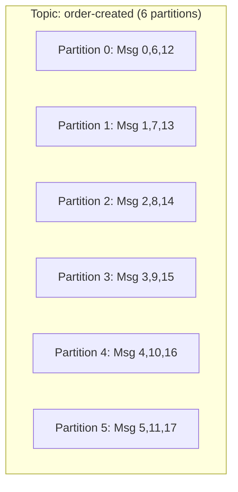
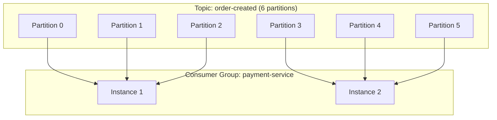
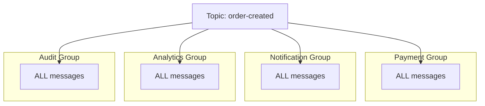
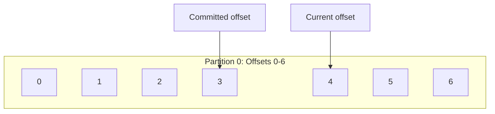
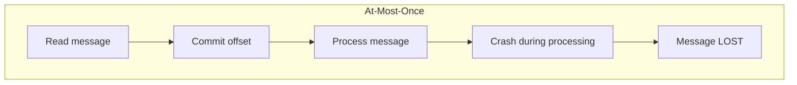
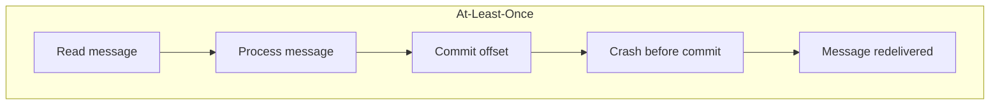
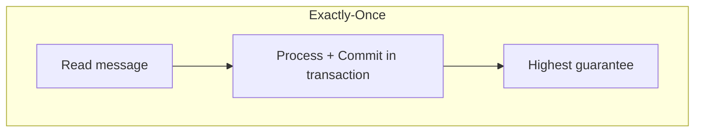
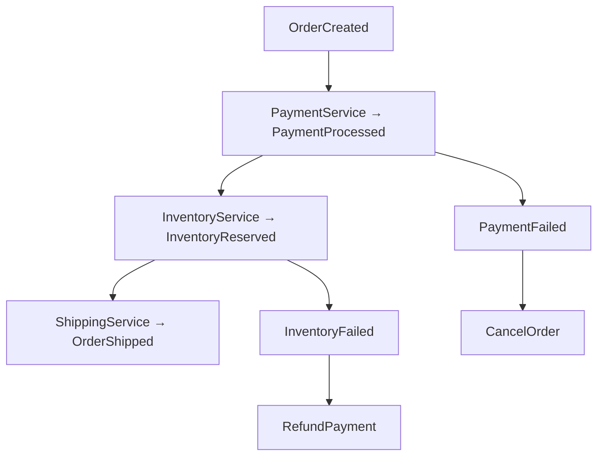

# Event-Driven Architecture with Kafka

## Tổng quan

Kiến trúc Hướng Sự kiện (EDA) là một mẫu thiết kế phần mềm nơi các dịch vụ giao tiếp thông qua sự kiện thay vì gọi trực tiếp. Apache Kafka phục vụ như một nhà môi giới thông điệp, cho phép giao tiếp không đồng bộ, kết hợp lỏng lẻo giữa các microservices.

## Request-Response vs Event-Driven

### Request-Response (Đồng bộ)


**Vấn đề:**
- **Kết hợp chặt chẽ**: OrderService biết về PaymentService và NotificationService
- **Chặn**: OrderService chờ tất cả dịch vụ hạ nguồn
- **Thảm họa thất bại**: Nếu PaymentService ngừng hoạt động, tạo đơn hàng thất bại
- **Vấn đề thời gian chờ**: Chuỗi dài có thể hết thời gian chờ
- **Khó mở rộng**: Thêm dịch vụ yêu cầu thay đổi mã

### Event-Driven (Không đồng bộ)


**Lợi ích:**
- **Kết hợp lỏng lẻo**: Dịch vụ chỉ biết về sự kiện
- **Không chặn**: OrderService trả về ngay lập tức
- **Bền bỉ**: Sự kiện được lưu trữ cho đến khi người tiêu dùng sẵn sàng
- **Có thể mở rộng**: Nhiều người tiêu dùng cho mỗi dịch vụ
- **Có thể mở rộng**: Thêm người tiêu dùng mới mà không thay đổi nhà sản xuất

## Các Khái niệm Cốt lõi

### Topics

Một **topic** là một kênh được đặt tên cho sự kiện. Nhà sản xuất gửi thông điệp đến topics, người tiêu dùng đọc từ topics.

```
order-created          ← Events about new orders
payment-processed      ← Events about completed payments
notification-requested ← Events requesting notifications
```

**Cấu hình:**
- **Partitions**: Số lượng đơn vị xử lý song song (mặc định: 3)
- **Replication Factor**: Số lượng bản sao cho khả năng chịu lỗi
- **Retention**: Bao lâu để giữ thông điệp (mặc định: 7 ngày)

### Partitions

Partitions cho phép **song song** và **đảm bảo thứ tự**.



**Điểm chính:**
- Thông điệp với **cùng khóa** → **cùng partition** (thứ tự)
- Thông điệp với **không khóa** → **phân phối vòng tròn**
- **Nhiều partitions** = **song song cao hơn**
- **Một partition** = **một consumer** tại một thời điểm (trong cùng nhóm)

**Chiến lược Partitioning:**
```typescript
// Same orderId → same partition → ordering guaranteed
await producer.send(Topics.ORDER_CREATED, event, 'order-123');
await producer.send(Topics.PAYMENT_PROCESSED, event, 'order-123');
// Events processed in order
```

### Consumer Groups

Consumer groups cho phép hai mẫu: **cân bằng tải** và **pub/sub**.

#### Mẫu 1: Cân bằng tải (Cùng nhóm)



**Hành vi:**
- Partitions được phân phối giữa các instance
- Mỗi thông điệp được xử lý bởi **MỘT** instance
- Tự động cân bằng lại khi tham gia/rời đi

#### Mẫu 2: Pub/Sub (Nhóm khác nhau)



**Hành vi:**
- Mỗi nhóm nhận **TẤT CẢ** thông điệp
- Các nhóm xử lý độc lập
- Dễ dàng thêm người tiêu dùng mới

### Offsets

Một **offset** là ID tuần tự của mỗi thông điệp trong một partition.



**Quản lý Offset:**
- **Auto-commit**: Offsets được commit tự động
- **Manual commit**: Kiểm soát đầy đủ về commits
- **On rebalance**: Commits trước khi gán lại

### Delivery Semantics

#### At-Most-Once (commit trước khi xử lý)

**Trường hợp sử dụng**: Logs, metrics (không quan trọng)

#### At-Least-Once (commit sau khi xử lý) ← **Mặc định**

**Trường hợp sử dụng**: Hầu hết trường hợp + idempotency

#### Exactly-Once (transactional)

**Trường hợp sử dụng**: Giao dịch tài chính

## Triển khai

### Ví dụ Producer

```typescript
import { KafkaProducerService } from '@libs/kafka';
import { Topics, OrderCreatedEvent } from '@libs/kafka';

@Injectable()
export class OrderService {
  constructor(private readonly producer: KafkaProducerService) {}

  async createOrder(dto: CreateOrderDto) {
    // 1. Business logic
    const order = await this.orderRepository.create(dto);
    
    // 2. Create event
    const event: OrderCreatedEvent = {
      eventType: 'OrderCreated',
      eventId: uuidv4(),
      timestamp: new Date().toISOString(),
      orderId: order.id,
      userId: order.userId,
      items: order.items,
      total: order.total,
    };
    
    // 3. Publish to Kafka
    await this.producer.send(
      Topics.ORDER_CREATED,
      event,
      order.id, // key for partitioning
    );
    
    return order;
  }
}
```

### Ví dụ Consumer

```typescript
import { KafkaConsumerService } from '@libs/kafka';
import { Topics, ConsumerGroups, OrderCreatedEvent } from '@libs/kafka';

@Injectable()
export class PaymentService implements OnModuleInit {
  constructor(private readonly consumer: KafkaConsumerService) {}

  async onModuleInit() {
    // Subscribe to events
    await this.consumer.subscribe<OrderCreatedEvent>(
      ConsumerGroups.PAYMENT_SERVICE,
      [Topics.ORDER_CREATED],
      this.handleOrderCreated.bind(this),
      {
        maxRetries: 3,
        fromBeginning: false,
        autoCommit: true,
        sendToDlqOnFailure: true,
      },
    );
  }

  private async handleOrderCreated(
    event: OrderCreatedEvent,
    metadata: MessageMetadata,
  ): Promise<void> {
    // Check idempotency
    if (await this.isProcessed(event.eventId)) {
      return; // Skip duplicate
    }
    
    // Process payment
    await this.processPayment(event);
    
    // Mark as processed
    await this.markProcessed(event.eventId);
  }
}
```

## Các Thực tiễn Tốt nhất

### 1. Đặt Tên Sự kiện

 **Tốt** (thì quá khứ):
- `OrderCreated`
- `PaymentProcessed`
- `UserRegistered`

 **Xấu**:
- `CreateOrder` (command)
- `Order` (quá chung chung)

### 2. Cấu trúc Sự kiện

Bao gồm ngữ cảnh thiết yếu:

```typescript
{
  eventType: 'OrderCreated',    // Event type
  eventId: 'uuid',              // Unique ID (idempotency)
  timestamp: '2024-01-...',     // When it happened
  orderId: 'order-123',         // Entity ID
  userId: 'user-456',           // Related entities
  // ... event-specific data
}
```

### 3. Idempotency

Luôn triển khai kiểm tra idempotency:

```typescript
async handleEvent(event) {
  // Check if already processed
  if (await this.isProcessed(event.eventId)) {
    return; // Skip duplicate
  }
  
  // Process
  await this.process(event);
  
  // Mark as processed
  await this.markProcessed(event.eventId);
}
```

**Tùy chọn lưu trữ:**
- **Redis**: Nhanh, hỗ trợ TTL
- **Database**: Bền vững, ràng buộc duy nhất
- **Kafka Transactions**: Built-in exactly-once

### 4. Xử lý Lỗi

```typescript
async handleEvent(event) {
  try {
    await this.process(event);
  } catch (error) {
    if (isTransientError(error)) {
      throw error; // Retry
    } else {
      await this.sendToDLQ(event, error); // Permanent error
    }
  }
}
```

**Lỗi tạm thời** (thử lại):
- Thời gian chờ mạng
- Mất kết nối database
- API bên ngoài không khả dụng

**Lỗi vĩnh viễn** (DLQ):
- Định dạng dữ liệu không hợp lệ
- Vi phạm quy tắc kinh doanh
- Dữ liệu không tìm thấy

### 5. Giám sát

**Các chỉ số chính:**
- **Consumer Lag**: Thông điệp chờ xử lý
- **DLQ Size**: Thông điệp thất bại
- **Processing Time**: Thời gian mỗi thông điệp
- **Error Rate**: % thất bại

**Công cụ:**
- Kafka UI: http://localhost:8080
- CLI: `kafka-consumer-groups --describe`
- Prometheus + Grafana (sản xuất)

## Các Mẫu Nâng cao

### Transactional Outbox

**Vấn đề**: Database lưu, nhưng Kafka publish thất bại.

**Giải pháp**: Lưu sự kiện trong database, publish không đồng bộ.

```typescript
// 1. Save in transaction
await db.transaction(async (tx) => {
  await tx.orders.create(order);
  await tx.outbox.create({ event, status: 'pending' });
});

// 2. Background job publishes
setInterval(async () => {
  const pending = await db.outbox.findPending();
  for (const item of pending) {
    await kafka.send(item.event);
    await db.outbox.markPublished(item.id);
  }
}, 1000);
```

### Saga Pattern

**Vấn đề**: Giao dịch phân tán trên các dịch vụ.

**Giải pháp**: Saga dựa trên choreography với sự kiện.



## Kiểm thử

### Unit Testing

```typescript
describe('OrderService', () => {
  it('should publish OrderCreatedEvent', async () => {
    const mockProducer = {
      send: jest.fn(),
    };
    
    const service = new OrderService(mockProducer);
    await service.createOrder(orderDto);
    
    expect(mockProducer.send).toHaveBeenCalledWith(
      Topics.ORDER_CREATED,
      expect.objectContaining({
        eventType: 'OrderCreated',
        orderId: expect.any(String),
      }),
      expect.any(String),
    );
  });
});
```

### Integration Testing

```typescript
describe('Payment Consumer', () => {
  it('should process OrderCreatedEvent', async () => {
    // Publish event
    await producer.send(Topics.ORDER_CREATED, orderCreatedEvent, 'order-123');
    
    // Wait for processing
    await sleep(1000);
    
    // Verify payment created
    const payment = await paymentRepository.findByOrderId('order-123');
    expect(payment).toBeDefined();
    expect(payment.status).toBe('completed');
  });
});
```

## Hiệu suất

### So sánh Throughput

| Chỉ số | Synchronous HTTP | Asynchronous Kafka |
|--------|-----------------|-------------------|
| Thời gian Phản hồi | 2000ms | 100ms (20x nhanh hơn) |
| Orders/sec | 50 | 1000+ |
| Tác động Thất bại | Cascading | Isolated |
| Khả năng Mở rộng | Vertical | Horizontal |

### Mẹo Tối ưu hóa

1. **Batch Messages**: Gửi nhiều thông điệp cùng lúc
2. **Compression**: Bật nén gzip/snappy
3. **Partitioning**: Nhiều partitions = song song cao hơn
4. **Consumer Instances**: Mở rộng consumers để khớp partitions
5. **Offset Commit**: Điều chỉnh khoảng thời gian auto-commit

## Tài nguyên

- [Apache Kafka Documentation](https://kafka.apache.org/documentation/)
- [KafkaJS Client](https://kafka.js.org/)
- [Event-Driven Architecture (Martin Fowler)](https://martinfowler.com/articles/201701-event-driven.html)
