# Message Dispatcher

## Tổng Quan

Message Dispatcher (còn gọi là Message Broker hoặc Message Queue) là middleware cho phép giao tiếp bất đồng bộ giữa các dịch vụ bằng cách định tuyến tin nhắn từ producer đến consumer. Nó rất quan trọng để xây dựng kiến trúc microservices hướng sự kiện, có khả năng mở rộng và tách rời.

## Tại Sao Cần Message Dispatcher?

### Không Có Message Dispatcher (Đồng Bộ)
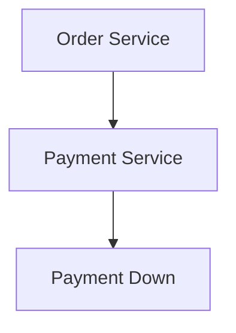

### Có Message Dispatcher (Bất Đồng Bộ)
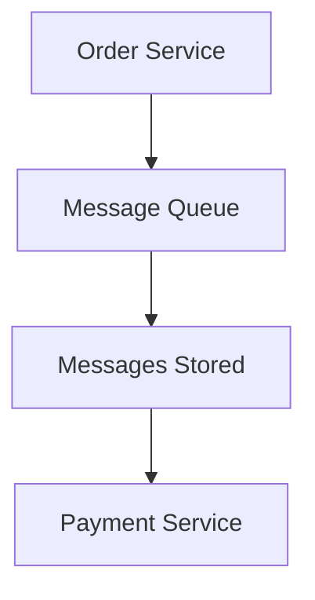

**Lợi Ích:**
- **Tách Rời**: Các service không cần biết về nhau
- **Độ Tin Cậy**: Tin nhắn không bị mất nếu consumer down
- **Khả Năng Mở Rộng**: Dễ dàng thêm consumer
- **Khả Năng Phục Hồi**: Lỗi được cô lập, có thể retry
- **Xử Lý Bất Đồng Bộ**: Không chặn khi chờ phản hồi

## Cấu Trúc Tài Liệu

Hướng dẫn này bao gồm các khái niệm và triển khai message dispatcher:

### Khái Niệm Cơ Bản
- **[Message Brokers](./message-brokers.md)** - Producer, consumer, các loại broker (Kafka, RabbitMQ, Redis, AWS SQS/SNS)
- **[Topics & Exchanges](./topics-exchanges.md)** - Cơ chế định tuyến: direct, fanout, topic, và headers exchanges
- **[Consumer Groups](./consumer-groups.md)** - Xử lý song song, phân bổ partition, các mẫu mở rộng

### Độ Tin Cậy & Phân Phối
- **[Delivery Semantics](./delivery-semantics.md)** - Đảm bảo at-most-once, at-least-once, exactly-once

## Các Khái niệm Cốt lõi

### 1. Message Broker

Hệ thống trung tâm nhận, lưu trữ và phân phối tin nhắn.

**Các broker phổ biến:**
- **Apache Kafka**: High-throughput, distributed streaming
- **RabbitMQ**: Traditional message queuing
- **AWS SQS/SNS**: Managed cloud services
- **Redis Streams**: Lightweight alternative

### 2. Producer

Dịch vụ gửi tin nhắn đến broker.

```typescript
@Injectable()
export class OrderService {
  constructor(
    @Inject('KAFKA_PRODUCER') private kafka: ClientKafka
  ) {}

  async createOrder(orderData: CreateOrderDto) {
    // Save to database
    const order = await this.orderRepository.save(orderData);

    // Publish event (fire and forget)
    await this.kafka.emit('order-created', {
      orderId: order.id,
      userId: order.userId,
      amount: order.amount,
      timestamp: Date.now()
    });

    return order;
  }
}
```

### 3. Consumer

Dịch vụ nhận và xử lý tin nhắn.

```typescript
@Controller()
export class PaymentConsumer {
  @EventPattern('order-created')
  async handleOrderCreated(data: OrderCreatedEvent) {
    console.log(`Processing order ${data.orderId}`);

    try {
      // Process payment
      await this.paymentService.processPayment(data);

      // Emit success event
      await this.kafka.emit('payment-processed', {
        orderId: data.orderId,
        status: 'success'
      });
    } catch (error) {
      // Emit failure event
      await this.kafka.emit('payment-failed', {
        orderId: data.orderId,
        error: error.message
      });
    }
  }
}
```

### 4. Message Queue vs Topic

#### Queue (Point-to-Point)
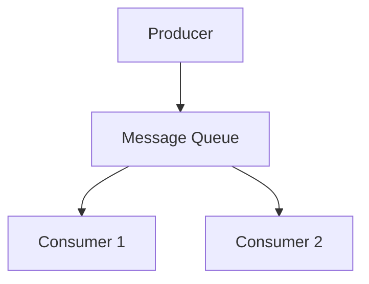

**Trường hợp sử dụng:** Phân bổ công việc (nhiều worker xử lý công việc)

#### Topic (Publish-Subscribe)
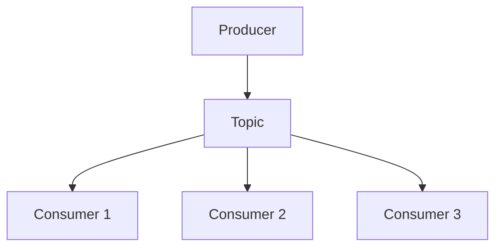

**Trường hợp sử dụng:** Phát sóng sự kiện (nhiều dịch vụ phản ứng với cùng sự kiện)

## Các Loại Exchange (RabbitMQ)

### 1. Direct Exchange

Định tuyến dựa trên khớp chính xác khóa định tuyến.

```typescript
// Producer
await channel.publish('direct-exchange', 'order.created', message);

// Consumer 1 - listens to 'order.created'
await channel.bindQueue(queue1, 'direct-exchange', 'order.created');

// Consumer 2 - listens to 'order.cancelled'
await channel.bindQueue(queue2, 'direct-exchange', 'order.cancelled');
```

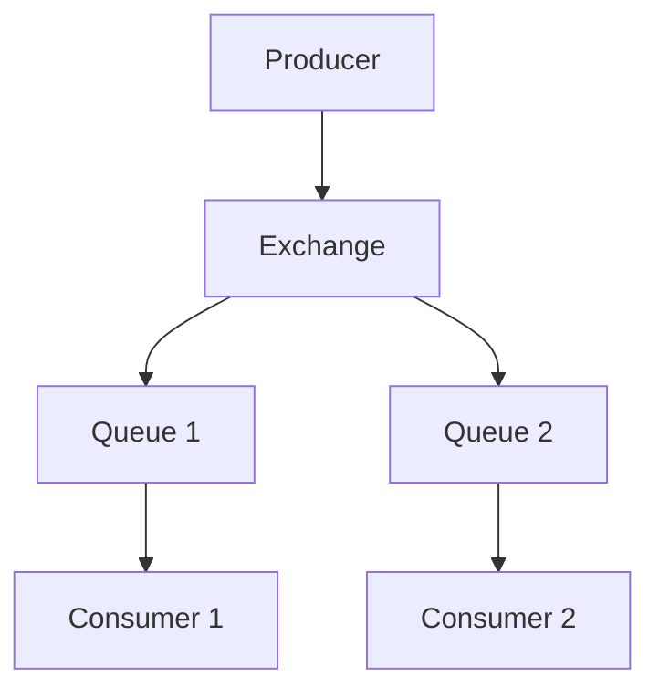

### 2. Fanout Exchange

Phát sóng đến tất cả hàng đợi liên kết (bỏ qua khóa định tuyến).

```typescript
// Broadcast to all
await channel.publish('fanout-exchange', '', message);
```

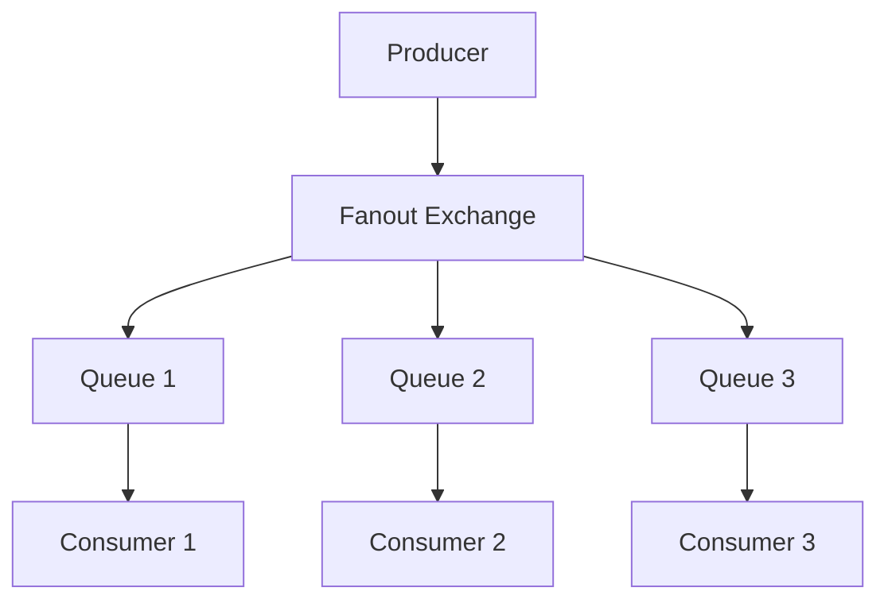

**Trường hợp sử dụng:** Thông báo, ghi nhật ký, phân tích

### 3. Topic Exchange

Định tuyến dựa trên khớp mẫu.

```typescript
// Producer
await channel.publish('topic-exchange', 'order.us.created', message);

// Consumer patterns
await channel.bindQueue(queue1, 'topic-exchange', 'order.*.created');  // Matches
await channel.bindQueue(queue2, 'topic-exchange', 'order.us.*');        // Matches
await channel.bindQueue(queue3, 'topic-exchange', 'payment.*');         // No match
```

**Ký tự đại diện:**
- `*`: Khớp chính xác một từ
- `#`: Khớp không hoặc nhiều từ

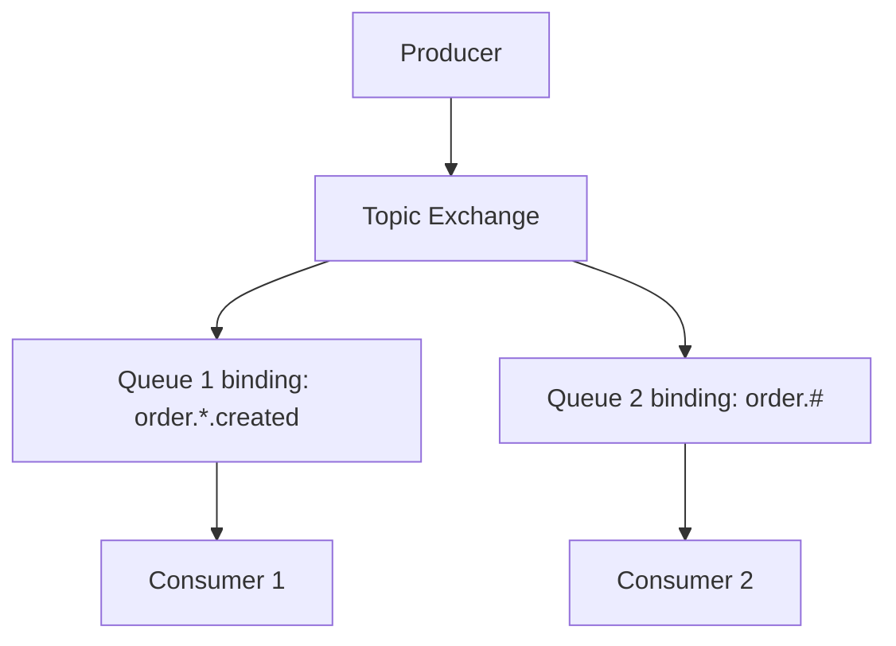

### 4. Headers Exchange

Định tuyến dựa trên tiêu đề tin nhắn (không phải khóa định tuyến).

```typescript
// Producer
await channel.publish('headers-exchange', '', message, {
  headers: {
    format: 'pdf',
    priority: 'high'
  }
});

// Consumer
await channel.bindQueue(queue, 'headers-exchange', '', {
  'x-match': 'all',  // or 'any'
  'format': 'pdf',
  'priority': 'high'
});
```

## Consumer Groups

Nhiều consumer trong cùng nhóm chia sẻ xử lý tin nhắn.

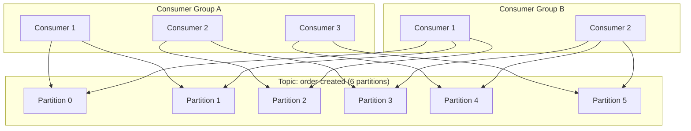

**Điểm chính:**
- Trong nhóm: Mỗi tin nhắn được tiêu thụ bởi chỉ MỘT consumer
- Qua các nhóm: Mỗi nhóm nhận TẤT CẢ tin nhắn
- Cho phép xử lý song song + nhiều subscriber

```typescript
// NestJS Kafka Consumer Group
@Module({
  imports: [
    ClientsModule.register([{
      name: 'KAFKA_SERVICE',
      transport: Transport.KAFKA,
      options: {
        client: {
          brokers: ['localhost:9092']
        },
        consumer: {
          groupId: 'payment-service-group', // All instances share this
        }
      }
    }])
  ]
})
```

## Delivery Semantics

### At-Most-Once

Tin nhắn có thể bị mất nhưng không bao giờ được phân phối hai lần.

```typescript
// No acknowledgment checking
@EventPattern('order-created')
async handleOrder(data: any) {
  // Process immediately, no retry if fails
  await this.processOrder(data);
  // Auto-ack before processing
}
```

**Trường hợp sử dụng:** Logs, metrics (mất một số dữ liệu là chấp nhận được)

### At-Least-Once

Tin nhắn không bao giờ bị mất nhưng có thể được phân phối nhiều lần.

```typescript
// Manual acknowledgment after processing
@EventPattern('order-created')
async handleOrder(data: any, context: KafkaContext) {
  try {
    await this.processOrder(data);
    context.commit(); // Ack after successful processing
  } catch (error) {
    // Don't ack, will be retried
    throw error;
  }
}
```

**Trường hợp sử dụng:** Hầu hết ứng dụng (xử lý trùng lặp với idempotency)

### Exactly-Once

Tin nhắn được phân phối chính xác một lần (khó đạt nhất).

```typescript
// Use transactional outbox pattern
@EventPattern('order-created')
async handleOrder(data: any) {
  await this.db.transaction(async (tx) => {
    // Check if already processed (idempotency key)
    const processed = await tx.findOne(ProcessedEvents, {
      where: { eventId: data.eventId }
    });

    if (processed) {
      return; // Already processed
    }

    // Process
    await this.processOrder(data, tx);

    // Mark as processed
    await tx.save(ProcessedEvents, {
      eventId: data.eventId,
      timestamp: Date.now()
    });
  });
}
```

**Trường hợp sử dụng:** Giao dịch tài chính, hoạt động quan trọng

## Dead Letter Queue (DLQ)

Khi xử lý tin nhắn thất bại lặp lại, gửi đến DLQ để điều tra.

```typescript
@Injectable()
export class MessageProcessor {
  private readonly MAX_RETRIES = 3;

  @EventPattern('order-created')
  async handleOrder(message: any, context: KafkaContext) {
    const retryCount = message.headers?.retryCount || 0;

    try {
      await this.processOrder(message.data);
      context.commit();
    } catch (error) {
      if (retryCount >= this.MAX_RETRIES) {
        // Send to DLQ
        await this.kafka.emit('order-created-dlq', {
          ...message,
          error: error.message,
          failedAt: Date.now()
        });
        
        context.commit(); // Don't retry anymore
      } else {
        // Retry with backoff
        await this.kafka.emit('order-created', {
          ...message,
          headers: { retryCount: retryCount + 1 }
        });
        
        context.commit();
      }
    }
  }

  // Monitor DLQ
  @EventPattern('order-created-dlq')
  async handleDLQ(message: any) {
    // Log to monitoring system
    console.error('Message sent to DLQ:', message);
    
    // Alert operations team
    await this.alerting.sendAlert({
      severity: 'critical',
      message: 'Message processing failed after max retries'
    });
  }
}
```

## Apache Kafka

### Architecture

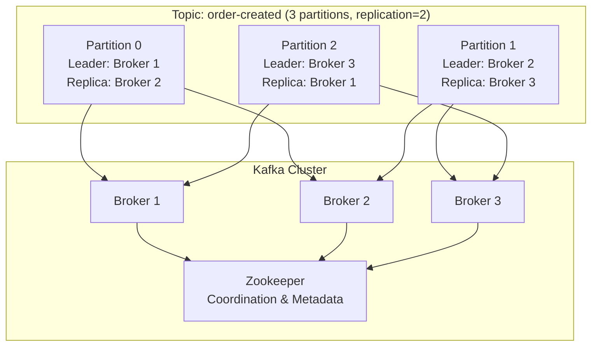

### Topics & Partitions

```typescript
// Create topic with partitions
await admin.createTopics({
  topics: [{
    topic: 'order-created',
    numPartitions: 6,        // Parallel processing
    replicationFactor: 2      // Fault tolerance
  }]
});
```

**Tại sao partitions?**
- **Song song**: Mỗi partition được xử lý độc lập
- **Khả năng mở rộng**: Phân bổ tải trên các broker
- **Thứ tự**: Tin nhắn trong cùng partition được sắp xếp

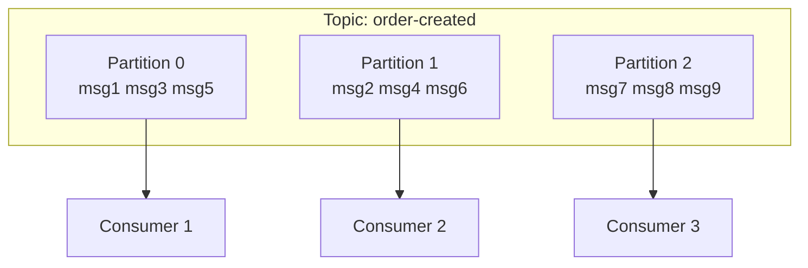

### Offset Management

Kafka theo dõi vị trí consumer với offsets.

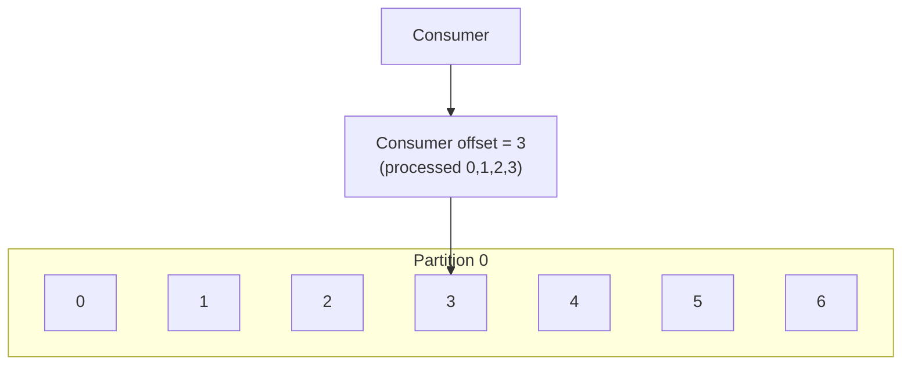

```typescript
// Manual offset commit
@EventPattern('order-created')
async handleOrder(message: any, context: KafkaContext) {
  const { partition, offset } = context.getMessage();
  
  try {
    await this.processOrder(message);
    
    // Commit offset manually
    await context.commit();
    
    console.log(`Processed partition ${partition}, offset ${offset}`);
  } catch (error) {
    // Don't commit - message will be reprocessed
    throw error;
  }
}
```

### Partitioning Strategy

```typescript
// Strategy 1: Key-based (same key → same partition)
await producer.send({
  topic: 'order-created',
  messages: [{
    key: userId,  // All messages for user go to same partition
    value: JSON.stringify(order)
  }]
});

// Strategy 2: Round-robin (default, no key)
await producer.send({
  topic: 'order-created',
  messages: [{
    value: JSON.stringify(order)  // Distributed evenly
  }]
});

// Strategy 3: Custom partitioner
await producer.send({
  topic: 'order-created',
  messages: [{
    value: JSON.stringify(order),
    partition: order.amount > 1000 ? 0 : 1  // High-value orders
  }]
});
```

## Ví dụ Triển khai

### Producer Setup

```typescript
// order.module.ts
@Module({
  imports: [
    ClientsModule.register([{
      name: 'KAFKA_SERVICE',
      transport: Transport.KAFKA,
      options: {
        client: {
          clientId: 'order-service',
          brokers: ['localhost:9092']
        },
        producer: {
          allowAutoTopicCreation: true,
          transactionTimeout: 30000
        }
      }
    }])
  ],
  providers: [OrderService]
})
export class OrderModule {}

// order.service.ts
@Injectable()
export class OrderService {
  constructor(
    @Inject('KAFKA_SERVICE') private kafka: ClientKafka
  ) {}

  async createOrder(data: CreateOrderDto) {
    const order = await this.orderRepository.save(data);

    // Publish event
    await this.kafka.emit('order-created', {
      orderId: order.id,
      userId: order.userId,
      items: order.items,
      amount: order.amount,
      timestamp: Date.now()
    });

    return order;
  }
}
```

### Consumer Setup

```typescript
// main.ts
const app = await NestFactory.createMicroservice<MicroserviceOptions>(
  PaymentModule,
  {
    transport: Transport.KAFKA,
    options: {
      client: {
        clientId: 'payment-service',
        brokers: ['localhost:9092']
      },
      consumer: {
        groupId: 'payment-consumer-group',
        sessionTimeout: 30000,
        heartbeatInterval: 3000
      }
    }
  }
);

// payment.controller.ts
@Controller()
export class PaymentController {
  @EventPattern('order-created')
  async handleOrderCreated(@Payload() data: OrderCreatedEvent) {
    console.log(`Received order: ${data.orderId}`);
    
    // Process payment
    const result = await this.paymentService.process(data);
    
    // Emit result
    await this.kafka.emit('payment-processed', result);
  }
}
```

## Các Thực tiễn Tốt nhất

### 1. Idempotency

Đảm bảo xử lý cùng tin nhắn nhiều lần có cùng hiệu quả.

```typescript
@EventPattern('order-created')
async handleOrder(data: OrderCreatedEvent) {
  // Check if already processed
  const existing = await this.orderRepository.findOne({
    where: { externalId: data.orderId }
  });

  if (existing) {
    console.log('Order already processed');
    return;
  }

  // Process
  await this.processOrder(data);
}
```

### 2. Xử lý Lỗi

```typescript
@EventPattern('order-created')
async handleOrder(data: OrderCreatedEvent) {
  try {
    await this.processOrder(data);
  } catch (error) {
    if (error instanceof ValidationError) {
      // Permanent error - send to DLQ
      await this.sendToDLQ(data, error);
    } else {
      // Temporary error - retry
      throw error;
    }
  }
}
```

### 3. Giám sát

```typescript
@Injectable()
export class KafkaMetrics {
  recordMessageProcessed(topic: string, success: boolean, duration: number) {
    this.metrics.increment('kafka_messages_total', {
      topic,
      success: success.toString()
    });

    this.metrics.observe('kafka_processing_duration', duration, {
      topic
    });
  }
}
```

## Triển khai Dự án

Xem:
- [Kafka setup](../../../backend/PHASE4-MESSAGE-DISPATCHER.md)
- [Docker Compose](../../../backend/docker-compose.kafka.yml)
- [Consumer examples](../../../backend/apps/payment-service/src)
- [Test scripts](../../../backend/test-kafka.sh)

## Các Bước Tiếp theo

- Học về saga pattern cho giao dịch phân tán
- Khám phá [Streaming](../streaming-processing/index.md)
- Kiểm tra các mẫu event sourcing
