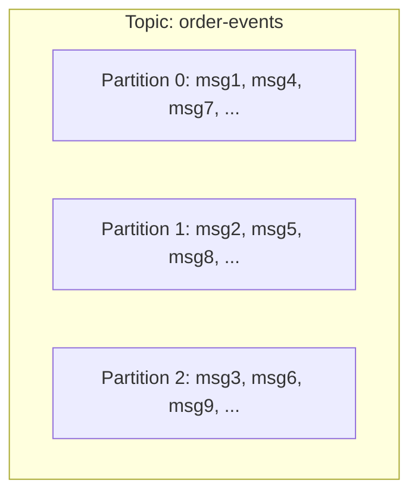
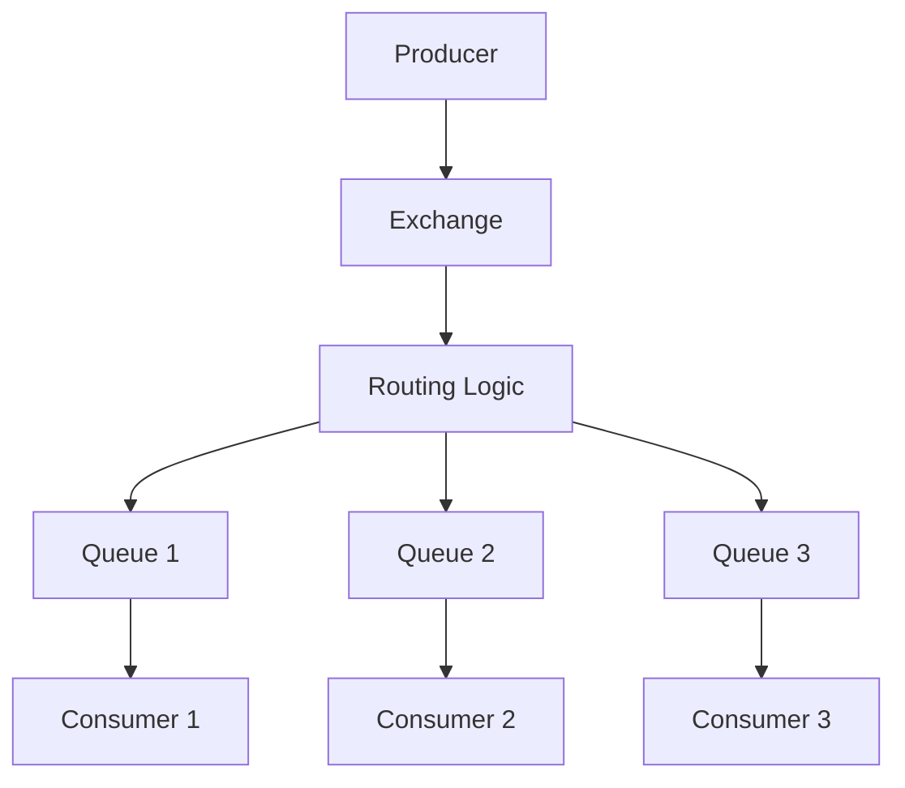
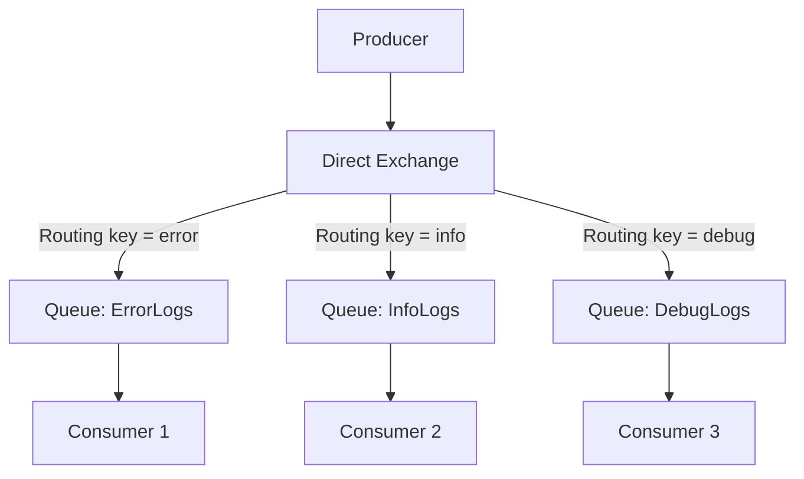
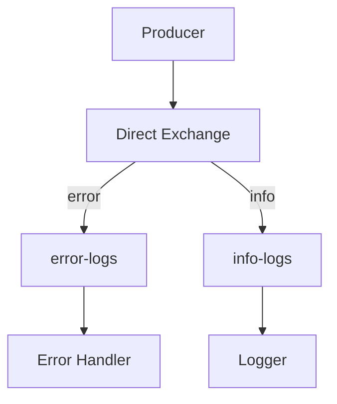
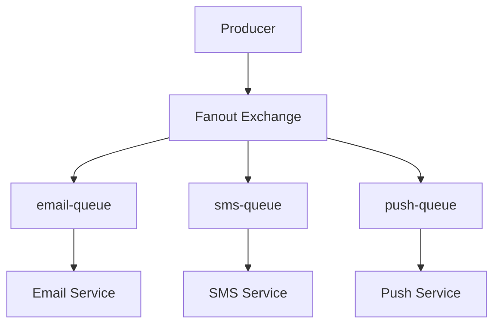

# Topics & Exchanges

## Tổng quan

Chủ đề và Trao đổi là các cơ chế định tuyến xác định cách thông điệp chảy từ nhà sản xuất đến người tiêu dùng. Hiểu các khái niệm này rất quan trọng để xây dựng kiến trúc hướng thông điệp linh hoạt.

## Kafka Topics

### Chủ đề là gì?

Một chủ đề là một danh mục hoặc tên nguồn cấp dữ liệu mà thông điệp được xuất bản. Chủ đề được chia thành các phân vùng để mở rộng quy mô và song song.



### Tạo Chủ đề

```typescript
// kafka-admin.service.ts
import { Kafka } from 'kafkajs';

@Injectable()
export class KafkaAdminService {
  private kafka: Kafka;
  private admin;

  constructor() {
    this.kafka = new Kafka({
      clientId: 'admin-client',
      brokers: ['localhost:9092']
    });
    this.admin = this.kafka.admin();
  }

  async createTopic(topicName: string, partitions: number = 3, replicationFactor: number = 1) {
    await this.admin.connect();

    await this.admin.createTopics({
      topics: [{
        topic: topicName,
        numPartitions: partitions,
        replicationFactor: replicationFactor,
        configEntries: [
          { name: 'retention.ms', value: '604800000' },        // 7 days
          { name: 'cleanup.policy', value: 'delete' },
          { name: 'compression.type', value: 'snappy' },
          { name: 'max.message.bytes', value: '1000000' }      // 1 MB
        ]
      }]
    });

    console.log(`Topic '${topicName}' created with ${partitions} partitions`);

    await this.admin.disconnect();
  }

  async listTopics() {
    await this.admin.connect();
    const topics = await this.admin.listTopics();
    await this.admin.disconnect();
    return topics;
  }

  async deleteTopic(topicName: string) {
    await this.admin.connect();
    await this.admin.deleteTopics({ topics: [topicName] });
    await this.admin.disconnect();
  }
}
```

### Quy ước Đặt Tên Chủ đề

```typescript
//  TỐT: Mô tả, phân cấp
'order.created'
'order.updated'
'order.cancelled'
'payment.succeeded'
'payment.failed'
'user.registered'
'inventory.stock-updated'

//  XẤU: Mơ hồ, không nhất quán
'orders'
'updates'
'data'
'events'
```

### Xuất bản đến Chủ đề

```typescript
@Injectable()
export class OrderProducer {
  constructor(@Inject('KAFKA_SERVICE') private kafka: ClientKafka) {}

  async publishOrderCreated(order: Order) {
    // Produce to topic
    await this.kafka.emit('order.created', {
      key: order.id,        // Messages with same key go to same partition
      value: {
        orderId: order.id,
        userId: order.userId,
        amount: order.amount,
        items: order.items,
        timestamp: Date.now()
      },
      headers: {
        'correlation-id': 'req_123',
        'event-type': 'OrderCreated'
      }
    });
  }

  // Multiple topics for different event types
  async publishOrderUpdated(order: Order) {
    await this.kafka.emit('order.updated', order);
  }

  async publishOrderCancelled(orderId: string, reason: string) {
    await this.kafka.emit('order.cancelled', { orderId, reason });
  }
}
```

### Tiêu thụ từ Chủ đề

```typescript
@Controller()
export class OrderConsumer {
  // Listen to specific topic
  @EventPattern('order.created')
  async handleOrderCreated(event: OrderCreatedEvent) {
    console.log('Order created:', event.orderId);
    await this.processOrder(event);
  }

  @EventPattern('order.updated')
  async handleOrderUpdated(event: OrderUpdatedEvent) {
    console.log('Order updated:', event.orderId);
    await this.updateOrder(event);
  }

  @EventPattern('order.cancelled')
  async handleOrderCancelled(event: OrderCancelledEvent) {
    console.log('Order cancelled:', event.orderId);
    await this.cancelOrder(event);
  }
}
```

## RabbitMQ Exchanges

### Các Loại Trao đổi

RabbitMQ sử dụng trao đổi để định tuyến thông điệp đến hàng đợi dựa trên quy tắc.



### 1. Direct Exchange

Định tuyến thông điệp đến hàng đợi dựa trên **khớp chính xác khóa định tuyến**.



**Thiết lập:**

```typescript
import * as amqp from 'amqplib';

@Injectable()
export class DirectExchangeService {
  private connection: amqp.Connection;
  private channel: amqp.Channel;

  async setup() {
    this.connection = await amqp.connect('amqp://localhost');
    this.channel = await this.connection.createChannel();

    // Create exchange
    await this.channel.assertExchange('logs', 'direct', { durable: true });

    // Create queues
    await this.channel.assertQueue('error-logs', { durable: true });
    await this.channel.assertQueue('info-logs', { durable: true });

    // Bind queues to exchange with routing keys
    await this.channel.bindQueue('error-logs', 'logs', 'error');
    await this.channel.bindQueue('info-logs', 'logs', 'info');
  }

  // Publish with routing key
  async publishLog(level: string, message: string) {
    this.channel.publish(
      'logs',              // exchange
      level,               // routing key
      Buffer.from(message)
    );
  }

  // Consume from specific queue
  async consumeErrors() {
    await this.channel.consume('error-logs', (msg) => {
      if (msg) {
        console.log('ERROR:', msg.content.toString());
        this.channel.ack(msg);
      }
    });
  }
}

// Usage
await service.publishLog('error', 'Database connection failed'); // → error-logs
await service.publishLog('info', 'User logged in');               // → info-logs
```

**Luồng:**



### 2. Fanout Exchange

Phát sóng thông điệp đến **tất cả hàng đợi liên kết**, bỏ qua khóa định tuyến.

```
One message → All queues get a copy
```

**Thiết lập:**

```typescript
@Injectable()
export class FanoutExchangeService {
  private channel: amqp.Channel;

  async setup() {
    // Create fanout exchange
    await this.channel.assertExchange('notifications', 'fanout', { durable: false });

    // Create multiple queues
    await this.channel.assertQueue('email-queue');
    await this.channel.assertQueue('sms-queue');
    await this.channel.assertQueue('push-queue');

    // Bind all queues to exchange (no routing key needed)
    await this.channel.bindQueue('email-queue', 'notifications', '');
    await this.channel.bindQueue('sms-queue', 'notifications', '');
    await this.channel.bindQueue('push-queue', 'notifications', '');
  }

  // Publish to all
  async notifyUser(message: string) {
    this.channel.publish(
      'notifications',
      '',                    // Routing key ignored in fanout
      Buffer.from(message)
    );
  }
}

// Usage
await service.notifyUser('Your order has shipped');
// → email-queue: sends email
// → sms-queue: sends SMS
// → push-queue: sends push notification
```

**Luồng:**



**Trường hợp sử dụng:**
- Phát sóng sự kiện
- Thông báo đến nhiều kênh
- Ghi nhật ký đến nhiều đích
- Cập nhật thời gian thực

### 3. Topic Exchange

Định tuyến dựa trên **khớp mẫu** với ký tự đại diện.

**Ký tự đại diện:**
- `*` (star): Khớp chính xác **một từ**
- `#` (hash): Khớp **không hoặc nhiều từ**

```
Routing key: 'order.us.created'

Pattern 'order.*.created' → Match 
Pattern 'order.#'         → Match 
Pattern 'payment.*'       → No match 
```

**Thiết lập:**

```typescript
@Injectable()
export class TopicExchangeService {
  private channel: amqp.Channel;

  async setup() {
    await this.channel.assertExchange('events', 'topic', { durable: true });

    // Different consumers with different patterns
    
    // Consumer 1: All order events
    await this.channel.assertQueue('all-orders');
    await this.channel.bindQueue('all-orders', 'events', 'order.#');

    // Consumer 2: Only created events
    await this.channel.assertQueue('created-events');
    await this.channel.bindQueue('created-events', 'events', '*.*.created');

    // Consumer 3: Only US region
    await this.channel.assertQueue('us-events');
    await this.channel.bindQueue('us-events', 'events', '*.us.*');

    // Consumer 4: Specific pattern
    await this.channel.assertQueue('order-us-created');
    await this.channel.bindQueue('order-us-created', 'events', 'order.us.created');
  }

  async publishEvent(routingKey: string, data: any) {
    this.channel.publish(
      'events',
      routingKey,
      Buffer.from(JSON.stringify(data))
    );
  }
}

// Usage examples
await service.publishEvent('order.us.created', {...});
// Matches: 'order.#', '*.*.created', '*.us.*', 'order.us.created'

await service.publishEvent('order.eu.updated', {...});
// Matches: 'order.#'

await service.publishEvent('payment.us.processed', {...});
// Matches: '*.us.*', '*.*.processed'
```

**Ví dụ Định tuyến:**

| Routing Key         | Pattern `order.*` | Pattern `order.#` | Pattern `*.*.created` |
| ------------------- | ----------------- | ----------------- | --------------------- |
| order.created       |  Match           |  Match           |  No match            |
| order.us.created    |  No match        |  Match           |  Match               |
| order.updated       |  Match           |  Match           |  No match            |
| payment.created     |  No match        |  No match        |  No match            |
| order.us.eu.created |  No match        |  Match           |  No match            |


**Trường hợp sử dụng:**
- Định tuyến đa vùng
- Lọc dựa trên danh mục
- Định tuyến sự kiện phân cấp
- Đăng ký linh hoạt

### 4. Headers Exchange

Định tuyến dựa trên **tiêu đề thông điệp** thay vì khóa định tuyến.

```typescript
@Injectable()
export class HeadersExchangeService {
  private channel: amqp.Channel;

  async setup() {
    await this.channel.assertExchange('tasks', 'headers', { durable: true });

    // Queue 1: Urgent PDF tasks
    await this.channel.assertQueue('urgent-pdf');
    await this.channel.bindQueue('urgent-pdf', 'tasks', '', {
      'x-match': 'all',      // Must match ALL headers
      'format': 'pdf',
      'priority': 'urgent'
    });

    // Queue 2: Any image tasks
    await this.channel.assertQueue('image-processing');
    await this.channel.bindQueue('image-processing', 'tasks', '', {
      'x-match': 'any',      // Match ANY header
      'format': 'jpg',
      'format': 'png'
    });
  }

  async publishTask(data: any, headers: Record<string, any>) {
    this.channel.publish(
      'tasks',
      '',                    // Routing key not used
      Buffer.from(JSON.stringify(data)),
      { headers }
    );
  }
}

// Usage
await service.publishTask(
  { task: 'generate-report' },
  { format: 'pdf', priority: 'urgent' }
);
// → urgent-pdf queue

await service.publishTask(
  { task: 'resize-image' },
  { format: 'jpg', size: 'large' }
);
// → image-processing queue
```

**Chế độ Khớp:**

| x-match | Hành vi |
|---------|----------|
| `all` | Thông điệp phải có TẤT CẢ tiêu đề được chỉ định với giá trị khớp |
| `any` | Thông điệp phải có ÍT NHẤT MỘT tiêu đề khớp |

**Trường hợp sử dụng:**
- Logic định tuyến phức tạp
- Định tuyến dựa trên thuộc tính
- Lọc dựa trên nội dung

## So sánh Chủ đề vs Trao đổi

| Tính năng | Kafka Topics | RabbitMQ Exchanges |
|---------|-------------|-------------------|
| **Định tuyến** | Phân vùng dựa trên khóa | Loại trao đổi xác định định tuyến |
| **Phân vùng** | Có (song song) | Không (hàng đợi có thể có nhiều người tiêu dùng) |
| **Thứ tự** | Theo phân vùng | Theo hàng đợi |
| **Phát lại Thông điệp** | Có | Không |
| **Ký tự đại diện** | Không | Có (trao đổi chủ đề) |
| **Phát sóng** | Nhóm người tiêu dùng | Trao đổi fanout |
| **Định tuyến Phức tạp** | Giới hạn | Rất linh hoạt |

## Các Thực tiễn Tốt nhất

### 1. Đặt Tên Chủ đề/Trao đổi

```typescript
//  TỐT: Rõ ràng, phân cấp
'ecommerce.order.created'
'ecommerce.payment.succeeded'
'analytics.user.login'

//  XẤU: Phẳng, không rõ ràng
'order_created'
'payment'
'event123'
```

### 2. Sử dụng Loại Trao đổi Phù hợp

```typescript
// Direct: Khớp chính xác
logs: 'error', 'warning', 'info' → Use Direct Exchange

// Fanout: Phát sóng đến tất cả
notifications → Use Fanout Exchange

// Topic: Khớp mẫu
'order.*.created', 'payment.us.*' → Use Topic Exchange

// Headers: Logic phức tạp
Multiple attributes → Use Headers Exchange
```

### 3. Tách biệt Quan tâm

```typescript
//  TỐT: Tách biệt chủ đề
'order-events'    // Order lifecycle
'payment-events'  // Payment lifecycle
'shipping-events' // Shipping lifecycle

//  XẤU: Một chủ đề cho mọi thứ
'all-events'
```

### 4. Phiên bản Thông điệp

```typescript
// Tên chủ đề với phiên bản
'order.v1.created'
'order.v2.created'

// Hoặc phiên bản trong payload
{
  version: 2,
  data: {...}
}
```

## Các Bước Tiếp theo

- Học về [Nhóm Người Tiêu Dùng](./consumer-groups.md)
- Khám phá chiến lược phân vùng để mở rộng quy mô
- Nghiên cứu các đảm bảo thứ tự thông điệp
