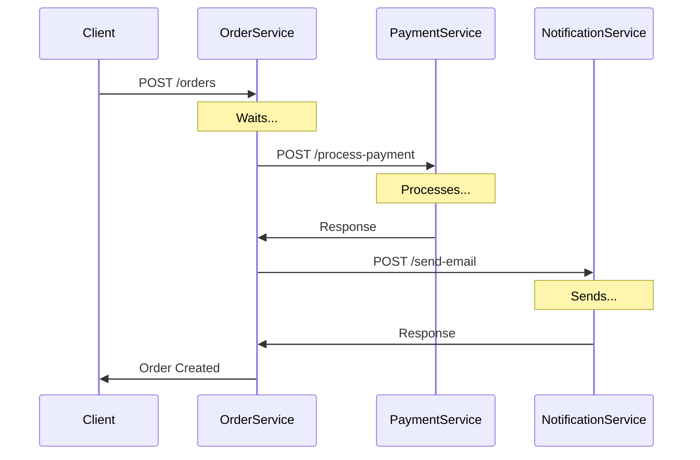
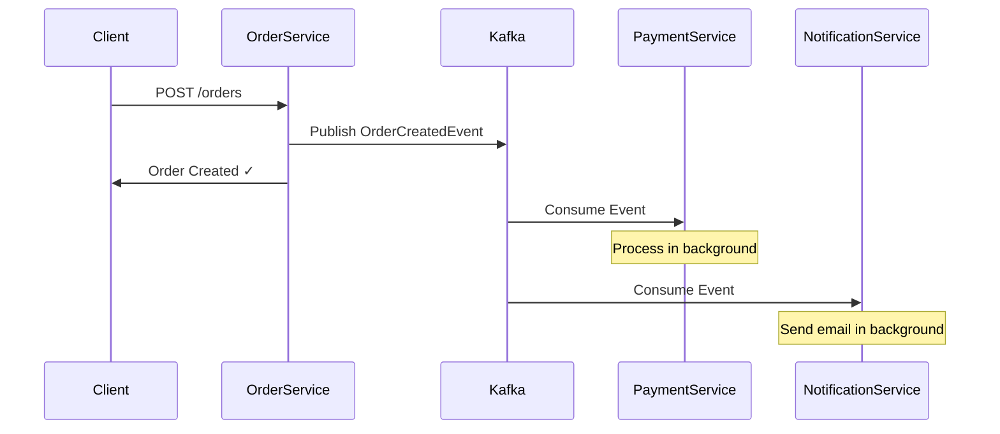

# Event-Driven Architecture with Kafka

## Overview

Event-Driven Architecture (EDA) is a software design pattern where services communicate through events rather than direct calls. Apache Kafka serves as the message broker, enabling asynchronous, loosely-coupled communication between microservices.

## Request-Response vs Event-Driven

### Request-Response (Synchronous)



**Problems:**
- **Tight Coupling**: OrderService knows about PaymentService and NotificationService
- **Blocking**: OrderService waits for all downstream services
- **Failure Cascade**: If PaymentService is down, order creation fails
- **Timeout Issues**: Long chain can timeout
- **Hard to Scale**: Adding services requires code changes

### Event-Driven (Asynchronous)



**Benefits:**
- **Loose Coupling**: Services only know about events
- **Non-Blocking**: OrderService returns immediately
- **Resilient**: Events stored until consumers ready
- **Scalable**: Multiple consumers per service
- **Extensible**: Add new consumers without changing producers

## Core Concepts

### Topics

A **topic** is a named channel for events. Producers send messages to topics, consumers read from topics.

```
order-created          ← Events about new orders
payment-processed      ← Events about completed payments
notification-requested ← Events requesting notifications
```

**Configuration:**
- **Partitions**: Number of parallel processing units (default: 3)
- **Replication Factor**: Number of replicas for fault tolerance
- **Retention**: How long to keep messages (default: 7 days)

### Partitions

Partitions enable **parallelism** and **ordering guarantees**.

```
Topic: order-created (6 partitions)

┌────────┬────────┬────────┬────────┬────────┬────────┐
│ Part 0 │ Part 1 │ Part 2 │ Part 3 │ Part 4 │ Part 5 │
├────────┼────────┼────────┼────────┼────────┼────────┤
│ Msg 0  │ Msg 1  │ Msg 2  │ Msg 3  │ Msg 4  │ Msg 5  │
│ Msg 6  │ Msg 7  │ Msg 8  │ Msg 9  │ Msg 10 │ Msg 11 │
│ Msg 12 │ Msg 13 │ Msg 14 │ Msg 15 │ Msg 16 │ Msg 17 │
└────────┴────────┴────────┴────────┴────────┴────────┘
```

**Key Points:**
- Messages with **same key** → **same partition** (ordering)
- Messages with **no key** → **round-robin** distribution
- **More partitions** = **higher parallelism**
- **One partition** = **one consumer** at a time (in same group)

**Partitioning Strategy:**
```typescript
// Same orderId → same partition → ordering guaranteed
await producer.send(Topics.ORDER_CREATED, event, 'order-123');
await producer.send(Topics.PAYMENT_PROCESSED, event, 'order-123');
// Events processed in order
```

### Consumer Groups

Consumer groups enable two patterns: **load balancing** and **pub/sub**.

#### Pattern 1: Load Balancing (Same Group)

```
Consumer Group: payment-service

Topic: order-created (6 partitions)
┌───┬───┬───┬───┬───┬───┐
│ 0 │ 1 │ 2 │ 3 │ 4 │ 5 │
└─┬─┴─┬─┴─┬─┴─┬─┴─┬─┴─┬─┘
  │   │   │   │   │   │
  └───┴───┘   └───┴───┘
      │           │
┌─────▼─────┐ ┌─▼───────┐
│ Instance1 │ │Instance2│
│(Parts 0-2)│ │(Parts3-5)│
└───────────┘ └─────────┘
```

**Behavior:**
- Partitions distributed among instances
- Each message processed by **ONE** instance
- Automatic rebalancing on join/leave

#### Pattern 2: Pub/Sub (Different Groups)

```
Topic: order-created
        │
    ┌───┼───┬───┐
    │   │   │   │
    ▼   ▼   ▼   ▼
┌─────┬──────┬────────┬──────┐
│ Grp │ Grp  │  Grp   │ Grp  │
│pay  │notify│analytic│audit │
│ment │      │        │      │
│ ALL │ ALL  │  ALL   │ ALL  │
└─────┴──────┴────────┴──────┘
```

**Behavior:**
- Each group receives **ALL** messages
- Groups process independently
- Easy to add new consumers

### Offsets

An **offset** is the sequential ID of each message in a partition.

```
Partition 0:
┌───┬───┬───┬───┬───┬───┬───┐
│ 0 │ 1 │ 2 │ 3 │ 4 │ 5 │ 6 │ ← Offsets
└───┴───┴───┴───┴───┴───┴───┘
         ▲       ▲
         │       └─ Current offset (4)
         └─ Committed offset (3)
```

**Offset Management:**
- **Auto-commit**: Offsets committed automatically
- **Manual commit**: Full control over commits
- **On rebalance**: Commits before reassignment

### Delivery Semantics

#### At-Most-Once (commit before processing)
```
Read → Commit → Process
If crash during process → Message lost
```
**Use case**: Logs, metrics (non-critical)

#### At-Least-Once (commit after processing) ← **Default**
```
Read → Process → Commit
If crash before commit → Message redelivered
```
**Use case**: Most use cases + idempotency

#### Exactly-Once (transactional)
```
Read → Process + Commit in transaction
Most complex, highest guarantee
```
**Use case**: Financial transactions

## Implementation

### Producer Example

```typescript
import { KafkaProducerService } from '@libs/kafka';
import { Topics, OrderCreatedEvent } from '@libs/kafka';

@Injectable()
export class OrderService {
  constructor(private readonly producer: KafkaProducerService) {}

  async createOrder(dto: CreateOrderDto) {
    // 1. Business logic
    const order = await this.orderRepository.create(dto);
    
    // 2. Create event
    const event: OrderCreatedEvent = {
      eventType: 'OrderCreated',
      eventId: uuidv4(),
      timestamp: new Date().toISOString(),
      orderId: order.id,
      userId: order.userId,
      items: order.items,
      total: order.total,
    };
    
    // 3. Publish to Kafka
    await this.producer.send(
      Topics.ORDER_CREATED,
      event,
      order.id, // key for partitioning
    );
    
    return order;
  }
}
```

### Consumer Example

```typescript
import { KafkaConsumerService } from '@libs/kafka';
import { Topics, ConsumerGroups, OrderCreatedEvent } from '@libs/kafka';

@Injectable()
export class PaymentService implements OnModuleInit {
  constructor(private readonly consumer: KafkaConsumerService) {}

  async onModuleInit() {
    // Subscribe to events
    await this.consumer.subscribe<OrderCreatedEvent>(
      ConsumerGroups.PAYMENT_SERVICE,
      [Topics.ORDER_CREATED],
      this.handleOrderCreated.bind(this),
      {
        maxRetries: 3,
        fromBeginning: false,
        autoCommit: true,
        sendToDlqOnFailure: true,
      },
    );
  }

  private async handleOrderCreated(
    event: OrderCreatedEvent,
    metadata: MessageMetadata,
  ): Promise<void> {
    // Check idempotency
    if (await this.isProcessed(event.eventId)) {
      return; // Skip duplicate
    }
    
    // Process payment
    await this.processPayment(event);
    
    // Mark as processed
    await this.markProcessed(event.eventId);
  }
}
```

## Best Practices

### 1. Event Naming

 **Good** (past tense):
- `OrderCreated`
- `PaymentProcessed`
- `UserRegistered`

 **Bad**:
- `CreateOrder` (command)
- `Order` (too generic)

### 2. Event Structure

Include essential context:

```typescript
{
  eventType: 'OrderCreated',    // Event type
  eventId: 'uuid',              // Unique ID (idempotency)
  timestamp: '2024-01-...',     // When it happened
  orderId: 'order-123',         // Entity ID
  userId: 'user-456',           // Related entities
  // ... event-specific data
}
```

### 3. Idempotency

Always implement idempotency checks:

```typescript
async handleEvent(event) {
  // Check if already processed
  if (await this.isProcessed(event.eventId)) {
    return; // Skip duplicate
  }
  
  // Process
  await this.process(event);
  
  // Mark as processed
  await this.markProcessed(event.eventId);
}
```

**Storage options:**
- **Redis**: Fast, TTL support
- **Database**: Durable, unique constraint
- **Kafka Transactions**: Built-in exactly-once

### 4. Error Handling

```typescript
async handleEvent(event) {
  try {
    await this.process(event);
  } catch (error) {
    if (isTransientError(error)) {
      throw error; // Retry
    } else {
      await this.sendToDLQ(event, error); // Permanent error
    }
  }
}
```

**Transient errors** (retry):
- Network timeout
- Database connection lost
- External API unavailable

**Permanent errors** (DLQ):
- Invalid data format
- Business rule violation
- Data not found

### 5. Monitoring

**Key metrics:**
- **Consumer Lag**: Messages waiting to process
- **DLQ Size**: Failed messages
- **Processing Time**: Time per message
- **Error Rate**: % of failures

**Tools:**
- Kafka UI: http://localhost:8080
- CLI: `kafka-consumer-groups --describe`
- Prometheus + Grafana (production)

## Advanced Patterns

### Transactional Outbox

**Problem**: Database saved, but Kafka publish fails.

**Solution**: Save event in database, publish asynchronously.

```typescript
// 1. Save in transaction
await db.transaction(async (tx) => {
  await tx.orders.create(order);
  await tx.outbox.create({ event, status: 'pending' });
});

// 2. Background job publishes
setInterval(async () => {
  const pending = await db.outbox.findPending();
  for (const item of pending) {
    await kafka.send(item.event);
    await db.outbox.markPublished(item.id);
  }
}, 1000);
```

### Saga Pattern

**Problem**: Distributed transactions across services.

**Solution**: Choreography-based saga with events.

```
OrderCreated → PaymentService → PaymentProcessed
                                      ↓
                                 InventoryService → InventoryReserved
                                                         ↓
                                                    ShippingService → OrderShipped

Rollback on failure:
  PaymentFailed → CancelOrder
  InventoryFailed → RefundPayment
```

## Testing

### Unit Testing

```typescript
describe('OrderService', () => {
  it('should publish OrderCreatedEvent', async () => {
    const mockProducer = {
      send: jest.fn(),
    };
    
    const service = new OrderService(mockProducer);
    await service.createOrder(orderDto);
    
    expect(mockProducer.send).toHaveBeenCalledWith(
      Topics.ORDER_CREATED,
      expect.objectContaining({
        eventType: 'OrderCreated',
        orderId: expect.any(String),
      }),
      expect.any(String),
    );
  });
});
```

### Integration Testing

```typescript
describe('Payment Consumer', () => {
  it('should process OrderCreatedEvent', async () => {
    // Publish event
    await producer.send(Topics.ORDER_CREATED, orderCreatedEvent, 'order-123');
    
    // Wait for processing
    await sleep(1000);
    
    // Verify payment created
    const payment = await paymentRepository.findByOrderId('order-123');
    expect(payment).toBeDefined();
    expect(payment.status).toBe('completed');
  });
});
```

## Performance

### Throughput Comparison

| Metric | Synchronous HTTP | Asynchronous Kafka |
|--------|-----------------|-------------------|
| Response Time | 2000ms | 100ms (20x faster) |
| Orders/sec | 50 | 1000+ |
| Failure Impact | Cascading | Isolated |
| Scalability | Vertical | Horizontal |

### Optimization Tips

1. **Batch Messages**: Send multiple messages at once
2. **Compression**: Enable gzip/snappy compression
3. **Partitioning**: More partitions = higher parallelism
4. **Consumer Instances**: Scale consumers to match partitions
5. **Offset Commit**: Tune auto-commit interval

## Resources

- [Apache Kafka Documentation](https://kafka.apache.org/documentation/)
- [KafkaJS Client](https://kafka.js.org/)
- [Event-Driven Architecture (Martin Fowler)](https://martinfowler.com/articles/201701-event-driven.html)
