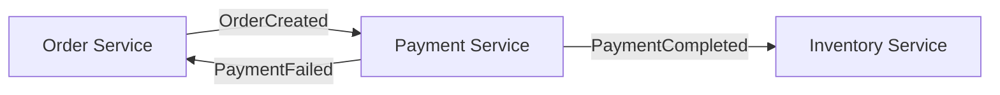
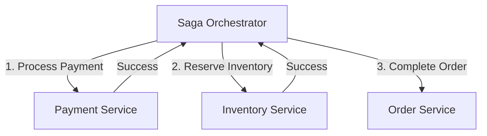

# Introduction to Saga Pattern

## What is a Saga?

A **saga** is a sequence of local transactions where each transaction updates data within a single service. The saga pattern is used to manage distributed transactions across multiple microservices.

## The Problem: Distributed Transactions

### Traditional Approach (Doesn't Work)

In a monolithic application, you can use database transactions:

```sql
BEGIN TRANSACTION;
  INSERT INTO orders (...);
  UPDATE inventory SET stock = stock - 1;
  INSERT INTO payments (...);
COMMIT;
```

**Problem**: This doesn't work across microservices because:
- Each service has its own database
- No distributed transactions across HTTP/Kafka
- 2PC (Two-Phase Commit) is blocking and fragile
- Tight coupling between services

### Microservices Challenge

```
┌─────────────┐     ┌─────────────┐     ┌─────────────┐
│   Order     │────▶│  Payment    │────▶│  Inventory  │
│  Service    │     │   Service   │     │   Service   │
└─────────────┘     └─────────────┘     └─────────────┘
     DB₁                  DB₂                  DB₃

How to maintain consistency across 3 databases?
```

## The Solution: Saga Pattern

Instead of a single ACID transaction, use a **sequence of local transactions** coordinated by events or orchestration.

### Key Characteristics

1. **Local Transactions**: Each service commits locally
2. **No Distributed Lock**: Services don't wait for each other
3. **Eventual Consistency**: System reaches consistent state over time
4. **Compensation**: Forward actions to undo effects (not rollback)

### Example Flow

```
┌──────────────────────────────────────────────────────┐
│                  SUCCESS PATH                         │
└──────────────────────────────────────────────────────┘

1. Order Service: Create order → Commit locally
   ↓ emit OrderCreatedEvent
   
2. Payment Service: Process payment → Commit locally
   ↓ emit PaymentCompletedEvent
   
3. Inventory Service: Reserve items → Commit locally
   ↓ emit InventoryReservedEvent
   
✓ Saga Complete


┌──────────────────────────────────────────────────────┐
│                 COMPENSATION PATH                     │
└──────────────────────────────────────────────────────┘

1. Order Service: Create order → Commit locally
   ↓ emit OrderCreatedEvent
   
2. Payment Service: Payment FAILS
   ↓ emit PaymentFailedEvent
   
3. Order Service: COMPENSATE - Cancel order
   ↓ emit OrderCancelledEvent
   
✗ Saga Cancelled (Compensation Applied)
```

## Two Saga Patterns

### 1. Choreography (Event-Driven)

Services react to events without central coordination.



**Pros:**
- ✅ Loose coupling
- ✅ No single point of failure
- ✅ Easy to extend

**Cons:**
- ❌ Hard to track overall flow
- ❌ Cyclic dependencies possible
- ❌ Difficult to debug

### 2. Orchestration (Centralized)

Central orchestrator coordinates the saga.



**Pros:**
- ✅ Clear control flow
- ✅ Easy to understand
- ✅ Centralized state

**Cons:**
- ❌ Central point of failure
- ❌ Orchestrator complexity
- ❌ Tight coupling

## When to Use Sagas

### Good Use Cases ✅

- **E-commerce orders**: Order → Payment → Inventory → Shipping
- **Travel booking**: Flight + Hotel + Car rental
- **Financial transactions**: Transfer between accounts
- **Multi-step workflows**: Any process across services

### Not Recommended ❌

- **Within a single service**: Use database transactions
- **Real-time requirements**: Sagas are eventually consistent
- **Cannot compensate**: Some actions can't be undone (e.g., sent email)

## Compensation vs Rollback

### Database Rollback

```sql
BEGIN TRANSACTION;
  INSERT INTO orders (...);
  -- Error occurs
ROLLBACK; -- Undo everything
```

**Result**: State restored to before transaction

### Saga Compensation

```
1. Create order (status: pending)
2. Process payment (status: completed)
3. Reserve inventory (FAILS)
4. COMPENSATE: Refund payment
5. COMPENSATE: Cancel order (status: cancelled)
```

**Result**: New state (cancelled), not restored to initial state

### Key Differences

| Aspect | Rollback | Compensation |
|--------|----------|--------------|
| Action | Undo (backward) | Forward action |
| Timing | Immediate | Asynchronous |
| State | Previous state | New state |
| Example | DELETE order | Mark as cancelled |
| Scope | Single database | Distributed |

## Compensation Design

### Guidelines

1. **Design compensatable steps**: Not all actions can be compensated
2. **Forward actions**: Cancel order, refund payment (don't try to delete)
3. **Idempotency**: Compensations can be retried
4. **Business logic**: Refund vs store credit? Business decision!

### Cannot Compensate

Some actions cannot be undone:
- ❌ Email sent
- ❌ Physical item shipped
- ❌ External API called (cannot guarantee undo)
- ❌ Time-sensitive actions (concert tickets sold)

**Solution**: Design saga to minimize irreversible steps, or accept eventual consistency.

## Next Steps

- [Choreography Pattern](./choreography.md) - Event-driven saga
- [Orchestration Pattern](./orchestration.md) - Centralized saga
- [Compensation Strategies](./compensation.md) - Designing compensations
- [Streaming vs Messaging](./streaming-vs-messaging.md) - Event processing
