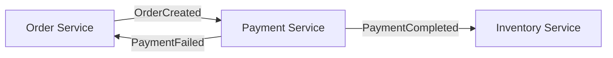
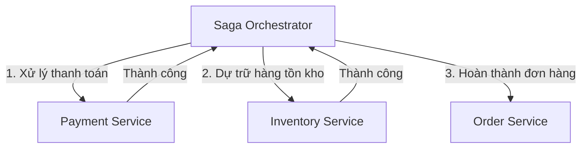

# Giới thiệu về Mẫu Saga

## Saga là gì?

Một **saga** là một chuỗi các giao dịch cục bộ nơi mỗi giao dịch cập nhật dữ liệu trong một dịch vụ duy nhất. Mẫu saga được sử dụng để quản lý các giao dịch phân tán trên nhiều microservices.

## Vấn đề: Giao dịch phân tán

### Cách tiếp cận truyền thống (Không hoạt động)

Trong ứng dụng monolithic, bạn có thể sử dụng giao dịch cơ sở dữ liệu:

```sql
BEGIN TRANSACTION;
  INSERT INTO orders (...);
  UPDATE inventory SET stock = stock - 1;
  INSERT INTO payments (...);
COMMIT;
```

**Vấn đề**: Điều này không hoạt động trên microservices vì:
- Mỗi dịch vụ có cơ sở dữ liệu riêng
- Không có giao dịch phân tán trên HTTP/Kafka
- 2PC (Two-Phase Commit) là chặn và dễ vỡ
- Ghép chặt giữa các dịch vụ

### Thách thức Microservices

```
┌─────────────┐     ┌─────────────┐     ┌─────────────┐
│   Order     │────▶│  Payment    │────▶│  Inventory  │
│  Service    │     │   Service   │     │   Service   │
└─────────────┘     └─────────────┘     └─────────────┘
     DB₁                  DB₂                  DB₃

Làm thế nào để duy trì tính nhất quán trên 3 cơ sở dữ liệu?
```

## Giải pháp: Mẫu Saga

Thay vì một giao dịch ACID duy nhất, sử dụng một **chuỗi các giao dịch cục bộ** được phối hợp bởi sự kiện hoặc orchestration.

### Đặc điểm chính

1. **Giao dịch cục bộ**: Mỗi dịch vụ commit cục bộ
2. **Không khóa phân tán**: Các dịch vụ không chờ đợi lẫn nhau
3. **Tính nhất quán cuối cùng**: Hệ thống đạt trạng thái nhất quán theo thời gian
4. **Bồi thường**: Hành động chuyển tiếp để hoàn tác hiệu ứng (không phải rollback)

### Luồng ví dụ

```
┌──────────────────────────────────────────────────────┐
│                  ĐƯỜNG THÀNH CÔNG                    │
└──────────────────────────────────────────────────────┘

1. Order Service: Tạo đơn hàng → Commit cục bộ
   ↓ emit OrderCreatedEvent
   
2. Payment Service: Xử lý thanh toán → Commit cục bộ
   ↓ emit PaymentCompletedEvent
   
3. Inventory Service: Dự trữ hàng → Commit cục bộ
   ↓ emit InventoryReservedEvent
   
✓ Saga Hoàn thành


┌──────────────────────────────────────────────────────┐
│                 ĐƯỜNG BỒI THƯỜNG                    │
└──────────────────────────────────────────────────────┘

1. Order Service: Tạo đơn hàng → Commit cục bộ
   ↓ emit OrderCreatedEvent
   
2. Payment Service: Thanh toán THẤT BẠI
   ↓ emit PaymentFailedEvent
   
3. Order Service: BỒI THƯỜNG - Hủy đơn hàng
   ↓ emit OrderCancelledEvent
   
✗ Saga Hủy (Bồi thường áp dụng)
```

## Hai mẫu Saga

### 1. Choreography (Hướng sự kiện)

Các dịch vụ phản ứng với sự kiện mà không có phối hợp trung tâm.



**Ưu điểm:**
-  Ghép lỏng
-  Không có điểm thất bại duy nhất
-  Dễ mở rộng

**Nhược điểm:**
-  Khó theo dõi luồng tổng thể
-  Có thể có phụ thuộc vòng tròn
-  Khó debug

### 2. Orchestration (Trung tâm)

Orchestrator trung tâm phối hợp saga.



**Ưu điểm:**
-  Luồng kiểm soát rõ ràng
-  Dễ hiểu
-  Trạng thái trung tâm

**Nhược điểm:**
-  Điểm thất bại trung tâm
-  Độ phức tạp của orchestrator
-  Ghép chặt

## Khi nào sử dụng Sagas

### Các trường hợp tốt

- **Đơn hàng thương mại điện tử**: Đơn hàng → Thanh toán → Hàng tồn kho → Vận chuyển
- **Đặt chỗ du lịch**: Chuyến bay + Khách sạn + Thuê xe
- **Giao dịch tài chính**: Chuyển khoản giữa các tài khoản
- **Luồng công việc nhiều bước**: Bất kỳ quy trình nào trên các dịch vụ

### Không khuyến nghị

- **Trong một dịch vụ duy nhất**: Sử dụng giao dịch cơ sở dữ liệu
- **Yêu cầu thời gian thực**: Sagas là nhất quán cuối cùng
- **Không thể bồi thường**: Một số hành động không thể hoàn tác (ví dụ: gửi email)

## Bồi thường so với Rollback

### Rollback cơ sở dữ liệu

```sql
BEGIN TRANSACTION;
  INSERT INTO orders (...);
  -- Lỗi xảy ra
ROLLBACK; -- Hoàn tác mọi thứ
```

**Kết quả**: Trạng thái được khôi phục về trước giao dịch

### Bồi thường Saga

```
1. Tạo đơn hàng (trạng thái: pending)
2. Xử lý thanh toán (trạng thái: completed)
3. Dự trữ hàng tồn kho (THẤT BẠI)
4. BỒI THƯỜNG: Hoàn tiền thanh toán
5. BỒI THƯỜNG: Hủy đơn hàng (trạng thái: cancelled)
```

**Kết quả**: Trạng thái mới (cancelled), không khôi phục về trạng thái ban đầu

### Sự khác biệt chính

| Khía cạnh | Rollback | Bồi thường |
|-----------|----------|------------|
| Hành động | Hoàn tác (lùi lại) | Hành động chuyển tiếp |
| Thời gian | Ngay lập tức | Bất đồng bộ |
| Trạng thái | Trạng thái trước | Trạng thái mới |
| Ví dụ | DELETE đơn hàng | Đánh dấu đã hủy |
| Phạm vi | Cơ sở dữ liệu duy nhất | Phân tán |

## Thiết kế bồi thường

### Nguyên tắc

1. **Thiết kế các bước có thể bồi thường**: Không phải tất cả hành động đều có thể bồi thường
2. **Hành động chuyển tiếp**: Hủy đơn hàng, hoàn tiền (đừng cố gắng xóa)
3. **Idempotency**: Bồi thường có thể được thử lại
4. **Logic kinh doanh**: Hoàn tiền so với tín dụng cửa hàng? Quyết định kinh doanh!

### Không thể bồi thường

Một số hành động không thể hoàn tác:
-  Email đã gửi
-  Hàng vật lý đã vận chuyển
-  API bên ngoài đã gọi (không thể đảm bảo hoàn tác)
-  Hành động nhạy cảm thời gian (vé hòa nhạc đã bán)

**Giải pháp**: Thiết kế saga để giảm thiểu các bước không thể đảo ngược, hoặc chấp nhận tính nhất quán cuối cùng.

## Các bước tiếp theo

- [Mẫu Choreography](./choreography.md) - Saga hướng sự kiện
- Học về mẫu orchestration để kiểm soát saga trung tâm
- Nghiên cứu chiến lược bồi thường để thiết kế logic rollback
- [Streaming so với Messaging](./streaming-vs-messaging.md) - Xử lý sự kiện
