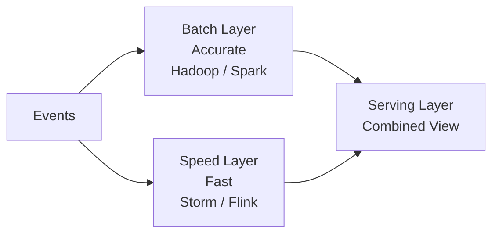
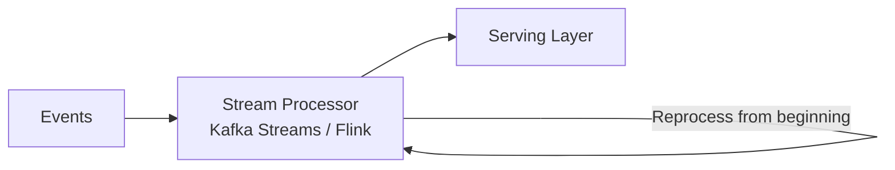

# Streaming so với Messaging

## Tổng quan

**Messaging** và **Streaming** đều là các mẫu hướng sự kiện, nhưng chúng phục vụ các mục đích khác nhau và có các đặc điểm khác nhau.

## Sự khác biệt chính

| Khía cạnh | Messaging | Streaming |
|-----------|-----------|-----------|
| **Mục đích** | Thực thi nhiệm vụ | Xử lý dữ liệu |
| **Trạng thái** | Không trạng thái | Có trạng thái |
| **Xử lý** | Sự kiện rời rạc | Luồng liên tục |
| **Giữ lại** | Ngắn (phút/giờ) | Dài (ngày/tuần) |
| **Ví dụ** | Gửi email | Tính doanh thu |
| **Tiêu thụ** | Hàng đợi (tiêu thụ một lần) | Pub/Sub (nhiều người tiêu thụ) |

## Mẫu Messaging

### Đặc điểm

- **Sự kiện rời rạc**: Mỗi sự kiện là độc lập
- **Xử lý không trạng thái**: Không có bộ nhớ giữa các sự kiện
- **Hướng nhiệm vụ**: Làm gì đó một lần
- **Bắn và quên**: Sự kiện được tiêu thụ và xong

### Ví dụ: Thông báo Email

```typescript
@Injectable()
export class NotificationService implements OnModuleInit {
  async onModuleInit() {
    await this.kafkaConsumer.subscribe(
      'notification-service',
      [Topics.ORDER_CREATED],
      this.handleOrderCreated.bind(this),
    );
  }

  private async handleOrderCreated(event: OrderCreatedEvent) {
    // Stateless: Just send email and done
    await this.sendEmail({
      to: event.data.userEmail,
      subject: 'Order Confirmed',
      body: `Your order ${event.data.orderId} has been created.`,
    });

    console.log(`Email sent for order ${event.data.orderId}`);
    // No state maintained
  }
}
```

**Các trường hợp sử dụng:**
- Gửi thông báo (email, SMS)
- Kích hoạt webhooks
- Thực thi lệnh
- Nhiệm vụ một lần

## Mẫu Streaming

### Đặc điểm

- **Luồng liên tục**: Sự kiện là một phần của luồng
- **Xử lý có trạng thái**: Duy trì trạng thái qua các sự kiện
- **Hướng phân tích**: Tổng hợp, tính toán, phân tích
- **Dựa trên thời gian**: Cửa sổ, khoảng, giai đoạn

### Ví dụ: Phân tích Doanh thu

```typescript
@Injectable()
export class AnalyticsService implements OnModuleInit {
  // Stateful: Maintain metrics
  private totalRevenue = 0;
  private orderCount = 0;
  private ordersPerMinute: number[] = Array(60).fill(0);
  private currentMinuteIndex = 0;
  private successfulOrders = 0;
  private failedOrders = 0;

  async onModuleInit() {
    // Subscribe to multiple events (streaming)
    await this.kafkaConsumer.subscribe(
      ConsumerGroups.ANALYTICS_SERVICE,
      [
        Topics.ORDER_CREATED,
        Topics.PAYMENT_COMPLETED,
        Topics.PAYMENT_FAILED,
        Topics.INVENTORY_RESERVED,
      ],
      this.handleEvent.bind(this),
    );

    // Periodic processing (time window)
    setInterval(() => this.updateTimeWindow(), 60000); // Every minute
    setInterval(() => this.printReport(), 10000); // Every 10 seconds
  }

  private async handleEvent(event: any) {
    // Update state based on event type
    switch (event.eventType) {
      case 'OrderCreated':
        this.orderCount++;
        this.ordersPerMinute[this.currentMinuteIndex]++;
        break;

      case 'PaymentCompleted':
        this.totalRevenue += event.data.amount;
        this.successfulOrders++;
        break;

      case 'PaymentFailed':
        this.failedOrders++;
        break;

      case 'InventoryReserved':
        // Track inventory metrics
        break;
    }
  }

  private updateTimeWindow() {
    // Slide time window
    this.currentMinuteIndex = (this.currentMinuteIndex + 1) % 60;
    this.ordersPerMinute[this.currentMinuteIndex] = 0;
  }

  private printReport() {
    console.log('\n📊 [STREAMING ANALYTICS]');
    console.log(`   Total Orders: ${this.orderCount}`);
    console.log(`   Successful: ${this.successfulOrders}`);
    console.log(`   Failed: ${this.failedOrders}`);
    console.log(`   Success Rate: ${(this.successfulOrders/this.orderCount*100).toFixed(1)}%`);
    console.log(`   Total Revenue: $${this.totalRevenue.toFixed(2)}`);
    console.log(`   Orders Last Minute: ${this.ordersPerMinute[this.currentMinuteIndex]}`);
  }

  getMetrics() {
    return {
      totalOrders: this.orderCount,
      successfulOrders: this.successfulOrders,
      failedOrders: this.failedOrders,
      successRate: (this.successfulOrders / this.orderCount * 100).toFixed(1),
      totalRevenue: this.totalRevenue.toFixed(2),
      ordersLastMinute: this.ordersPerMinute[this.currentMinuteIndex],
    };
  }
}
```

**Các trường hợp sử dụng:**
- Phân tích thời gian thực
- Theo dõi doanh thu
- Chỉ số bảng điều khiển
- Phát hiện gian lận
- Hệ thống giám sát

## Các mẫu xử lý luồng

### 1. Tổng hợp

Kết hợp nhiều sự kiện thành tóm tắt:

```typescript
// Sum, count, average
totalRevenue += event.amount;
orderCount++;
averageOrderValue = totalRevenue / orderCount;
```

### 2. Cửa sổ

Nhóm sự kiện theo thời gian:

```typescript
// Tumbling window (non-overlapping)
const ordersThisMinute = ordersPerMinute[currentMinute];

// Sliding window (overlapping)
const ordersLast5Minutes = ordersPerMinute.slice(-5).reduce((a, b) => a + b, 0);

// Session window (activity-based)
if (timeSinceLastOrder > 5 * 60 * 1000) {
  // Start new session
  sessionCount++;
}
```

### 3. Lọc

Chọn tập con của sự kiện:

```typescript
// High-value orders
if (event.amount > 1000) {
  highValueOrders.push(event);
}

// Failed payments only
if (event.eventType === 'PaymentFailed') {
  failedPayments.push(event);
}
```

### 4. Làm giàu

Thêm ngữ cảnh vào sự kiện:

```typescript
// Add user details
const enrichedEvent = {
  ...event,
  userDetails: await this.getUserProfile(event.userId),
  locationDetails: await this.getLocation(event.ip),
};
```

### 5. Kết hợp

Kết hợp nhiều luồng:

```typescript
// Join orders with payments
const order = ordersMap.get(event.orderId);
const payment = paymentsMap.get(event.paymentId);

const joined = {
  orderId: order.id,
  amount: order.total,
  paymentMethod: payment.method,
  transactionId: payment.transactionId,
};
```

## Kiến trúc Lambda so với Kappa

### Kiến trúc Lambda (Truyền thống)



**Đặc điểm:**
- Hai đường ống xử lý (batch + streaming)
- Lớp batch: Chính xác nhưng chậm
- Lớp tốc độ: Nhanh nhưng gần đúng
- Kết hợp kết quả trong lớp phục vụ

**Ưu điểm:**
- Kết quả chính xác (batch)
- Độ trễ thấp (tốc độ)
- Tốt nhất của cả hai thế giới

**Nhược điểm:**
- Phức tạp (duy trì hai hệ thống)
- Khó đồng bộ lớp batch và tốc độ
- Các cơ sở mã khác nhau
- Logic trùng lặp

### Kiến trúc Kappa (Hiện đại)



**Đặc điểm:**
- Đường ống xử lý đơn
- Tập trung vào Kafka
- Khả năng phát lại
- Cùng mã cho batch và streaming

**Ưu điểm:**
- Đơn giản (một hệ thống)
- Dễ duy trì
- Phát lại Kafka để xử lý lại
- Cách tiếp cận hiện đại

**Nhược điểm:**
- Cần xử lý lại cho thay đổi schema
- Mô hình xử lý đơn (không tối ưu hóa batch)

**Hầu hết các hệ thống ngày nay sử dụng Kappa**

## Chủ đề Kafka: Messaging so với Streaming

### Chủ đề Messaging

```typescript
// Short retention (1 day)
Topics.ORDER_CREATED
Topics.PAYMENT_COMPLETED

// Consumed once per consumer group
ConsumerGroups.PAYMENT_SERVICE
ConsumerGroups.INVENTORY_SERVICE
```

**Cấu hình:**
```
retention.ms=86400000  # 1 day
cleanup.policy=delete
```

### Chủ đề Streaming

```typescript
// Long retention (7 days or more)
Topics.ORDER_EVENTS_STREAM
Topics.PAYMENT_EVENTS_STREAM

// Multiple consumers (pub/sub)
ConsumerGroups.ANALYTICS_SERVICE
ConsumerGroups.FRAUD_DETECTION_SERVICE
ConsumerGroups.REPORTING_SERVICE
```

**Cấu hình:**
```
retention.ms=604800000  # 7 days
cleanup.policy=compact  # Keep latest per key
```

## Có trạng thái so với Không trạng thái

### Không trạng thái (Messaging)

```typescript
// No state between events
async handleEvent(event) {
  await this.sendEmail(event.data);
  // Done, forget about it
}
```

**Đặc điểm:**
- Không bộ nhớ
- Mỗi sự kiện độc lập
- Dễ mở rộng (thêm nhiều instance)
- Không cần phối hợp

### Có trạng thái (Streaming)

```typescript
// Maintain state
private revenue = 0;
private orders = new Map();

async handleEvent(event) {
  this.revenue += event.amount;
  this.orders.set(event.orderId, event);
  // State persists
}
```

**Đặc điểm:**
- Bộ nhớ của các sự kiện trước
- Phải xử lý quản lý trạng thái
- Khó mở rộng hơn (phân vùng trạng thái)
- Cần phối hợp

**Giải pháp quản lý trạng thái:**
- Trong bộ nhớ (demo của chúng ta)
- Redis (trạng thái chia sẻ)
- RocksDB (Kafka Streams)
- Cơ sở dữ liệu (trạng thái bền vững)

## Khi nào sử dụng mỗi loại

### Sử dụng Messaging khi:

- Thực thi nhiệm vụ (gửi email, gọi API)
- Hoạt động một lần
- Không cần trạng thái
- Xử lý sự kiện đơn giản
- Sự kiện độc lập

### Sử dụng Streaming khi:

- Phân tích và chỉ số
- Tổng hợp (tổng, đếm, trung bình)
- Xử lý dựa trên thời gian
- Cần kết hợp nhiều sự kiện
- Bảng điều khiển và báo cáo
- Phát hiện gian lận
- Hệ thống giám sát

## Triển khai trong Phase 5

### Ví dụ Messaging

```typescript
// Payment Service (messaging)
@KafkaListener(Topics.ORDER_CREATED)
handleOrderCreated(event) {
  // Process payment (stateless)
  const result = this.processPayment(event.data);
  
  // Emit next event
  this.kafkaProducer.send(
    result.success ? Topics.PAYMENT_COMPLETED : Topics.PAYMENT_FAILED,
    result,
  );
}
```

### Ví dụ Streaming

```typescript
// Analytics Service (streaming)
@KafkaListener([
  Topics.ORDER_CREATED,
  Topics.PAYMENT_COMPLETED,
  Topics.PAYMENT_FAILED,
])
handleEvent(event) {
  // Update state (stateful)
  switch (event.eventType) {
    case 'OrderCreated':
      this.orderCount++;
      break;
    case 'PaymentCompleted':
      this.totalRevenue += event.data.amount;
      break;
  }
}

// Periodic reporting (time window)
setInterval(() => {
  console.log('Total Revenue:', this.totalRevenue);
  console.log('Order Count:', this.orderCount);
}, 10000);
```

## Tóm tắt

| Mẫu | Mục đích | Trạng thái | Ví dụ |
|-----|----------|------------|-------|
| **Messaging** | Thực thi nhiệm vụ | Không trạng thái | Gửi email |
| **Streaming** | Xử lý dữ liệu | Có trạng thái | Tính doanh thu |

**Điểm chính:**
- Messaging = Làm gì đó một lần
- Streaming = Phân tích dữ liệu liên tục
- Cả hai đều sử dụng Kafka, mục đích khác nhau
- Có thể sử dụng cả hai trong cùng hệ thống (như Phase 5)

**Trong Phase 5:**
- Dịch vụ saga sử dụng messaging (đơn hàng → thanh toán → hàng tồn kho)
- Dịch vụ phân tích sử dụng streaming (tổng hợp doanh thu)
- Cả hai mẫu hoạt động cùng nhau

Tiếp theo: Khám phá kiến trúc Lambda và Kappa cho xử lý luồng
