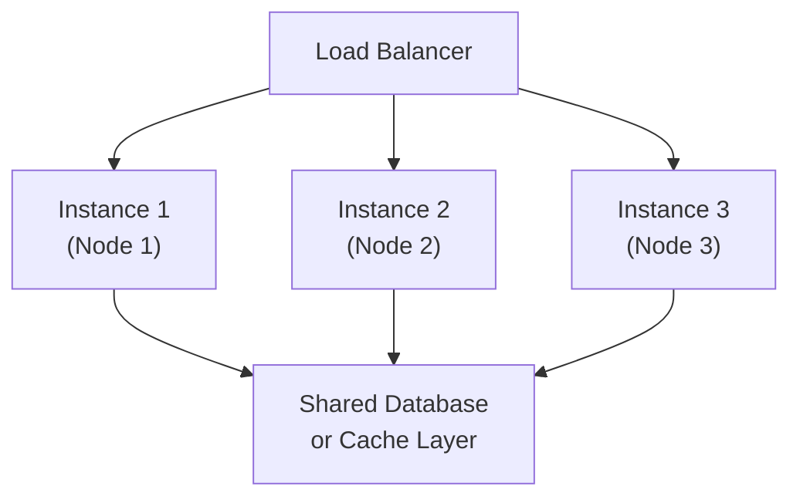

## Horizontal Scaling

Thêm nhiều máy hơn để phân phối tải.

### Các Trường Hợp Sử Dụng

1. **Các ứng dụng web**: API gateways, web servers
2. **Các dịch vụ stateless**: Kiến trúc microservices
3. **Khả năng sẵn sàng cao**: Cần dự phòng
4. **Tối ưu hóa chi phí**: Sử dụng phần cứng hàng hóa

### Ưu điểm

 Không có giới hạn cứng - thêm bao nhiêu máy tùy ý
 Khả năng sẵn sàng cao - dự phòng tích hợp
 Hiệu quả về chi phí - sử dụng máy rẻ hơn
 Dung sai lỗi - một máy lỗi, các máy khác tiếp tục

### Nhược điểm

 Phức tạp - thách thức hệ thống phân tán
 Quản lý trạng thái - cần lưu trữ chia sẻ
 Độ trễ mạng - giữa các máy
 Tính nhất quán - thách thức định lý CAP

### Kiến trúc



### Triển khai

```typescript
// docker-compose.yml
services:
  api-gateway:
    build: .
    ports:
      - "3000"  # No fixed port
    environment:
      - NODE_ENV=production
    deploy:
      replicas: 3  # Run 3 instances
      
  nginx:
    image: nginx
    ports:
      - "80:80"
    volumes:
      - ./nginx.conf:/etc/nginx/nginx.conf
    depends_on:
      - api-gateway
```

```nginx
# nginx.conf - Load balancer config
upstream backend {
    server api-gateway:3000 max_fails=3 fail_timeout=30s;
}

server {
    listen 80;
    
    location / {
        proxy_pass http://backend;
        proxy_set_header Host $host;
        proxy_set_header X-Real-IP $remote_addr;
    }
}
```