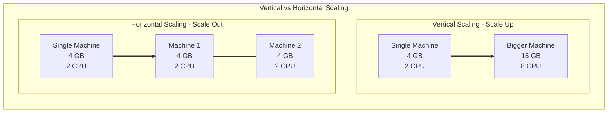
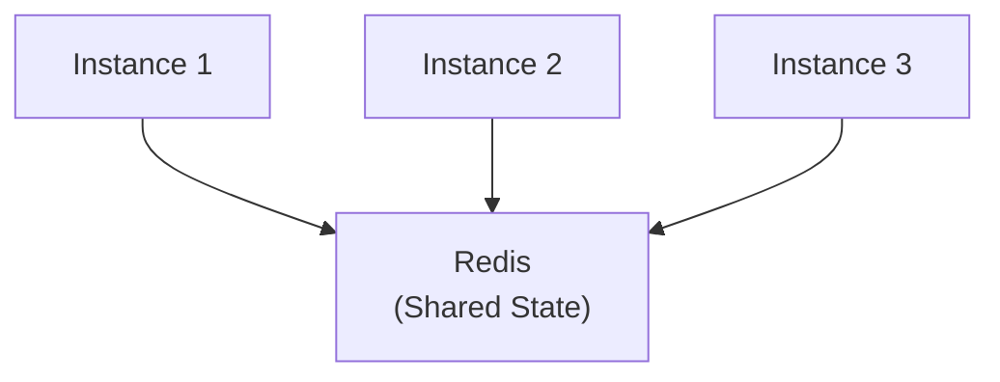

# Giới thiệu

## Tổng quan

Scaling là khả năng của hệ thống xử lý tải tăng bằng cách thêm tài nguyên. Điều này rất quan trọng để xây dựng các ứng dụng có khả năng phục hồi, hiệu suất cao có thể phát triển theo nhu cầu.

## Các Loại Scaling




## Quản lý Trạng thái

### Thách thức

Horizontal scaling giới thiệu **vấn đề trạng thái chia sẻ**:

```
Yêu cầu đầu tiên của người dùng → Instance 1 (lưu session trong bộ nhớ)
Yêu cầu thứ hai của người dùng → Instance 2 (không có session!)
```

### Giải pháp 1: Thiết kế Stateless

Không lưu bất kỳ trạng thái nào trong các instance ứng dụng.

```typescript
//  BAD: Stateful
let userSessions = new Map();

@Post('login')
login(@Body() credentials) {
  const session = createSession(credentials);
  userSessions.set(session.id, session); // Stored in memory!
  return { sessionId: session.id };
}

@Get('profile')
getProfile(@Headers('session-id') sessionId: string) {
  const session = userSessions.get(sessionId); // Won't work on other instances!
  return session.user;
}

//  GOOD: Stateless with JWT
@Post('login')
login(@Body() credentials) {
  const token = jwt.sign(
    { userId: user.id, email: user.email },
    'secret',
    { expiresIn: '1h' }
  );
  return { token }; // Client stores it!
}

@Get('profile')
@UseGuards(JwtAuthGuard)
getProfile(@Request() req) {
  // JWT decoded by guard, works on any instance
  return req.user;
}
```

### Giải pháp 2: Shared State Store

Sử dụng lưu trữ bên ngoài (Redis, database) cho trạng thái chia sẻ.

```typescript
// Session stored in Redis (accessible by all instances)
@Injectable()
export class SessionService {
  constructor(private redis: Redis) {}

  async createSession(user: User): Promise<string> {
    const sessionId = uuid();
    await this.redis.setex(
      `session:${sessionId}`,
      3600, // 1 hour TTL
      JSON.stringify(user)
    );
    return sessionId;
  }

  async getSession(sessionId: string): Promise<User> {
    const data = await this.redis.get(`session:${sessionId}`);
    return JSON.parse(data);
  }
}
```

**Kiến trúc:**


### Giải pháp 3: Sticky Sessions

Định tuyến người dùng đến cùng một instance (không khuyến nghị cho khả năng sẵn sàng cao).

```nginx
upstream backend {
    ip_hash;  # Route based on client IP
    server instance1:3000;
    server instance2:3000;
    server instance3:3000;
}
```

**Vấn đề:**
- Instance crash → người dùng mất session
- Phân phối tải không đều
- Khó triển khai cập nhật


## Hiệu suất Thực tế

Dự án của chúng tôi chứng minh tác động của scaling:

### Single Instance (Blocking)
```bash
# CPU-intensive task blocks all requests
Instance 1: Processing request... (53 seconds)
Request 2: Waiting... (53+ seconds)
Request 3: Waiting... (106+ seconds)

Total: 53,364ms for single request!
```

### Three Instances (Non-Blocking)
```bash
# Load distributed across instances
Instance 1: Processing... (116ms)
Instance 2: Processing... (116ms)
Instance 3: Processing... (116ms)

457x performance improvement!
```

## Các phương pháp tốt nhất

### 1. Thiết kế cho Horizontal Scaling từ Ngày đầu tiên

```typescript
//  Use environment variables for config
const port = process.env.PORT || 3000;
const redisHost = process.env.REDIS_HOST || 'localhost';

//  Use external session storage
@Module({
  imports: [
    RedisModule.register({
      host: redisHost,
      port: 6379
    })
  ]
})
```

### 2. Health Checks

```typescript
@Get('health')
async health() {
  const dbHealth = await this.checkDatabase();
  const redisHealth = await this.checkRedis();
  
  if (!dbHealth || !redisHealth) {
    throw new ServiceUnavailableException();
  }
  
  return {
    status: 'healthy',
    uptime: process.uptime(),
    memory: process.memoryUsage()
  };
}
```

### 3. Graceful Shutdown

```typescript
async function bootstrap() {
  const app = await NestFactory.create(AppModule);
  await app.listen(3000);

  // Graceful shutdown
  process.on('SIGTERM', async () => {
    console.log('SIGTERM received, closing server...');
    await app.close();
    process.exit(0);
  });
}
```

### 4. Giám sát & Metrics

```typescript
@Injectable()
export class MetricsService {
  private readonly metrics = {
    requestCount: 0,
    errorCount: 0,
    avgResponseTime: 0
  };

  recordRequest(duration: number) {
    this.metrics.requestCount++;
    this.metrics.avgResponseTime = 
      (this.metrics.avgResponseTime * (this.metrics.requestCount - 1) + duration) / 
      this.metrics.requestCount;
  }
}
```

## Kiểm thử Scaling

```bash
# Test with Apache Bench
ab -n 10000 -c 100 http://localhost/api/users

# Test with k6
k6 run --vus 100 --duration 30s load-test.js
```

## Triển khai Dự án

Xem:
- [Scaling demonstration](../../../backend/SCALING-DEMO.md)
- [Test scripts](../../../backend/test-scaling.sh)
- [Docker Compose](../../../backend/docker-compose.yml)

## Các Bước Tiếp Theo

- Tìm hiểu về [Load Balancer](../load-balancer/index.md)
- Khám phá chiến lược caching phân tán
- Kiểm tra [Connection Pool](../connection-pool/index.md)
