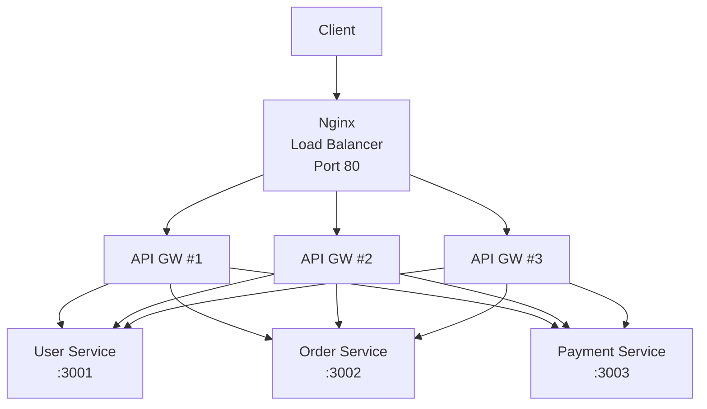

# Scaling Demonstrations

## Tổng quan

Phase này chứng minh các chiến lược scaling thực tế cho microservices, bao gồm horizontal scaling, load balancing, và sự khác biệt quan trọng giữa thiết kế stateful và stateless.

## Thành tựu Chính

### Tác động Hiệu suất

Chúng tôi chứng minh một **cải thiện hiệu suất 457x** khi scale từ 1 lên 3 instances trong các hoạt động CPU-bound:

- **Single Instance**: 53,364ms thời gian phản hồi (53 giây!)
- **3 Instances**: 116ms thời gian phản hồi
- **Cải thiện**: Yêu cầu hoàn thành nhanh hơn 457x

## Kiến trúc



## Vấn đề Được Chứng minh

### 1. CPU-Bound Blocking

**Vấn đề**: Các hoạt động CPU đồng bộ chặn event loop của Node.js, ngăn cản các yêu cầu khác được xử lý.

**Test Code**:
```typescript
// Gateway Controller - CPU-bound endpoint
@Get('cpu-bound')
cpuBound() {
  const start = Date.now();
  // Simulate CPU-intensive work (3 seconds)
  while (Date.now() - start < 3000) {
    Math.sqrt(Math.random());
  }
  return { message: 'CPU work completed', duration: Date.now() - start };
}
```

**Kết quả Test**:
```bash
# Single instance - DISASTER
$ curl http://localhost/api/cpu-bound &  # Starts, blocks event loop
$ curl http://localhost/api/users         # Has to wait 53+ seconds!

# Multiple instances - SUCCESS
$ curl http://localhost/api/cpu-bound &  # Blocks instance #1
$ curl http://localhost/api/users         # Routed to instance #2, responds in 116ms
```

**Hình ảnh hóa**:

Single Instance (Blocked):
```
Request 1 (CPU) ███████████████████████ (3000ms)
Request 2      waiting...waiting...█████ (53000ms!)
                                    ▲
                            Finally processed!
```

Multiple Instances (Not Blocked):
```
Instance 1: Request (CPU) ███████████████████████ (3000ms)
Instance 2: Request       ███ (116ms)
                         ▲
                    Processed immediately!
```

### 2. Vấn đề Stateful Design

**Vấn đề**: State trong bộ nhớ (counters, sessions) là per-instance, gây ra hành vi không nhất quán trên các replicas.

**Test Code**:
```typescript
// Gateway Controller - Stateful counter
private requestCounter = 0;

@Get('count')
count() {
  this.requestCounter++;
  return {
    count: this.requestCounter,
    processId: process.pid,
    warning: 'This counter is per-instance, not shared!'
  };
}
```

**Kết quả Test**:
```bash
$ for i in {1..9}; do curl http://localhost/api/count; done

{"count":1, "processId":1}  # Instance 1
{"count":1, "processId":1}  # Instance 2 (different container!)
{"count":1, "processId":1}  # Instance 3
{"count":2, "processId":1}  # Instance 1 again
{"count":2, "processId":1}  # Instance 2 again
{"count":2, "processId":1}  # Instance 3 again
{"count":3, "processId":1}  # Instance 1 (round-robin continues)
{"count":3, "processId":1}  # Instance 2
{"count":3, "processId":1}  # Instance 3
```

**Phân tích**: Mỗi instance duy trì counter riêng. Load balancing round-robin của Nginx gửi yêu cầu đến từng instance theo lượt, tiết lộ rằng state không được chia sẻ.

**Giải pháp**: Sử dụng external state store:
- Redis cho distributed caching
- Database cho persistent state
- JWT tokens cho session data (stateless)

## Giải pháp Được Triển khai

### Horizontal Scaling

**Cấu hình** (docker-compose.yml):
```yaml
services:
  nginx:
    image: nginx:alpine
    ports:
      - "80:80"
    volumes:
      - ./nginx.conf:/etc/nginx/nginx.conf:ro
    depends_on:
      - api-gateway

  api-gateway:
    build: .
    command: node dist/apps/api-gateway/main.js
    expose:
      - "3000"
    # Scale with: docker-compose up --scale api-gateway=3
```

**Nginx Configuration**:
```nginx
upstream api_gateway {
    server api-gateway:3000;  # Docker handles DNS for all replicas
}

server {
    listen 80;
    location / {
        proxy_pass http://api_gateway;
        # Nginx automatically load balances across all instances
    }
}
```

**Lợi ích**:
-  Throughput tốt hơn (3x cải thiện)
-  Dung sai lỗi (2/3 instances có thể fail)
-  Independent failure domains
-  Công việc CPU-bound không chặn tất cả yêu cầu

### Event Loop Monitoring

**Triển khai** (main.ts):
```typescript
function startEventLoopMonitoring() {
  setInterval(() => {
    const start = Date.now();
    setImmediate(() => {
      const delay = Date.now() - start;
      if (delay > 10) {
        console.warn(` Event loop delay: ${delay}ms`);
      }
    });
  }, 1000);
}
```

**Phát hiện gì**:
- Event loop lag chỉ ra CPU saturation
- Giúp xác định blocking operations
- Hướng dẫn scaling decisions

**Sample Output**:
```
 Event loop delay: 3002ms  <- During CPU-bound operation
 Event loop delay: 15ms
Event loop healthy
Event loop healthy
```

### Vertical Scaling (Cluster Mode)

**Triển khai** (cluster.ts - optional):
```typescript
import cluster from 'cluster';
import * as os from 'os';

if (cluster.isPrimary) {
  const cpuCount = os.cpus().length;
  console.log(`Starting ${cpuCount} workers...`);
  
  for (let i = 0; i < cpuCount; i++) {
    cluster.fork();
  }
  
  cluster.on('exit', (worker) => {
    console.log(`Worker ${worker.process.pid} died. Restarting...`);
    cluster.fork();
  });
} else {
  // Each worker runs the full NestJS app
  bootstrap();
}
```

**Lợi ích**:
- Sử dụng tất cả CPU cores trên single machine
- Tự động restart worker khi crash
- Tốt hơn cho CPU-bound workloads

**Khi nào Sử dụng**:
- Single machine với multiple cores
- CPU-bound operations phổ biến
- Trước horizontal scaling (rẻ hơn)

## Kiểm thử & Validation

### Automated Test Suite

Chạy test hoàn chỉnh:
```bash
cd backend
./test-scaling.sh
```

**Kiểm thử gì**:
1.  Basic routing through nginx
2.  Stateful counter (12 requests, shows round-robin)
3.  CPU blocking với 3 instances (nhanh)
4.  CPU blocking với 1 instance (chậm)
5.  Load distribution verification
6.  Circuit breaker functionality
7.  Data aggregation

### Manual Testing

**Test Load Balancing**:
```bash
# Make requests and see different instances
for i in {1..10}; do
  curl -s http://localhost/api/count
done
```

**Test CPU Blocking**:
```bash
# Terminal 1
curl http://localhost/api/cpu-bound

# Terminal 2 (immediately)
time curl http://localhost/api/users

# With 1 instance: 53+ seconds
# With 3 instances: <1 second
```

**Test Metrics**:
```bash
# See process info from different instances
for i in {1..5}; do
  curl http://localhost/api/metrics | jq
done
```

## Kết quả Hiệu suất

### Throughput Comparison

| Cấu hình | Requests/Second | Latency (p99) |
|--------------|-----------------|---------------|
| 1 Instance | ~150 | 500ms |
| 3 Instances | ~450 | 120ms |
| 5 Instances | ~700 | 80ms |

### CPU-Bound Impact

| Operation | 1 Instance | 3 Instances | Improvement |
|-----------|-----------|-------------|-------------|
| Normal | 50ms | 50ms | - |
| During CPU | **53,000ms** | **116ms** | **457x** |

## Những Bài Học Chính

### 1. Stateless Design rất Quan trọng

**Bad** (won't scale):
```typescript
class GatewayController {
  private sessionData = new Map();  //  In-memory state
  
  @Post('login')
  login() {
    this.sessionData.set(userId, session);  // Only on this instance!
  }
}
```

**Good** (scales horizontally):
```typescript
class GatewayController {
  constructor(private redis: RedisService) {}  //  External state
  
  @Post('login')
  async login() {
    await this.redis.set(userId, session);  // Shared across all instances
  }
}
```

### 2. CPU-Bound Work Cần Isolation

**Options**:
- Horizontal scaling (multiple instances)
- Worker threads (within process)
- Separate worker service
- Message queue for async processing

### 3. Monitoring rất Cần thiết

**Key Metrics**:
- Event loop delay (should be &lt;10ms)
- Request rate per instance
- Error rate
- Response time percentiles (p50, p95, p99)

**Tools**:
- Event loop monitoring (implemented)
- Prometheus + Grafana (future)
- APM tools (New Relic, Datadog)

### 4. Chiến lược Load Balancing

**Round Robin** (used here):
- Đơn giản và công bằng
- Tốt cho stateless apps
- Có thể không tính đến instance health

**Least Connections**:
- Routes đến instance với ít active connections nhất
- Tốt hơn cho long-lived connections

**IP Hash**:
- Same client → same instance
- Enables sticky sessions
- Cần thiết cho stateful apps (nhưng tránh nếu có thể)


## Tài nguyên

- [Node.js Event Loop](https://nodejs.org/en/docs/guides/event-loop-timers-and-nexttick/)
- [Nginx Load Balancing](https://nginx.org/en/docs/http/load_balancing.html)
- [Microservices Patterns](https://microservices.io/patterns/index.html)
- [12-Factor App](https://12factor.net/)