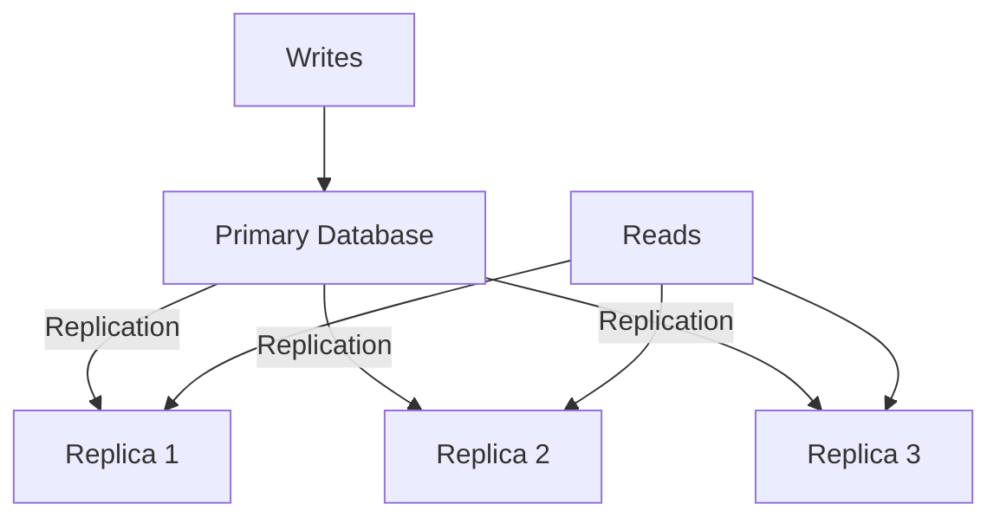

# Strategy Scaling

### 1. Request Per Second (RPS)

Đo lường dung lượng hiện tại và scale tương ứng.

```typescript
@Injectable()
export class ScalingMetrics {
  private requestCount = 0;
  private readonly CHECK_INTERVAL = 60000; // 1 minute

  constructor() {
    this.monitorRPS();
  }

  private monitorRPS() {
    setInterval(() => {
      const rps = this.requestCount / (this.CHECK_INTERVAL / 1000);
      console.log(`Current RPS: ${rps}`);
      
      if (rps > 1000) {
        this.alertScaleUp();
      }
      
      this.requestCount = 0;
    }, this.CHECK_INTERVAL);
  }

  incrementRequest() {
    this.requestCount++;
  }
}
```

### 2. CPU/Memory-Based Autoscaling

```yaml
# Kubernetes autoscaling
apiVersion: autoscaling/v2
kind: HorizontalPodAutoscaler
metadata:
  name: api-gateway
spec:
  scaleTargetRef:
    apiVersion: apps/v1
    kind: Deployment
    name: api-gateway
  minReplicas: 2
  maxReplicas: 10
  metrics:
  - type: Resource
    resource:
      name: cpu
      target:
        type: Utilization
        averageUtilization: 70  # Scale when CPU > 70%
  - type: Resource
    resource:
      name: memory
      target:
        type: Utilization
        averageUtilization: 80  # Scale when memory > 80%
```

### 3. Queue Length-Based Scaling

```typescript
// Scale based on message queue depth
async checkQueueDepth() {
  const depth = await this.kafka.getConsumerLag();
  
  if (depth > 10000) {
    // Too many pending messages, scale up consumers
    await this.scaleConsumers(5);
  }
}
```

## Data Layer Scaling

### 1. Read Replicas

Tách biệt các hoạt động đọc và ghi.



```typescript
@Injectable()
export class UserService {
  constructor(
    @InjectConnection('primary') private primaryDb: Connection,
    @InjectConnection('replica') private replicaDb: Connection
  ) {}

  async createUser(data: CreateUserDto) {
    // Write to primary
    return this.primaryDb.getRepository(User).save(data);
  }

  async findUsers() {
    // Read from replica
    return this.replicaDb.getRepository(User).find();
  }
}
```

### 2. Sharding

Chia dữ liệu trên nhiều databases.

```typescript
// Shard by user ID
function getShardId(userId: string): number {
  return parseInt(userId) % 4; // 4 shards
}

@Injectable()
export class ShardedUserService {
  private shards: Connection[] = [];

  async getUser(userId: string) {
    const shardId = getShardId(userId);
    return this.shards[shardId]
      .getRepository(User)
      .findOne({ where: { id: userId } });
  }
}
```

### 3. CQRS (Command Query Responsibility Segregation)

Tách biệt các mô hình cho các hoạt động đọc và ghi.

```typescript
// Write Model (Commands)
@CommandHandler(CreateOrderCommand)
export class CreateOrderHandler {
  async execute(command: CreateOrderCommand) {
    const order = new Order(command.data);
    await this.orderRepository.save(order);
    
    // Publish event
    await this.eventBus.publish(
      new OrderCreatedEvent(order)
    );
  }
}

// Read Model (Queries)
@QueryHandler(GetOrdersQuery)
export class GetOrdersHandler {
  async execute(query: GetOrdersQuery) {
    // Query optimized read model
    return this.orderReadRepository.find(query.criteria);
  }
}
```