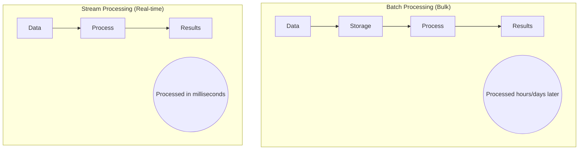
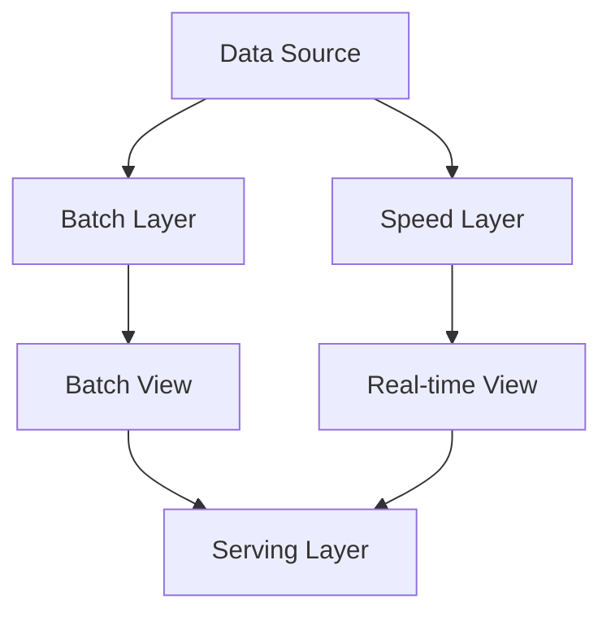
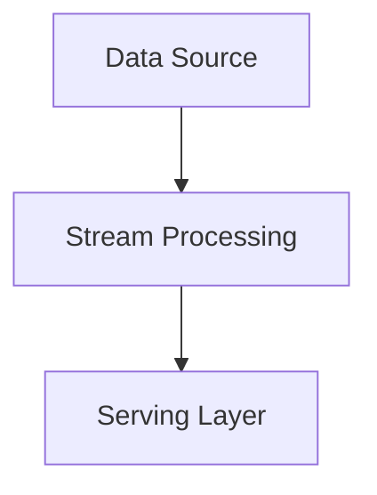
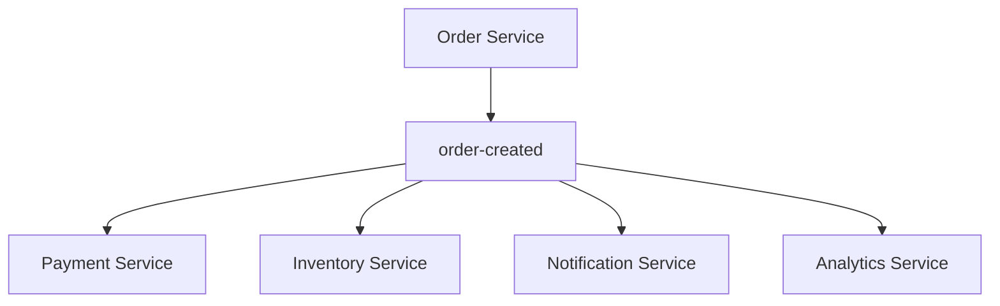

# Xử lý Luồng

## Tổng quan

Xử lý luồng là xử lý thời gian thực của các luồng dữ liệu liên tục. Không giống như xử lý hàng loạt (xử lý dữ liệu ở trạng thái nghỉ), xử lý luồng xử lý dữ liệu khi nó di chuyển - khi nó đến.

## Xử lý Luồng vs Xử lý Hàng loạt



## Kiến trúc

### 1. Kiến trúc Lambda

Kết hợp xử lý hàng loạt và luồng để hoàn thiện và độ trễ thấp.



**Lớp:**
1. **Batch Layer**: Xử lý tất cả dữ liệu để chính xác (Hadoop, Spark)
2. **Speed Layer**: Xử lý dữ liệu gần đây để độ trễ thấp (Storm, Flink)
3. **Serving Layer**: Hợp nhất kết quả từ cả hai lớp

**Example:**
```typescript
// Batch Layer - Process historical data
@Cron('0 0 * * *') // Daily
async batchProcess() {
  const orders = await this.orderRepository.find({
    where: { date: Between(startDate, endDate) }
  });

  const metrics = this.calculateMetrics(orders);
  await this.batchViewRepository.save(metrics);
}

// Speed Layer - Process real-time
@EventPattern('order-created')
async streamProcess(order: Order) {
  await this.updateRealtimeMetrics(order);
}

// Serving Layer - Merge results
@Get('metrics')
async getMetrics() {
  const batch = await this.batchViewRepository.findLatest();
  const realtime = await this.realtimeViewRepository.findCurrent();
  
  return this.merge(batch, realtime);
}
```

**Ưu điểm:**
-  Hoàn thiện và chính xác (batch layer)
-  Độ trễ thấp (speed layer)

**Nhược điểm:**
-  Phức tạp - duy trì hai codebase
-  Chi phí cao hơn - xử lý trùng lặp

### 2. Kiến trúc Kappa

Phiên bản đơn giản hóa - chỉ xử lý luồng.



**Ý tưởng Chính:** Giữ tất cả dữ liệu trong luồng (Kafka), xử lý lại nếu cần.

```typescript
// Single stream processing pipeline
@EventPattern('order-created')
async processOrder(order: Order) {
  // Calculate metrics in real-time
  await this.updateMetrics(order);
  
  // Store events (can replay if needed)
  await this.eventStore.append(order);
}

// Reprocess historical data if needed
async reprocess() {
  // Read from beginning of Kafka topic
  const consumer = kafka.consumer({ groupId: 'reprocess' });
  await consumer.subscribe({ topic: 'orders', fromBeginning: true });
  
  await consumer.run({
    eachMessage: async ({ message }) => {
      await this.processOrder(message.value);
    }
  });
}
```

**Ưu điểm:**
-  Đơn giản hơn - một codebase
-  Chi phí thấp hơn
-  Thân thiện với event sourcing

**Nhược điểm:**
-  Có thể không xử lý tất cả trường hợp sử dụng
-  Xử lý lại có thể chậm

### 3. Kiến trúc Microservices

Microservices hướng sự kiện với xử lý luồng.



```typescript
// Order Service (Producer)
@Injectable()
export class OrderService {
  async createOrder(data: CreateOrderDto) {
    const order = await this.save(data);
    
    await this.kafka.emit('order-created', {
      orderId: order.id,
      userId: order.userId,
      amount: order.amount
    });
    
    return order;
  }
}

// Payment Service (Consumer + Producer)
@Controller()
export class PaymentService {
  @EventPattern('order-created')
  async handleOrder(data: OrderCreatedEvent) {
    const payment = await this.processPayment(data);
    
    await this.kafka.emit('payment-processed', {
      orderId: data.orderId,
      paymentId: payment.id,
      status: 'success'
    });
  }
}

// Analytics Service (Consumer)
@Controller()
export class AnalyticsService {
  @EventPattern('order-created')
  async trackOrder(data: OrderCreatedEvent) {
    await this.metrics.increment('orders_total');
    await this.metrics.observe('order_amount', data.amount);
  }

  @EventPattern('payment-processed')
  async trackPayment(data: PaymentEvent) {
    await this.metrics.increment('payments_total');
  }
}
```

## Các Mẫu Xử lý Luồng

### 1. Idempotent Producer

Đảm bảo gửi cùng tin nhắn nhiều lần là an toàn.

```typescript
@Injectable()
export class IdempotentProducer {
  private sentMessages = new Set<string>();

  async send(topic: string, message: any) {
    // Generate deterministic ID
    const messageId = this.generateId(message);

    if (this.sentMessages.has(messageId)) {
      console.log('Message already sent, skipping');
      return;
    }

    await this.kafka.send({
      topic,
      messages: [{
        key: messageId,
        value: JSON.stringify(message),
        headers: { messageId }
      }]
    });

    this.sentMessages.add(messageId);
  }

  private generateId(message: any): string {
    // Use content-based ID
    return createHash('sha256')
      .update(JSON.stringify(message))
      .digest('hex');
  }
}
```

### 2. Event Splitter

Chia một sự kiện thành nhiều sự kiện.

```typescript
@EventPattern('order-created')
async splitOrder(order: OrderCreatedEvent) {
  // Split into smaller events
  for (const item of order.items) {
    await this.kafka.emit('order-item-created', {
      orderId: order.id,
      itemId: item.id,
      product: item.product,
      quantity: item.quantity
    });
  }

  // Emit summary
  await this.kafka.emit('order-summary-created', {
    orderId: order.id,
    itemCount: order.items.length,
    totalAmount: order.amount
  });
}
```

### 3. Claim Check Pattern

Lưu payload lớn riêng biệt, chỉ gửi tham chiếu.

```typescript
// Producer - Store payload in S3, send reference
@Injectable()
export class ClaimCheckProducer {
  async sendLargeOrder(order: LargeOrderDto) {
    // Store payload in S3
    const claimCheck = await this.s3.upload({
      bucket: 'orders',
      key: `order-${order.id}.json`,
      body: JSON.stringify(order)
    });

    // Send only reference
    await this.kafka.emit('order-created', {
      orderId: order.id,
      claimCheckUrl: claimCheck.url,
      size: order.items.length
    });
  }
}

// Consumer - Retrieve payload using reference
@EventPattern('order-created')
async handleOrder(event: OrderEvent) {
  // Download full payload
  const order = await this.s3.download(event.claimCheckUrl);
  
  // Process
  await this.processOrder(order);
}
```

**Khi nào sử dụng:** Payloads > 1MB (giới hạn kích thước tin nhắn Kafka)

### 4. Event Aggregator

Kết hợp nhiều sự kiện thành một.

```typescript
@Injectable()
export class OrderAggregator {
  private orderParts = new Map<string, Partial<Order>>();

  @EventPattern('order-created')
  async handleOrderCreated(event: OrderCreatedEvent) {
    this.addPart(event.orderId, { id: event.orderId, userId: event.userId });
  }

  @EventPattern('payment-processed')
  async handlePayment(event: PaymentEvent) {
    this.addPart(event.orderId, { paymentId: event.paymentId });
  }

  @EventPattern('inventory-reserved')
  async handleInventory(event: InventoryEvent) {
    this.addPart(event.orderId, { inventoryReserved: true });
  }

  private async addPart(orderId: string, part: Partial<Order>) {
    const order = this.orderParts.get(orderId) || {};
    Object.assign(order, part);
    this.orderParts.set(orderId, order);

    // Check if complete
    if (this.isComplete(order)) {
      await this.kafka.emit('order-completed', order);
      this.orderParts.delete(orderId);
    }
  }

  private isComplete(order: Partial<Order>): boolean {
    return !!(order.id && order.paymentId && order.inventoryReserved);
  }
}
```

### 5. Gateway Routing Pattern

Định tuyến sự kiện đến các handler phù hợp.

```typescript
@Controller()
export class EventRouter {
  @EventPattern('*') // Listen to all events
  async routeEvent(@Payload() data: any, @Ctx() context: KafkaContext) {
    const topic = context.getTopic();

    switch (topic) {
      case 'order-created':
        return this.orderHandler.handle(data);
      
      case 'payment-processed':
        return this.paymentHandler.handle(data);
      
      case 'inventory-updated':
        return this.inventoryHandler.handle(data);
      
      default:
        console.warn(`Unknown topic: ${topic}`);
    }
  }
}
```

### 6. CQRS (Command Query Responsibility Segregation)

Tách mô hình ghi (commands) khỏi mô hình đọc (queries).

```typescript
// Command Side (Write Model)
@CommandHandler(CreateOrderCommand)
export class CreateOrderHandler {
  async execute(command: CreateOrderCommand) {
    // Validate
    await this.validator.validate(command);

    // Create order
    const order = new Order(command);
    await this.orderRepository.save(order);

    // Publish events
    await this.eventBus.publish(
      new OrderCreatedEvent(order)
    );
  }
}

// Query Side (Read Model)
@QueryHandler(GetOrdersQuery)
export class GetOrdersHandler {
  async execute(query: GetOrdersQuery) {
    // Query optimized read model
    return this.orderReadModel.find({
      userId: query.userId,
      status: query.status
    });
  }
}

// Event Handler - Update Read Model
@EventHandler(OrderCreatedEvent)
export class OrderProjection {
  async handle(event: OrderCreatedEvent) {
    // Update denormalized read model
    await this.orderReadModel.insert({
      orderId: event.orderId,
      userId: event.userId,
      userName: await this.getUserName(event.userId), // Denormalized
      status: 'created',
      amount: event.amount,
      createdAt: event.timestamp
    });
  }
}
```

### 7. Strangler Fig Pattern

Từ từ di chuyển từ monolith sang microservices.

```typescript
// Phase 1: Route new features to microservice
@Controller('api')
export class StranglerGateway {
  @Get('orders')
  async getOrders() {
    // New implementation
    return this.newOrderService.getOrders();
  }

  @Get('legacy/*')
  async legacyRoute(@Req() req: Request) {
    // Forward to monolith
    return this.legacySystem.forward(req);
  }
}

// Phase 2: Intercept and sync
@EventPattern('order-created-legacy')
async syncFromLegacy(data: any) {
  // Sync to new system
  await this.newOrderService.create(data);
}

// Phase 3: Gradually migrate all features
// ...

// Phase 4: Retire monolith
```

## Saga Pattern

Quản lý giao dịch phân tán trên microservices.

### Orchestration-Based Saga

Orchestrator trung tâm điều phối saga.

```typescript
@Injectable()
export class OrderSaga {
  async execute(order: CreateOrderDto) {
    const sagaId = uuid();
    let compensations = [];

    try {
      // Step 1: Create Order
      const orderResult = await this.orderService.create(order);
      compensations.push(() => this.orderService.cancel(orderResult.id));

      // Step 2: Reserve Inventory
      const inventoryResult = await this.inventoryService.reserve(order.items);
      compensations.push(() => this.inventoryService.release(inventoryResult.id));

      // Step 3: Process Payment
      const paymentResult = await this.paymentService.process(order.amount);
      compensations.push(() => this.paymentService.refund(paymentResult.id));

      // Step 4: Update Shipping
      await this.shippingService.schedule(orderResult.id);

      // Success!
      return { success: true, orderId: orderResult.id };

    } catch (error) {
      // Execute compensations in reverse order
      console.error('Saga failed, executing compensations');
      
      for (const compensate of compensations.reverse()) {
        try {
          await compensate();
        } catch (compensationError) {
          console.error('Compensation failed:', compensationError);
        }
      }

      throw new Error('Order creation failed');
    }
  }
}
```

### Choreography-Based Saga

Dịch vụ phản ứng với sự kiện, không có coordinator trung tâm.

```typescript
// Order Service
@Injectable()
export class OrderService {
  async createOrder(data: CreateOrderDto) {
    const order = await this.save(data);
    
    await this.kafka.emit('order-created', {
      orderId: order.id,
      items: order.items,
      amount: order.amount
    });
  }

  @EventPattern('payment-failed')
  async handlePaymentFailed(event: PaymentFailedEvent) {
    await this.cancelOrder(event.orderId);
    await this.kafka.emit('order-cancelled', event);
  }
}

// Inventory Service
@Controller()
export class InventoryService {
  @EventPattern('order-created')
  async reserveInventory(event: OrderCreatedEvent) {
    try {
      await this.reserve(event.items);
      await this.kafka.emit('inventory-reserved', {
        orderId: event.orderId
      });
    } catch (error) {
      await this.kafka.emit('inventory-reservation-failed', {
        orderId: event.orderId,
        reason: error.message
      });
    }
  }

  @EventPattern('order-cancelled')
  async releaseInventory(event: OrderCancelledEvent) {
    await this.release(event.orderId);
  }
}

// Payment Service
@Controller()
export class PaymentService {
  @EventPattern('inventory-reserved')
  async processPayment(event: InventoryReservedEvent) {
    try {
      await this.process(event.amount);
      await this.kafka.emit('payment-processed', {
        orderId: event.orderId
      });
    } catch (error) {
      await this.kafka.emit('payment-failed', {
        orderId: event.orderId,
        reason: error.message
      });
    }
  }
}
```

**Orchestration vs Choreography:**

| Orchestration | Choreography |
|--------------|--------------|
| Coordinator trung tâm | Phân tán |
| Dễ hiểu luồng hơn | Kết hợp lỏng lẻo hơn |
| Điểm thất bại duy nhất | Khó theo dõi luồng hơn |
| Dễ debug hơn | Bền bỉ hơn |

## Các Thực tiễn Tốt nhất

### 1. Event Versioning

```typescript
interface OrderCreatedEventV1 {
  version: 1;
  orderId: string;
  amount: number;
}

interface OrderCreatedEventV2 {
  version: 2;
  orderId: string;
  amount: number;
  currency: string; // New field
}

@EventPattern('order-created')
async handleOrder(event: OrderCreatedEventV1 | OrderCreatedEventV2) {
  if (event.version === 1) {
    // Handle old format
    event = { ...event, currency: 'USD' }; // Default
  }
  
  // Process v2 format
  await this.processOrder(event as OrderCreatedEventV2);
}
```

### 2. Giám sát

```typescript
@Injectable()
export class StreamMetrics {
  recordEventProcessed(topic: string, latency: number) {
    this.prometheus.increment('events_processed_total', { topic });
    this.prometheus.observe('event_latency_ms', latency, { topic });
  }

  recordEventFailed(topic: string, error: string) {
    this.prometheus.increment('events_failed_total', {
      topic,
      error_type: error
    });
  }
}
```

### 3. Kiểm thử

```typescript
describe('Order Saga', () => {
  it('should complete successfully', async () => {
    const saga = new OrderSaga();
    const result = await saga.execute(mockOrder);
    
    expect(result.success).toBe(true);
    expect(orderService.create).toHaveBeenCalled();
    expect(paymentService.process).toHaveBeenCalled();
  });

  it('should compensate on failure', async () => {
    paymentService.process.mockRejectedValue(new Error('Payment failed'));
    
    await expect(saga.execute(mockOrder)).rejects.toThrow();
    
    // Verify compensations executed
    expect(inventoryService.release).toHaveBeenCalled();
    expect(orderService.cancel).toHaveBeenCalled();
  });
});
```

## Triển khai Dự án

Xem:
- [Saga implementation](../../../backend/PHASE5-STREAMING-SAGA.md)
- [Orchestration vs Choreography](../../../backend/ORCHESTRATION-VS-CHOREOGRAPHY.md)
- [Event handlers](../../../backend/apps/)

## Next Steps

- Learn about saga pattern for distributed transactions
- Explore event sourcing patterns
- Check [Distributed Locking](../distributed-locking/index.md)
